# AICoding 架构设计 · 系统设计

> 本文档为《AICoding 架构设计》核心产物之一，对应**系统架构设计模版**。
> 上游输入：《高层架构设计》（G3 已冻结，2026-07-28）产出的业务架构、系统定位、能力盘点、MVP/完整版边界；
> 下游输出：用于驱动《部署设计》《安全设计》《UserStory》的实施。
>
> **MVP 架构基线（权威约束，来自 U-03 方案A，2026-07-28 用户裁决）**：MVP 阶段**不引入任何后端服务 / BaaS / 云数据库**，系统设计基于本地桌面端（Electron + IndexedDB + mtStore 客户端模拟隔离）描述。§4 数据库设计在 MVP 语境下映射到本地存储（IndexedDB 对象仓库），并明确标注「完整版切换 Node + PostgreSQL」替换路径；§5 部署架构在 MVP 下描述桌面端本地运行 + 轻量同步，完整版服务端形态单独成节，禁止把云原生 K8s 部署当作 MVP 主路径。§4.1 多租户隔离字段 tenant_id 在 MVP 下表现为 mtStore 命名空间隔离（keyPath=`tenant:${tid}:${key}`）的实施说明。

---

## 0. 元信息：修订记录

| 文档版本 | 发布日期 | 修订人 | 修订说明 |
| --- | --- | --- | --- |
| v1.0 | 2026-07-28 | 高见远 / system-architect | 文档初始版本（G4 审核前；G8 形态依据 U-03 方案A 定稿，标注「经中间确认 U-03 · 2026-07-28 · 用户选方案A」） |

**填写要求**：每次评审通过新增一行；修订说明必须能定位到具体章节。

**裁剪声明**：
- 无跳过章节。§4.5 数据迁移与兼容性：MVP 为全新桌面应用，无存量数据迁移，本节仅描述「完整版」本地 IndexedDB → 服务端 PostgreSQL 的前向切换路径（依据 U-03 方案A 的契约预留纪律）。
- 缓存与 Key 规范（§4.4）：MVP 无分布式缓存组件（Redis），仅用进程内 Zustand + IndexedDB 读数；本节以「完整版 Redis」为权威缓存契约，并标注 MVP 等价实现，Key 命名规范全形态统一。

---

## 1. 引言

### 1.1 文档目标

- **一句话定位**：本文档定义 Vorzai 电商 Agent（桌面端，v0.1.0 演进版）在交付物中的所有架构设计相关产物——DDD 限界上下文、模块五段式设计、接口契约、本地存储（IndexedDB）与可观测设计。
- **读者对象**：架构师 / 开发 / 运维 / 安全 / 评审委员会。
- **设计范围**：业务架构 + 应用架构 + 本地存储设计（MVP：IndexedDB；完整版：PostgreSQL）+ 部署架构（MVP：桌面本地；完整版：服务端）+ 网络架构（MVP：进程内 + 出口 HTTPS）+ 安全设计（机制选择 + 基线，完整方案归 security-architect）+ 可观测设计。

### 1.2 关联文档清单

| 输入类型 | 内容要点 | 在本文档中的用途 | 形式 |
| --- | --- | --- | --- |
| 业务需求 | 双定位（HR 管理 + 电商业务方案专家）、五环节闭环、7 项目标、MVP/完整版边界 | 第 2 章业务架构 | 本文档自带（源自《高层架构设计》D1~D5） |
| 非功能性需求 | 桌面离线可用、关键操作审计 100%、对话驱动 ≥5 类操作、本地响应 P99≤3s | 第 3.5 / 5.3 / 8 章 | 本文档自带 |
| 系统定位与边界 | 桌面 Electron 本地优先、MVP 不引入后端、多租户客户端模拟隔离 | 第 3.1 / 4.1 / 5 章 | 本文档自带（源自《高层架构设计》§4.2/§4.3） |
| 外部系统 API | LLM 服务（OpenAI 等 7 平台 + 本地 Ollama）、邮箱 SMTP/IMAP、电商平台开放 API（完整版） | 第 3.1.3 / 3.2 模块 | 本文档自带（源自 material_digest D3§3.6/D3§3.7） |
| 云组件 / 中间件清单 | MVP：本地 IndexedDB / 进程内事件总线 / 本地向量索引；完整版：Node + PostgreSQL + Redis + 对象存储 | 第 3.1.3 / 4.3 / 5 章 | 本文档自带 |
| 团队 / 行业规范 | 命名规范、数据库（本地存储）约定、安全基线 | 第 4.1 / 5 / 7 章 | 本文档自带（源自 material_digest D4） |

### 1.3 名词与术语表

| 业务术语 | 业务定义（≤ 30 字） | 应用层核心对象（§3.3 O-xx） | 数据库表名（§4.2） |
| --- | --- | --- | --- |
| 业务链项目 | 立项阶段的目标项目与范围 | `ChainProject` (O-01) | `t_chain_project` |
| 组盘 | 商品组合/毛利/库存预占模型 | `Assortment` (O-02) | `t_chain_assortment` |
| 订单 | 电商交易订单（复用 business-chain） | `Order` (O-03) | `t_order` |
| 对话会话 | 用户与对话引擎的一次会话 | `ConversationSession` (O-04) | `t_conversation_session` |
| 知识文档 | 企业上传的可检索文档 | `KnowledgeDoc` (O-05) | `t_knowledge_doc` |
| OGSM 目标 | 目标四层分解的单个目标项 | `OgsmItem` (O-06) | `t_ogsm_item` |
| 薪酬计算 | HR 简化规则引擎的薪酬结果 | `PayrollCalc` (O-07) | `t_hr_payroll` |
| 账号用户 | 系统使用者（对标钉钉） | `AccountUser` (O-08) | `t_account_user` |
| 租户 | 多租户隔离单元（客户端命名空间） | `Tenant` (O-09) | `t_tenant` |
| 审计日志 | 关键操作留痕记录 | `AuditEntry` (O-10) | `t_audit_log` |

**填写要求**：§2 业务架构、§3 模块名与核心业务对象名、§4 数据表所代表的核心实体，全部能在术语表中查到且只有一个标准名；任意一行的"业务术语 → 核心对象 → 表名"映射可双向追溯。

---

## 2. 业务架构

> **本章回答**：系统服务什么业务、业务由哪些场景构成、业务的关键流程长什么样。
> **本章不回答**：用什么技术、怎么部署、表怎么建。

### 2.1 业务架构概览

#### 2.1.1 业务全景图

**业务域清单**（6 个，与第 3 章模块、第 4 章数据库分组一致）：

| 业务域 | 核心场景 | 涉及角色 | 与其他业务域的关系 |
| --- | --- | --- | --- |
| 业务链域 | 立项(OGSM)→选品→组盘→订单→客服 主链路编排 | 电商运营 / 客服一线 / 管理者 | 上游 人力运营域（OGSM 目标）；下游 对话智能域（工具调用）；消费者经客服触达 |
| 对话智能域 | 单轮+工具调用骨架、意图识别、多轮上下文（完整版） | 运营 / 客服一线 | 消费 业务链域 工具；消费 知识资产域 检索；受 账号与连接域 鉴权 |
| 知识资产域 | 企业知识库上传+检索（RAG）、企业专属 Skill 创建 | 运营 / HR / 管理者 | 被 对话智能域 检索消费；被 业务链域 引用 |
| 人力运营域 | OGSM 管理闭环（四阶段+仪表盘）、HR 真实计算（简化版） | HR / 中层管理者 / 决策者 | 上游 业务链域（立项目标）；下游 账号与连接域（人员组织） |
| 账号与连接域 | 账号权限（RBAC+ABAC）、email 连接器、多租户隔离 | 全员 / 管理员 | 被 全部业务域 依赖（鉴权+隔离） |
| 基础平台域 | 多模型适配工厂、事件总线、文件 IO、本地存储 | 系统（无直接人角色） | 被 全部业务域 依赖（底座复用） |

**业务域全景图（Mermaid）**：

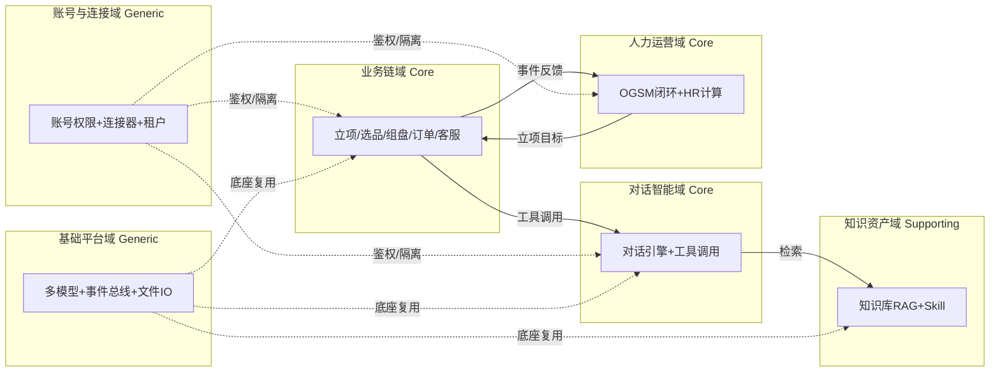

### 2.2 领域关系映射

#### 2.2.1 限界上下文清单

每个业务域对应一个限界上下文（Bounded Context），明确该域内"业务实体的标准定义"：

| 限界上下文 | 对应业务域 | 域类型 | 覆盖的核心业务实体 | 上下文边界（属于本域 vs 不属于） |
| --- | --- | --- | --- | --- |
| BC-Chain | 业务链域 | 核心域 | ChainProject / Assortment / Order / CustomerServiceTicket | 属于：立项/选品/组盘/订单/客服；不属于：OGSM 目标分解（归 BC-HR）、对话意图（归 BC-Conversation） |
| BC-Conversation | 对话智能域 | 核心域 | ConversationSession / ConversationMessage / ToolCall / Intent | 属于：会话/消息/工具调用/意图；不属于：业务计算结果（归 BC-Chain）、知识切片（归 BC-Knowledge） |
| BC-Knowledge | 知识资产域 | 支撑域 | KnowledgeDoc / KnowledgeChunk / Skill | 属于：文档/切片/技能；不属于：LLM 生成内容（归 BC-Conversation） |
| BC-HR | 人力运营域 | 核心域 | OgsmItem / OgsmTask / HrEmployee / PayrollCalc | 属于：OGSM/RACI/激励/试点/员工/薪酬；不属于：订单（归 BC-Chain） |
| BC-Account | 账号与连接域 | 通用域 | AccountUser / Role / Permission / Connector / Tenant | 属于：用户/角色/权限/连接器/租户；不属于：业务逻辑（归各业务域） |
| BC-Platform | 基础平台域 | 通用域 | LLMAdapter / ModuleMessage / FileAsset | 属于：多模型适配/事件总线/文件；不属于：业务语义（归各业务域） |

**域类型说明**：

| 域类型 | 含义 | 投入策略 |
| --- | --- | --- |
| 核心域（Core） | 业务护城河，差异化竞争力所在 | 投入最多资源自研 |
| 支撑域（Supporting） | 必要但非差异化 | 可自研可外采 |
| 通用域（Generic） | 通用能力（如用户中心、消息中心） | 优先复用 / 外采 |

#### 2.2.2 上下文映射（Context Mapping）

| 关系编号 | 上游上下文 | 下游上下文 | 关系模式 | 同步方式 | 选择理由 |
| --- | --- | --- | --- | --- | --- |
| C-01 | BC-Chain | BC-Conversation | Customer/Supplier | 进程内事件 + 函数调用 | 业务链作为 Supplier 提供选品/组盘/订单/客服工具，对话引擎作为 Customer 按节奏消费工具结果 |
| C-02 | 外部邮箱服务（SMTP/IMAP） | BC-Account | ACL 防腐层 | 同步 API + 适配器 | 外部邮箱模型（MIME/文件夹）不污染本域，经 EmailAdapter 适配为内部 Connector 模型 |
| C-03 | BC-HR | BC-Account | Shared Kernel | 共享 DTO / SDK | 用户/组织/租户内核（User/Tenant/Org）被 OGSM 与账号权限共同依赖，必须一致 |
| C-04 | 外部 LLM 服务（OpenAI/DeepSeek 等） | BC-Conversation | Conformist | 同步 HTTPS（流式） | 无议价能力的强势上游，对话引擎直接遵循对方 API/模型规范，复用 llm-platform 适配 |
| C-05 | BC-Chain | BC-HR / BC-Conversation | Published Language | moduleBus 事件（标准协议） | 业务链以标准事件（订单完结/客服完结）对外暴露，OGSM 仪表盘与对话引擎共同消费 |

**关系模式说明**：

| 关系模式 | 适用场景 |
| --- | --- |
| Customer/Supplier | 上下游强协作，下游能影响上游迭代节奏（如：订单 → 支付） |
| Conformist | 顺从者，下游完全遵循上游模型（如：对接微信开放平台） |
| ACL（Anticorruption Layer） | 在本域和外部域之间建一层适配，外部模型变化不影响本域（对接外部强势平台时必用） |
| Shared Kernel | 共享内核，多个上下文共享一小块代码 / 模型；维护成本高，慎用 |
| Published Language | 上游以标准协议（事件 / Schema）对外暴露，多下游消费 |
| Open Host Service | 上游提供标准 API 接口，类似 Published Language 但通过 RPC |

#### 2.2.3 跨域协作原则

| 原则编号 | 原则 |
| --- | --- |
| P-01 | 核心域 → 支撑域 / 通用域：禁止反向依赖（核心域不依赖支撑域的内部模型） |
| P-02 | 核心域之间：禁止直接耦合，必须通过事件 / API 解耦（BC-Chain ↔ BC-HR 经 C-05 事件） |
| P-03 | 对接外部不可控系统：必须建 ACL 防腐层，禁止把外部模型贯穿到本域（邮箱 C-02、LLM C-04） |

### 2.3 详细业务架构

#### 2.3.1 用例图

**用例图清单**：

| 编号 | 用例图标题 | 涉及业务域 | 源文件位置 |
| --- | --- | --- | --- |
| UC-01 | 业务链闭环编排 | 业务链域 | docs/uml/uc-chain.puml |
| UC-02 | 对话式工作流 | 对话智能域 | docs/uml/uc-conversation.puml |
| UC-03 | 企业知识库与 Skill | 知识资产域 | docs/uml/uc-knowledge.puml |
| UC-04 | OGSM 管理闭环 | 人力运营域 | docs/uml/uc-ogsm.puml |
| UC-05 | 账号权限与连接器 | 账号与连接域 | docs/uml/uc-account.puml |

#### 2.3.2 业务流程图

**关键流程清单**（核心业务覆盖度 ≥ 80%）：

| 流程编号 | 流程名 | 起点 | 终点 | 涉及业务域 | 源文件位置 |
| --- | --- | --- | --- | --- | --- |
| BF-01 | 立项→组盘→订单 主链路 | 运营创建业务链项目 | 订单落库 + 反馈 OGSM | 业务链域 / 人力运营域 | docs/uml/bf-chain.puml |
| BF-02 | 对话驱动组盘 | 一线输入对话指令 | 组盘草稿生成并提交 | 对话智能域 / 业务链域 / 知识资产域 | docs/uml/bf-conv-assort.puml |
| BF-03 | 客服问答/工单 | 消费者咨询触达 | 工单创建/转人工 | 业务链域（客服）/ 对话智能域 | docs/uml/bf-cs.puml |
| BF-04 | OGSM 四阶段闭环 | 决策者分解目标 | 完成率仪表盘刷新 | 人力运营域 | docs/uml/bf-ogsm.puml |
| BF-05 | 企业知识库 RAG | HR 上传文档 | 对话可检索引用 | 知识资产域 / 对话智能域 | docs/uml/bf-rag.puml |

### 2.4 业务范围与边界

#### 2.4.1 功能模块清单

按"功能编号 → 子功能编号"两层组织，与 §2.1 业务域对应。

| 编号 | 一级功能名 | 子功能描述 | 对应业务域 | 实现状态 |
| --- | --- | --- | --- | --- |
| F1 | 对话式工作流引擎 | — | 对话智能域 | — |
| F1.1 | — | 单轮对话 + 意图识别 + 工具调用骨架（CALM 式） | 对话智能域 | 完整实现 |
| F1.2 | — | 多轮上下文管理 | 对话智能域 | `[MOCK]` 完整版替换路径：引入对话状态机 + moduleBus 跨轮 tracker |
| F2 | 企业知识库与 Skill | — | 知识资产域 | — |
| F2.1 | — | 文档上传/解析/向量化/检索（RAG） | 知识资产域 | 完整实现（本地向量索引） |
| F2.2 | — | 企业专属 Skill 创建（SOP + 工具绑定） | 知识资产域 | 完整实现（基础版） |
| F3 | OGSM 管理闭环 | — | 人力运营域 | — |
| F3.1 | — | OGSM 四层分解 + 仪表盘（完成率/对齐率） | 人力运营域 | 完整实现 |
| F3.2 | — | RACI + 激励 + 试点灰度 | 人力运营域 | 完整实现 |
| F4 | 业务链编排 | — | 业务链域 | — |
| F4.1 | — | 组盘建模（商品组合/毛利/库存预占） | 业务链域 | 完整实现（骨架） |
| F4.2 | — | 客服建模（问答/工单/转人工） | 业务链域 | 完整实现（骨架） |
| F4.3 | — | 订单/库存/结算（复用 business-chain） | 业务链域 | 完整实现 |
| F5 | 账号权限与连接器 | — | 账号与连接域 | — |
| F5.1 | — | RBAC+ABAC + 委托权限模型 | 账号与连接域 | 完整实现（复用 multi-tenant） |
| F5.2 | — | email 连接器（补类型 + 基础收发） | 账号与连接域 | 完整实现（基础版） |
| F6 | HR 真实计算 | — | 人力运营域 | — |
| F6.1 | — | 薪酬/考勤基础规则引擎 | 人力运营域 | `[简化]` 完整版替换路径：九阳式 5000+ 规则组合引擎 |
| F7 | 多租户与权限引擎 | — | 账号与连接域 / 基础平台域 | — |
| F7.1 | — | 客户端模拟隔离（mtStore 命名空间）+ 审计 100% | 账号与连接域 | 完整实现（MVP）；`[MOCK]` 服务端强隔离归完整版 |

**编号规则**：

| 规则项 | 取值 |
| --- | --- |
| 一级编号 | `F1 / F2 / ...`，与一级业务域一一对应 |
| 子功能编号 | `F1.1 / F1.2 / ...`，互不重叠 |
| Mock / 简化标注 | 必须显式标注 `[MOCK]` 或 `[简化]`，并附"完整版替换路径" |

**In-Scope（本期范围内）**：

| 编号 | 本期必做的事项 |
| --- | --- |
| F1 | 对话式工作流引擎骨架（单轮 + 工具调用） |
| F2 | 企业知识库（上传+检索 RAG）+ 企业专属 Skill 基础版 |
| F3 | OGSM 管理闭环（四阶段 + 仪表盘） |
| F4 | 业务链编排（组盘/客服骨架 + 订单复用） |
| F5 | 账号权限对标钉钉 + email 连接器 |
| F6 | HR 真实计算简化版（薪酬/考勤基础规则） |
| F7 | 多租户客户端模拟隔离 + 关键操作 100% 审计 |
| N1 | 桌面离线可用（Electron 本地优先） |
| N2 | 关键操作审计覆盖率 100%（MVP） |
| N3 | 对话驱动 ≥5 类高频操作（MVP） |

**Out-of-Scope（本期不做）**：

| 编号 | 不做的事项 | 不做的原因 | 未来归属 |
| --- | --- | --- | --- |
| O1 | 真实电商平台 API 对接（G7） | MVP 维持 mock；真实对接需密钥 + 合规，重大投入 | 完整版 |
| O2 | 服务端多租户强隔离（G8） | 当前无后端，引入后端属重大不可逆架构决策，已「经中间确认 U-03 · 2026-07-28 · 用户选方案A」 | 完整版（Node + PostgreSQL 行级/库级隔离） |
| O3 | 采购第三方 SaaS（钉钉/飞书/北森/Dify 等） | 用户诉求 100% 原创，不得采购/复制闭源系统 | 不采购，仅参考理念自研 |
| O4 | HR 完整规则引擎（九阳式 5000+ 规则组合） | MVP 做简化规则，复杂规则迭代成本高 | 完整版 |
| O5 | 企业 Skill 市场 / 跨企业复用 | 需服务端支撑与隔离，MVP 先做单租户创建 | 完整版 |
| O6 | 非电商行业通用 OA 能力 | 聚焦电商行业属性，避免范围蔓延 | 不做 |

### 2.5 质量与柔性可用

#### 2.5.1 服务质量目标

**质量目标 Top 3-5**（按 ISO 25010 选出，排序）：

| 优先级 | 质量目标 | 业务驱动 | 受影响的关键章节 |
| --- | --- | --- | --- |
| Q1 | 离线可用与本地响应（P99 对话首字 ≤3s，列表 P95 ≤300ms） | 桌面本地优先、用户体验阈值 | §3.1 / §4.4 / §5.3 / §8.1 |
| Q2 | 关键操作审计 100% 可追溯（合规） | 等保三级审计要求、合规驱动 | §7.2.4 / §8.2 |
| Q3 | 可维护性（MVP 结构 = 完整版子集，契约预留） | 团队规模、演进纪律 | §3.1 / §3.2 / §4.1 |
| Q4 | 可扩展性（完整版引入后端无需推倒重来） | 业务增长、服务端强隔离 | §4.2 / §5.5 |
| Q5 | 数据隔离合规（多租户越权防护） | 监管 / 合规 | §4.1 / §7.2.5 |

**可验证质量场景**：

| 场景编号 | 关联目标 | 触发源 | 触发条件 | 期望响应 | 度量指标 |
| --- | --- | --- | --- | --- | --- |
| QS-01 | Q1 | 用户对话输入 | 输入到首字呈现 | 本地 LLM/云端流式首字 ≤3s | P99 ≤ 3000ms |
| QS-02 | Q1 | 用户访问列表 | 业务链/OGSM 列表 100 并发本地查询 | 正常返回 | P95 ≤ 300ms；P99 ≤ 1000ms |
| QS-03 | Q3 | 完整版切换 | IndexedDB 结构 → PostgreSQL 表 | 无需重构核心契约 | 改造工期 ≤ 5 人天 |

#### 2.5.2 业务柔性可用策略

**业务功能优先级分层**（§2.4.1 中每个一级功能 F-x 已显式标注层级）：

| 层级 | 含义 | 故障态下的处置方向 | 用户感知 |
| --- | --- | --- | --- |
| L0 核心业务 | 系统的生命线，挂掉等于业务停摆 | 不降级；优先消耗所有资源保障 | 无 / 极轻微 |
| L1 重要业务 | 不影响主链路但用户高频使用 | 限流 + 排队 + 异步化 | 变慢 / 排队提示 |
| L2 辅助业务 | 提升体验但非必要 | 关闭 / 返回兜底数据 | 部分功能不可用 + 友好提示 |
| L3 附加业务 | 长尾 / 数据类 / 统计类 | 直接关闭 + 异步补偿 | 通常无感 |

**业务降级清单**：

| 编号 | 关联功能（F-xx） | 触发条件 | 降级动作 | 用户感知 | 决策类型 |
| --- | --- | --- | --- | --- | --- |
| BD-01 | F1 对话引擎 | 云端 LLM 不可达且无本地模型 | 切换本地 Ollama 模型；仍不可达则返回兜底话术 | 回答变慢或提示稍后重试 | 自动 |
| BD-02 | F4.3 订单/库存（复用 business-chain） | 本地 IndexedDB 写满（>1.8GB） | 提示清理历史数据 + 异步导出归档 | 部分历史查询不可用 + 友好提示 | 自动 |
| BD-03 | F2 知识库检索 | 本地向量索引损坏 | 返回「知识库暂不可用」+ 对话引擎降级为无检索直答 | 回答缺少企业知识引用 | 自动 |

**填写要求**：§2.4.1 全部一级功能均已分层（L0~L3）；L0 数量 ≤ 总功能数的 30%；用户感知列禁止出现"走兜底逻辑 / 熔断"等技术词。

---

## 3. 应用架构

> **本章回答**：系统由哪些模块组成、模块与外部系统怎么集成、每个模块的内部交互链路是什么。
> **本章是系统设计的核心**，章节下占整个文档篇幅的 40%~50%。

### 3.1 应用架构概览

#### 3.1.1 系统上下文

本系统作为**中心节点**，周围辐射出"用户角色 + 外部业务系统 + 上游 / 下游平台"关系。

**系统上下文要素清单**：

| 节点类型 | 节点名 | 与本系统的关系 | 关系语义 |
| --- | --- | --- | --- |
| 角色 | 电商运营 / 客服一线 | 使用 | 对话式工作台操作 |
| 角色 | HR / 中层管理者 | 使用 | OGSM/管理看板操作 |
| 角色 | 决策者（电商业务负责人/HRD） | 使用 | 目标制定 / 看板审阅 |
| 上游平台 | E-01 LLM 服务 | 本系统 → 调用 | 文本生成 / 推理（流式） |
| 上游平台 | E-02 邮箱服务 | 本系统 → 调用 + 接收 | 邮件收发（SMTP/IMAP） |
| 上游平台 | E-03 外部电商平台 API | 本系统 → 调用（完整版） | 商品/订单/库存数据（MVP mock） |
| 外部系统 | E-04 钉钉/飞书连接器（预留） | 本系统 → 推送（完整版预留） | 审计告警通知 |

**系统上下文图（Mermaid）**：

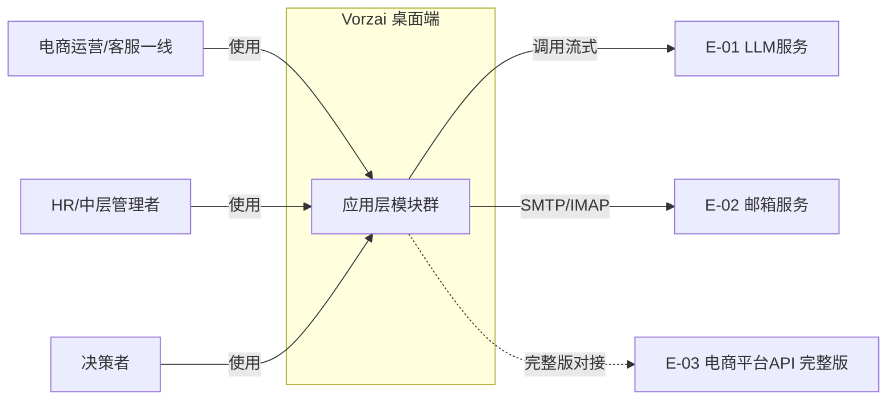

#### 3.1.2 系统模块图

**分层组件清单**：

| 层次 | 内容 | 数据来源 |
| --- | --- | --- |
| 接入层 | 管理端 / 对话式工作台 / OGSM 管理看板 / 个人工作台（均为 Electron 渲染进程视图） | §2.3 用例图角色 |
| 应用层 | M1 业务链编排 / M2 对话式工作流引擎 / M3 企业知识库与技能 / M4 OGSM 管理闭环 / M5 HR 真实计算 / M6 账号权限与连接器 / M7 多租户与权限引擎 | §2.1 / §3.2 |
| 中间件层 | C-01 本地 IndexedDB（持久化）/ C-02 本地向量索引 / C-03 进程内事件总线 moduleBus / C-04 本地文件 IO | §3.1.3 云组件清单 |
| 集成对接层 | E-01 LLM（llm-platform 适配）/ E-02 邮箱（EmailAdapter ACL）/ E-03 电商平台（完整版 ConnectorRegistry） | §3.1.3 外部依赖清单 |

**系统模块分层图（Mermaid）**：

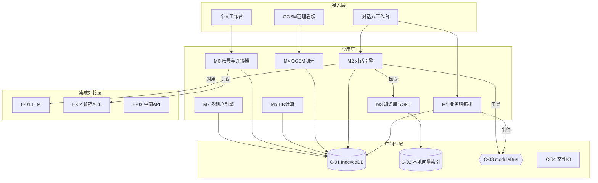

#### 3.1.3 集成架构

##### 外部依赖清单

| ID | 外部系统 | 归属团队 / 供应商 | 类别 | 使用方式 | 集成方式 | 协议 / 版本 | 功能定位（≤ 30 字） | 联系人 |
| --- | --- | --- | --- | --- | --- | --- | --- | --- |
| E-01 | LLM 服务（OpenAI/Anthropic/DeepSeek/通义/智谱/Moonshot/自定义/Ollama） | 各模型厂商 / 本地 | 第三方业务平台 | 消费 | SDK（llm-platform 适配工厂） | HTTPS / SSE 流式 | 文本生成 / 推理 / 意图识别 | @system-architect |
| E-02 | 邮箱服务（SMTP/IMAP/Exchange） | 邮件服务商 | 通知推送 | 消费 + 生产 | SDK + ACL 适配器 | SMTP 25/587 / IMAP 143/993 | email 连接器基础收发 | @system-architect |
| E-03 | 外部电商平台 API（淘宝/抖音/Shopify 等） | 各平台开放平台 | 第三方业务平台 | 消费（完整版） | SDK（ConnectorRegistry） | REST OpenAPI | 商品/订单/库存数据（MVP mock） | @system-architect |
| E-04 | 钉钉 / 飞书（预留） | 阿里 / 字节 | 通知推送 | 生产（完整版预留） | Webhook / OpenAPI | HTTPS | 审计告警通知通道 | @security-architect |

**填写要求**：类别取值（封闭枚举）：身份认证 / 业务协作 / 支付 / 通知推送 / 埋点 / 第三方业务平台 / 监控审计 / 文件导出；使用方式取值：消费（本系统调用对方）/ 生产（对方调用 / 订阅本系统）/ 双向。

##### 云组件 / 基础设施清单

| ID | 组件类别 | 选型 | 部署形态 | 规格量级 | 容量预估 | 提供方 / SLA | 用途 |
| --- | --- | --- | --- | --- | --- | --- | --- |
| C-01 | 本地对象存储 | IndexedDB（浏览器原生） | 桌面进程内 / 离线 | 单库 ≤ 2GB（建议 ≤1.8GB 归档） | 单租户 ≤ 2GB | 用户设备；本地优先 | 业务主数据持久化 |
| C-02 | 本地向量索引 | 自研轻量余弦相似度索引（落 IndexedDB） | 桌面进程内 | 切片 ≤ 5 万条 / 租户 | 知识文档 ≤ 2000 篇 | 自研 | 知识库 RAG 检索 |
| C-03 | 事件总线 | moduleBus（进程内发布-订阅，Vorzai 现有） | 桌面进程内 | 单进程单总线 | 事件吞吐 ≤ 1k/s | 自研 | 模块解耦通信 |
| C-04 | 文件 IO | Electron fs + file-io 模块（Vorzai 现有） | 桌面本地文件系统 | — | 导入导出 ≤ 100MB/次 | 自研 | 文档解析 / 本地备份 |
| C-05 | 关系型数据库（完整版） | PostgreSQL 16.x | 轻量自建后端 Node 服务 | 2C8G × 主从 | 数据量 ≤ 50GB / 初期 | 自建；SLA 99.95% | 服务端强隔离主数据 |
| C-06 | 缓存（完整版） | Redis 7.0 | 主从 / 哨兵 | 2C4G | 内存 ≤ 4GB | 自建 | 会话 / 去重 / 分布式锁 |

**填写要求**：选型必须含**具体产品 + 版本号**；规格量级 / 容量预估必须有数字；MVP 阶段不使用的组件（C-05/C-06）整行删除，仅以「完整版」形态在 §5.4.2 单独成节说明。

##### 组件依赖关系

| 业务模块（§3.2） | 依赖的外部系统（E-xx） | 依赖的云组件（C-xx） | 故障传导风险 |
| --- | --- | --- | --- |
| M1 业务链编排 | E-03（完整版） | C-01, C-03 | E-03 不可达（MVP mock）→ 组盘无真实平台数据，降级本地草稿 |
| M2 对话式工作流引擎 | E-01 | C-01, C-03 | E-01 超时 → 对话降级本地模型 / 兜底话术（BD-01） |
| M3 企业知识库与技能 | E-01（切片摘要可选） | C-01, C-02 | C-02 索引损坏 → 检索降级（BD-03） |
| M4 OGSM 管理闭环 | — | C-01, C-03 | C-01 不可用 → OGSM 看板不可写，提示本地异常 |
| M5 HR 真实计算 | — | C-01 | C-01 不可用 → 薪酬计算失败，提示重试 |
| M6 账号权限与连接器 | E-02 | C-01 | E-02 超时 → 邮件发送排队 / 失败告警 |
| M7 多租户与权限引擎 | — | C-01 | C-01 不可用 → 全模块鉴权失败，应用进入只读异常态 |

#### 3.1.4 工程结构

- 明确项目的物理组织方式
- 公共模块（`common`）与业务服务的依赖方向必须清晰：**业务服务依赖 common，禁止反向**

```
vorzai-ecommerce/           # Electron + React + TS 桌面工程根目录
├── electron/               # 主进程：窗口 / IPC / 自动更新 / CSP
│   ├── main.js
│   ├── preload.js
│   └── updater.js
├── src/
│   ├── modules/           # 业务模块（与 §3.2 M1~M7 对应）
│   │   ├── business-chain/   # M1 业务链编排（选品/组盘/订单/客服）
│   │   ├── conversation/     # M2 对话式工作流引擎
│   │   ├── knowledge/       # M3 企业知识库与技能
│   │   ├── ogsm/           # M4 OGSM 管理闭环
│   │   ├── hr-calc/        # M5 HR 真实计算
│   │   ├── account/         # M6 账号权限与连接器
│   │   └── multi-tenant/   # M7 多租户与权限引擎（复用 + 扩展）
│   ├── common/            # 公共模块：DTO / VO / Enum / Exception / Constants
│   ├── api/              # moduleBus（C-03）/ llmAdapter（E-01 适配）
│   ├── store/            # Zustand 全局 + 各模块状态（落 IndexedDB）
│   ├── views/           # 接入层视图（对话工作台 / OGSM 看板 / 个人工作台）
│   ├── components/       # 跨页面通用组件
│   ├── types/           # TS 类型定义（与后端 DTO/VO 对齐）
│   ├── file-io/         # C-04 文件 IO（C-05 完整版备份）
│   └── utils/          # storage（IndexedDB 封装）/ 工具函数
└── package.json
```

#### 3.1.5 技术选型（版本约束）

| 技术分类 | 选型 | 版本 | 备注 / 选型理由（为什么选 A 不选 B） |
| --- | --- | --- | --- |
| 桌面框架 | Electron | 28.3.0 | 复用现有 Vorzai 底座，离线可用；为什么选 Electron 不选 Tauri：现有代码库已基于 Electron + contextIsolation 安全模型，迁 Tauri 需重写 IPC 层，违背"MVP 结构=完整版子集"纪律 |
| 前端框架 | React + TypeScript | React 18.3.1 / TypeScript 5.4.5 | 复用现有；为什么选 React 不选 Vue：现有代码库与组件库均为 React 生态，切换成本高且无收益 |
| 状态管理 | Zustand | 4.5.2 | 轻量、TS 友好、无样板；为什么选 Zustand 不选 Redux：Redux 样板代码多，桌面本地应用无需重中间件 |
| 构建工具 | Vite | 5.3.1 | 复用现有 dev/build 链路；为什么选 Vite 不选 Webpack：启动/热更新快，现有工程已锁定 |
| 本地持久化 | IndexedDB（浏览器原生） | 原生（无版本号） | 离线优先、无需后端；为什么选 IndexedDB 不选 SQLite：现有底座已用 IndexedDB（material_digest X1 已证无 SQLite 运行实例），引入 SQLite 需 Native 模块破坏纯 Web 栈 |
| 本地向量检索 | 自研轻量余弦相似度索引 | 自研 v0.1 | 落 IndexedDB，避免引入重型向量库；为什么选自研不选 pgvector/Milvus：MVP 无后端，pgvector 需 PostgreSQL，Milvus 过重，违背离线优先 |
| 多模型适配 | LLMAdapterFactory（复用 llm-platform） | 现有（无版本号） | 7 平台 + 本地 Ollama；为什么选自研工厂不选 LangChain：避免供应商锁定，100% 原创约束 |
| 对话编排范式 | 自研 CALM 式（LLM 理解 + 确定性 Flow） | 自研 v0.1 | 业务链需确定性可靠；为什么选 CALM 式不选 Dify Workflow 节点式：电商组盘/客服需可靠执行业务流，CALM 分离 LLM 与业务逻辑更可控 |
| 认证方案 | RBAC+ABAC 引擎 + HMAC 租户上下文（复用 multi-tenant） | 现有（无版本号） | 对标钉钉；为什么选自研不选 Keycloak：Keycloak 为服务端 SaaS 形态，违背 MVP 无后端 + 100% 原创 |
| 图表库 | 轻量 SVG / React 组件 | 自研 + d3-shape 可选 | 仪表盘用 React 组件；为什么选轻量不选 ECharts 全量：桌面包体敏感，按需引入 |
| 后端（完整版） | Node.js + PostgreSQL | Node 20.11.0 / PostgreSQL 16.2 | 经 U-03 方案A 裁决；为什么选 Node 不选 Go/Java：与现有 TS 技术栈统一，团队无需多语言 |

**填写要求**：必须有版本号；选型理由用一句话说明（**为什么选 A 不选 B**），避免"团队习惯"这种空话。

### 3.2 模块详细设计

> **核心方法论**：模块详细设计要画的是**业务逻辑在角色和系统之间流动的过程**，不是接口实现细节。
> **组织原则**：先在 §3.2.1 / §3.2.2 给出跨模块共享约束与模块清单；§3.2.3 给出"单模块设计模板（五段式）"；之后**每个模块在 §3.2.M{N} 下独立成节**，按模板展开。

#### 3.2.1 模块公共约束（Common）

**通信方式约束**：

| 约束项 | 取值 |
| --- | --- |
| 接口路径风格 | 进程内模块方法 + moduleBus 事件（MVP 无 REST 暴露；完整版 Node 服务提供 `/api/v1/...` RESTful） |
| 协议 | MVP：进程内函数调用 / moduleBus 发布订阅；完整版：HTTP / gRPC |
| 数据格式 | JSON（进程内对象经结构化序列化） |
| 字符编码 | UTF-8 |

**通用基础结构**：

| 基类 / 结构 | 用途 | 包路径 |
| --- | --- | --- |
| `BaseRequest` | 多态请求对象基类 | `@common/dto` |
| `BaseResponse` | 多态响应对象基类 | `@common/dto` |
| `PageRequest` | 分页请求 | `@common/dto` |
| `PageResponse` | 分页响应（泛型承载于 data 字段） | `@common/dto` |
| `Result` | 统一返回结构（含 code / msg / data / traceId） | `@common/dto` |

#### 3.2.2 模块清单与编号规则

**模块清单**：

| 编号 | 模块名 | 业务域（§2.1） | 模块负责人 | 关联子领域 |
| --- | --- | --- | --- | --- |
| M1 | 业务链编排 | 业务链域 | @高见远 / system-architect | 立项/选品/组盘/订单/客服 |
| M2 | 对话式工作流引擎 | 对话智能域 | @高见远 / system-architect | 会话/意图/工具调用 |
| M3 | 企业知识库与技能 | 知识资产域 | @高见远 / system-architect | 文档/切片/技能 |
| M4 | OGSM 管理闭环 | 人力运营域 | @高见远 / system-architect | 目标/RACI/激励/试点 |
| M5 | HR 真实计算 | 人力运营域 | @高见远 / system-architect | 薪酬/考勤基础规则 |
| M6 | 账号权限与连接器 | 账号与连接域 | @高见远 / system-architect | 用户/角色/权限/邮箱 |
| M7 | 多租户与权限引擎 | 账号与连接域 / 基础平台域 | @高见远 / system-architect | 租户/隔离/审计 |

**编号规则**：
- 模块编号 `M{N}` 全局唯一，与 §2.1 业务域名一致；
- 每个模块在 §3.2 下独立成节，编号 `§3.2.M{N}`；
- 节内五段式编号 `§3.2.M{N}.1` ~ `§3.2.M{N}.5`，顺序与 §3.2.3 模板一致。

#### 3.2.3 单模块设计模板（五段式）

> ⚠️ **本节性质说明（写给使用本模版的人 / AI）**
>
> 本节定义"每个模块在 §3.2.M{N} 下五段各应该**产出什么内容**、**遵守什么格式**"。**本节本身不是任何模块的内容**。

##### §3.2.M{N}.1 模块概述
**该段产出物**：在 §3.2.M{N}.1 下输出本模块的"业务定位三要素"——位置 / 角色 / 内外部系统。

##### §3.2.M{N}.2 接口清单
**该段产出物**：在 §3.2.M{N}.2 下输出本模块**对外暴露的真实业务接口列表**（按子领域分组）。

##### §3.2.M{N}.3 关键结构定义（DTO）
**该段产出物**：在 §3.2.M{N}.3 下输出本模块**特有的 DTO/VO 代码** + **关键字段定义表**。

##### §3.2.M{N}.4 模块逻辑时序图
**该段产出物**：在 §3.2.M{N}.4 下输出本模块**特有的时序图清单** + **关键时序图本体**（Mermaid 文本格式）。

##### §3.2.M{N}.5 关键流程逻辑
**该段产出物**：在 §3.2.M{N}.5 下输出本模块**含 Mock / 含状态机 / 跨多步异步**的关键流程伪代码 + 状态机迁移表。

#### 3.2.M1 业务链编排

##### §3.2.M1.1 模块概述
业务链编排模块覆盖「立项(OGSM)→选品→组盘→订单→客服」主链路中"选品/组盘/订单/客服"四个环节的建模与贯通，业务逻辑在电商运营、客服一线、管理者之间流动，同时涉及对话引擎（工具调用）、知识库（检索引用）、OGSM（立项目标与反馈）、多租户引擎（隔离与审计）等内外部系统的数据流动。订单/库存/结算复用现有 business-chain，组盘与客服为本期新建骨架。

##### §3.2.M1.2 接口清单

| 子领域 | 方法 | 路径（完整版 REST / MVP 进程内） | 用途（≤ 20 字） | 请求 DTO | 响应 VO | 幂等 |
| --- | --- | --- | --- | --- | --- | --- |
| 组盘 | POST | `/api/v1/assortments` | 创建组盘草稿 | `AssortmentCreateRequest` | `AssortmentVO` | 是（biz_req_no） |
| 组盘 | GET | `/api/v1/assortments/{id}` | 查询组盘详情 | — | `AssortmentDetailVO` | 天然 |
| 组盘 | PUT | `/api/v1/assortments/{id}/status` | 提交/预占库存 | `AssortmentStatusUpdateRequest` | `AssortmentVO` | 是（id+version） |
| 客服 | POST | `/api/v1/cs/tickets` | 创建客服工单 | `TicketCreateRequest` | `TicketVO` | 是（biz_req_no） |
| 客服 | POST | `/api/v1/cs/tickets/{id}/transfer` | 转人工 | `TicketTransferRequest` | `Result` | 是（X-Idempotency-Key） |
| 订单 | GET | `/api/v1/orders/{id}` | 查询订单（复用） | — | `OrderVO` | 天然 |
| 立项 | POST | `/api/v1/chain-projects` | 创建业务链项目 | `ChainProjectCreateRequest` | `ChainProjectVO` | 是（biz_req_no） |

##### §3.2.M1.3 关键结构定义（DTO）

```typescript
// 组盘创建请求
export class AssortmentCreateRequest {
  // ===== 必填字段 =====
  tenantId: string;          // 租户 ID（MVP：mtStore 命名空间）
  projectId: string;         // 所属业务链项目
  name: string;             // 组盘名称
  // ===== 业务字段 =====
  items: AssortItemInput[];  // 商品组合
  marginRate: number;        // 目标毛利率（0~1）
  preoccupyStock: boolean;   // 是否库存预占
  // ===== 扩展字段 =====
  bizReqNo: string;         // 幂等键（业务请求号）
}

// 组盘详情视图
export class AssortmentDetailVO {
  id: string;
  name: string;
  status: 'DRAFT' | 'SUBMITTED' | 'STOCK_LOCKED' | 'CANCELLED';
  totalSku: number;
  estMargin: number;        // 预估毛利
  createdBy: string;
  createdTime: string;       // ISO8601 UTC
}
```

**关键字段定义表**：

| DTO / VO 名 | 字段名 | 类型 | 必填 | 业务含义 | 约束 / 默认值 |
| --- | --- | --- | --- | --- | --- |
| `AssortmentCreateRequest` | `tenantId` | string | 是 | 租户 ID | MVP 注入 mtStore 命名空间 |
| `AssortmentCreateRequest` | `marginRate` | number | 是 | 目标毛利率 | 取值区间 (0, 1]，不含 0 |
| `AssortmentCreateRequest` | `bizReqNo` | string | 是 | 幂等键 | UUID，调用方生成 |
| `AssortmentDetailVO` | `status` | string | 是 | 组盘状态 | DRAFT/SUBMITTED/STOCK_LOCKED/CANCELLED |

##### §3.2.M1.4 模块逻辑时序图

**时序图清单**：

| 编号 | 标题 | 场景类别 | 是否包含异常分支 |
| --- | --- | --- | --- |
| SQ-01 | 业务链编排 - 组盘创建与库存预占 | 核心实体的创建 / 配置 | 是 |
| SQ-02 | 业务链编排 - 客服工单转人工 | 核心动作的执行 / 触发 | 是 |

**SQ-01 组盘创建与库存预占（Mermaid）**：

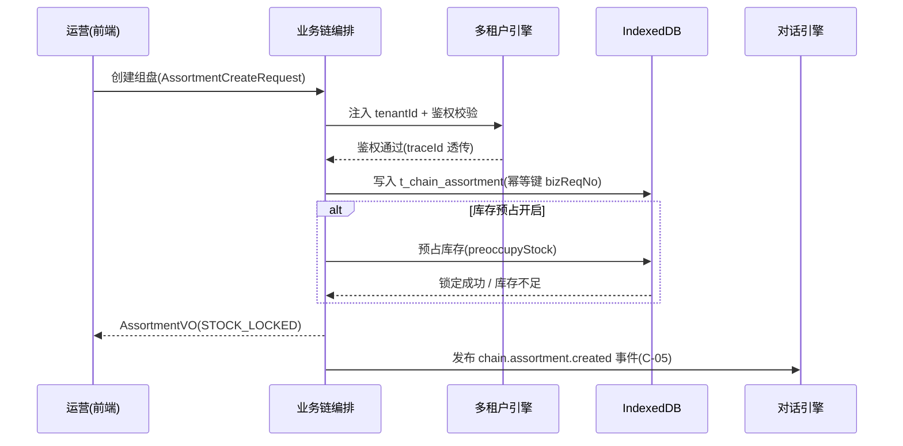

##### §3.2.M1.5 关键流程逻辑

**组盘状态机迁移表**：

| 起始状态 | 触发事件 | 终止状态 | 触发条件 / 校验 | 副作用 |
| --- | --- | --- | --- | --- |
| DRAFT | submit | SUBMITTED | 商品组合非空 + 毛利率合规 | 发布 chain.assortment.submitted |
| SUBMITTED | lockStock | STOCK_LOCKED | 库存充足校验通过 | 预占库存写入 |
| STOCK_LOCKED | cancel | CANCELLED | 运营主动取消 | 释放预占库存 |
| SUBMITTED | cancel | CANCELLED | 运营主动取消 | 无 |

#### 3.2.M2 对话式工作流引擎

##### §3.2.M2.1 模块概述
对话式工作流引擎模块覆盖「单轮对话 + 意图识别 + 工具调用骨架（CALM 式）」业务流程，业务逻辑在运营/客服一线与对话引擎之间流动，同时涉及 LLM 服务（E-01，Conformist 顺从模型）、知识库（检索引用）、业务链（工具执行）、多租户引擎（隔离与审计）等内外部系统的数据流动。本期为骨架（单轮 + 工具调用），多轮上下文为完整版替换路径。

##### §3.2.M2.2 接口清单

| 子领域 | 方法 | 路径（完整版 REST / MVP 进程内） | 用途（≤ 20 字） | 请求 DTO | 响应 VO | 幂等 |
| --- | --- | --- | --- | --- | --- | --- |
| 会话 | POST | `/api/v1/conversations` | 创建会话 | `ConversationCreateRequest` | `ConversationSessionVO` | 是（biz_req_no） |
| 会话 | POST | `/api/v1/conversations/{id}/messages` | 发送消息+工具调用 | `MessageSendRequest` | `MessageVO` | 是（biz_req_no） |
| 工具 | POST | `/api/v1/tools/{toolName}/invoke` | 调用业务链工具 | `ToolInvokeRequest` | `ToolResultVO` | 是（X-Idempotency-Key） |
| 意图 | GET | `/api/v1/intents` | 查询可识别意图 | — | `IntentListVO` | 天然 |

##### §3.2.M2.3 关键结构定义（DTO）

```typescript
// 消息发送请求
export class MessageSendRequest {
  tenantId: string;
  sessionId: string;
  content: string;          // 用户原文
  bizReqNo: string;         // 幂等键
}

// 工具调用结果
export class ToolResultVO {
  toolName: string;         // 如 chain.createAssortment
  success: boolean;
  payload: { [key: string]: unknown };
  traceId: string;          // 链路追踪
}
```

**关键字段定义表**：

| DTO / VO 名 | 字段名 | 类型 | 必填 | 业务含义 | 约束 / 默认值 |
| --- | --- | --- | --- | --- | --- |
| `MessageSendRequest` | `content` | string | 是 | 用户对话原文 | 长度 ≤ 4000 |
| `MessageSendRequest` | `bizReqNo` | string | 是 | 幂等键 | UUID |
| `ToolResultVO` | `traceId` | string | 是 | 链路 ID | W3C TraceContext |

##### §3.2.M2.4 模块逻辑时序图

**时序图清单**：

| 编号 | 标题 | 场景类别 | 是否包含异常分支 |
| --- | --- | --- | --- |
| SQ-01 | 对话引擎 - 对话驱动组盘 | 核心动作的执行 / 触发 | 是 |
| SQ-02 | 对话引擎 - LLM 不可达降级 | 异常 / 补偿 / 回滚 | 是 |

**SQ-01 对话驱动组盘（Mermaid）**：

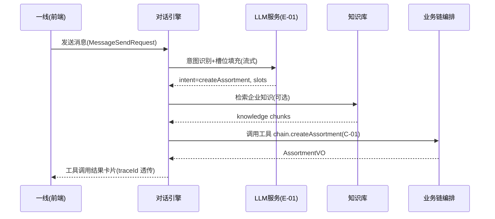

##### §3.2.M2.5 关键流程逻辑

```
触发：用户发送对话消息(MessageSendRequest)

Step 1: 意图识别（同步，调用 E-01）
  ├── 校验：tenantId 注入（M7）+ bizReqNo 幂等查重 → 重复则返回首次结果
  ├── 校验：content 非空 + 敏感词过滤
  └── 状态变更：会话追加用户消息

Step 2: 工具路由（同步）
  ├── 若 intent 命中业务链工具 → 经 C-01 调用 M1（见 M1 SQ-01）
  ├── 若需知识检索 → 经 C-05 事件通知 M3 检索
  └── [MOCK] 多轮上下文（完整版替换点：引入跨轮 tracker store，MVP 仅单轮）

Step 3: 响应合成（同步，调用 E-01 流式）
  ├── 失败分支：E-01 超时/不可达 → 降级本地 Ollama（BD-01）；仍失败 → 兜底话术 + 友好提示
  └── 状态变更：会话追加助手消息（含 traceId）
```

#### 3.2.M3 企业知识库与技能

##### §3.2.M3.1 模块概述
企业知识库与技能模块覆盖「文档上传 + 解析 + 向量化 + 检索（RAG）」与「企业专属 Skill 创建（SOP + 工具绑定）」业务流程，业务逻辑在 HR/运营/管理者与知识库之间流动，同时涉及文件 IO（C-04 解析）、本地向量索引（C-02 检索）、对话引擎（检索消费）、多租户引擎（隔离）等内外部系统。

##### §3.2.M3.2 接口清单

| 子领域 | 方法 | 路径 | 用途（≤ 20 字） | 请求 DTO | 响应 VO | 幂等 |
| --- | --- | --- | --- | --- | --- | --- |
| 知识文档 | POST | `/api/v1/knowledge/docs` | 上传并解析文档 | `KnowledgeDocUploadRequest` | `KnowledgeDocVO` | 是（biz_req_no） |
| 知识文档 | POST | `/api/v1/knowledge/retrieve` | 检索相关切片 | `RetrieveRequest` | `RetrieveResultVO` | 天然（查询） |
| 技能 | POST | `/api/v1/skills` | 创建企业 Skill | `SkillCreateRequest` | `SkillVO` | 是（biz_req_no） |

##### §3.2.M3.3 关键结构定义（DTO）

```typescript
export class KnowledgeDocUploadRequest {
  tenantId: string;
  title: string;
  fileName: string;        // 原始文件名
  format: 'pdf' | 'csv' | 'txt' | 'md' | 'docx' | 'xlsx';
  bizReqNo: string;
}

export class RetrieveRequest {
  tenantId: string;
  query: string;           // 检索问句
  topK: number;            // 返回切片数，默认 5
}
```

**关键字段定义表**：

| DTO / VO 名 | 字段名 | 类型 | 必填 | 业务含义 | 约束 / 默认值 |
| --- | --- | --- | --- | --- | --- |
| `KnowledgeDocUploadRequest` | `format` | string | 是 | 文档格式 | pdf/csv/txt/md/docx/xlsx |
| `RetrieveRequest` | `topK` | number | 否 | 返回切片数 | 默认 5，上限 20 |

##### §3.2.M3.4 模块逻辑时序图

**时序图清单**：

| 编号 | 标题 | 场景类别 | 是否包含异常分支 |
| --- | --- | --- | --- |
| SQ-01 | 知识库 - 文档上传与向量化 | 核心实体的创建 / 配置 | 是 |
| SQ-02 | 知识库 - 检索召回 | 核心动作的执行 | 是 |

**SQ-01 文档上传与向量化（Mermaid）**：

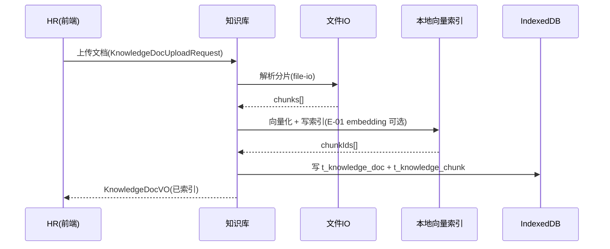

##### §3.2.M3.5 关键流程逻辑
无复杂状态机/事务/跨多步异步，本段省略（上传为单事务写 + 索引构建，失败整体回滚至草稿态）。

#### 3.2.M4 OGSM 管理闭环

##### §3.2.M4.1 模块概述
OGSM 管理闭环模块覆盖「目标四层分解（O/S/G/M）+ 仪表盘（完成率/对齐率）+ RACI + 激励 + 试点灰度」业务流程，业务逻辑在决策者、HR/中层管理者之间流动，复用现有 hrms 模块并扩展真实计算，同时涉及业务链（立项目标来源与反馈）、多租户引擎（隔离与审计）等内外部系统。

##### §3.2.M4.2 接口清单

| 子领域 | 方法 | 路径 | 用途（≤ 20 字） | 请求 DTO | 响应 VO | 幂等 |
| --- | --- | --- | --- | --- | --- | --- |
| 目标 | POST | `/api/v1/ogsm/items` | 创建 OGSM 目标项 | `OgsmItemCreateRequest` | `OgsmItemVO` | 是（biz_req_no） |
| 目标 | GET | `/api/v1/ogsm/tree` | 查询目标树 | — | `OgsmTreeVO` | 天然 |
| 仪表盘 | GET | `/api/v1/ogsm/dashboard` | 完成率/对齐率 | — | `OgsmDashboardVO` | 天然 |
| RACI | PUT | `/api/v1/ogsm/items/{id}/raci` | 设置责任人矩阵 | `RaciUpdateRequest` | `Result` | 是（id+version） |

##### §3.2.M4.3 关键结构定义（DTO）

```typescript
export class OgsmItemCreateRequest {
  tenantId: string;
  level: 'O' | 'S' | 'G' | 'M';   // 四层
  parentId?: string;                // 上层目标
  title: string;
  targetValue: number;
  baselineValue: number;
  bizReqNo: string;
}

export class OgsmDashboardVO {
  total: number;
  completionRate: number;     // 完成率 0~1
  alignmentRate: number;     // 对齐率 0~1
}
```

**关键字段定义表**：

| DTO / VO 名 | 字段名 | 类型 | 必填 | 业务含义 | 约束 / 默认值 |
| --- | --- | --- | --- | --- | --- |
| `OgsmItemCreateRequest` | `level` | string | 是 | 目标层 | O/S/G/M |
| `OgsmDashboardVO` | `completionRate` | number | 是 | 完成率 | 0~1 |

##### §3.2.M4.4 模块逻辑时序图

**时序图清单**：

| 编号 | 标题 | 场景类别 | 是否包含异常分支 |
| --- | --- | --- | --- |
| SQ-01 | OGSM - 目标分解与仪表盘刷新 | 核心实体的创建 / 配置 | 是 |
| SQ-02 | OGSM - 业务链反馈回流 | 核心动作的执行 / 触发 | 是 |

**SQ-01 目标分解与仪表盘刷新（Mermaid）**：

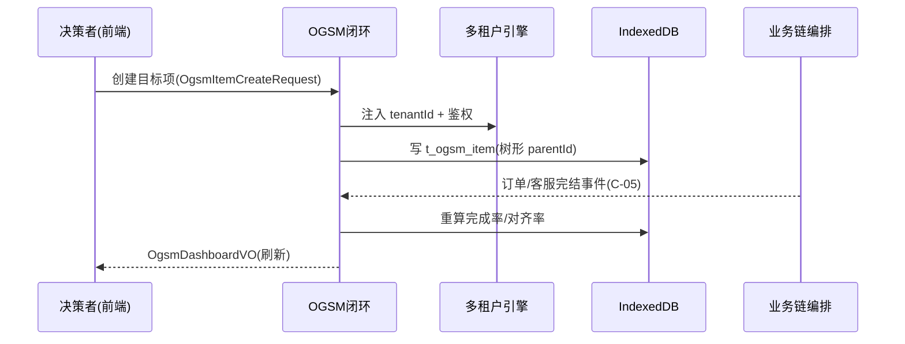

##### §3.2.M4.5 关键流程逻辑
无复杂状态机/事务/跨多步异步，本段省略（目标项为单事务写 + 仪表盘派生计算，无分布式事务）。

#### 3.2.M5 HR 真实计算

##### §3.2.M5.1 模块概述
HR 真实计算模块覆盖「薪酬 / 考勤基础规则引擎」业务流程（MVP 简化版），业务逻辑在 HR/中层管理者之间流动，复用现有 hr-system 内存模型并落地真实计算，同时涉及 OGSM（绩效关联）、多租户引擎（隔离与审计）等内外部系统。完整版（九阳式 5000+ 规则组合）为替换路径。

##### §3.2.M5.2 接口清单

| 子领域 | 方法 | 路径 | 用途（≤ 20 字） | 请求 DTO | 响应 VO | 幂等 |
| --- | --- | --- | --- | --- | --- | --- |
| 薪酬 | POST | `/api/v1/hr/payroll/calc` | 计算单人薪酬 | `PayrollCalcRequest` | `PayrollCalcVO` | 是（biz_req_no） |
| 考勤 | POST | `/api/v1/hr/attendance/calc` | 计算考勤 | `AttendanceCalcRequest` | `AttendanceVO` | 是（biz_req_no） |

##### §3.2.M5.3 关键结构定义（DTO）

```typescript
export class PayrollCalcRequest {
  tenantId: string;
  employeeId: string;
  baseSalary: number;        // 基本工资
  performanceScore: number;  // 绩效分（关联 OGSM）
  bizReqNo: string;
}

export class PayrollCalcVO {
  employeeId: string;
  baseSalary: number;
  performanceBonus: number;  // 绩效奖金
  total: number;              // 应发合计
}
```

**关键字段定义表**：

| DTO / VO 名 | 字段名 | 类型 | 必填 | 业务含义 | 约束 / 默认值 |
| --- | --- | --- | --- | --- | --- |
| `PayrollCalcRequest` | `performanceScore` | number | 是 | 绩效分 | 0~100 |
| `PayrollCalcVO` | `total` | number | 是 | 应发合计 | DECIMAL(12,2) |

##### §3.2.M5.4 模块逻辑时序图

**时序图清单**：

| 编号 | 标题 | 场景类别 | 是否包含异常分支 |
| --- | --- | --- | --- |
| SQ-01 | HR - 薪酬计算（简化规则） | 核心动作的执行 | 是 |

**SQ-01 薪酬计算（Mermaid）**：

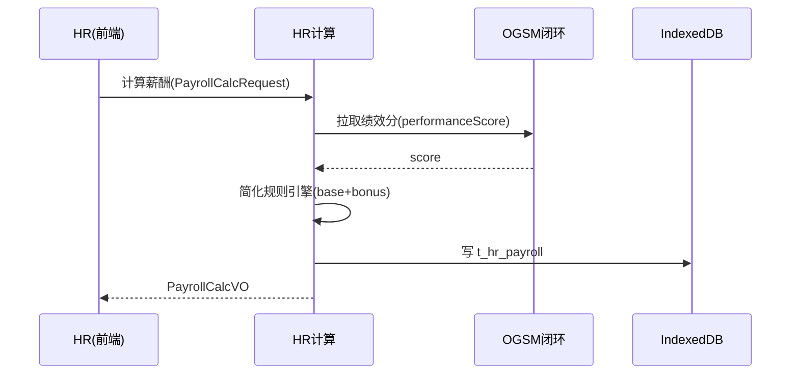

##### §3.2.M5.5 关键流程逻辑

```
触发：HR 发起薪酬计算(PayrollCalcRequest)

Step 1: 绩效关联（同步）
  ├── 校验：employeeId 存在 + tenantId 注入
  └── 拉取 OGSM 绩效分 → [简化] MVP 直接取 performanceScore 字段

Step 2: 规则计算（同步，简化引擎）
  ├── performanceBonus = baseSalary × (performanceScore/100) × 系数0.2
  ├── total = baseSalary + performanceBonus
  └── [MOCK] 复杂规则（完整版替换点：九阳式 5000+ 规则组合，含税算/补贴/扣款）

Step 3: 落库
  └── 写 t_hr_payroll（含 traceId + tenantId），返回 PayrollCalcVO
```

#### 3.2.M6 账号权限与连接器

##### §3.2.M6.1 模块概述
账号权限与连接器模块覆盖「RBAC+ABAC 权限引擎 + 委托权限模型 + email 连接器（补类型 + 基础收发）」业务流程，业务逻辑在全员/管理员之间流动，复用现有 multi-tenant 权限引擎并扩展，同时涉及邮箱服务（E-02，ACL 适配）、多租户引擎（隔离）等内外部系统。对标钉钉账号体系。

##### §3.2.M6.2 接口清单

| 子领域 | 方法 | 路径 | 用途（≤ 20 字） | 请求 DTO | 响应 VO | 幂等 |
| --- | --- | --- | --- | --- | --- | --- |
| 账号 | POST | `/api/v1/account/users` | 创建用户 | `UserCreateRequest` | `AccountUserVO` | 是（biz_req_no） |
| 权限 | PUT | `/api/v1/account/roles/{id}/perms` | 配置角色权限 | `RolePermUpdateRequest` | `Result` | 是（id+version） |
| 连接器 | POST | `/api/v1/connectors/email/send` | 发送邮件（E-02） | `EmailSendRequest` | `Result` | 是（X-Idempotency-Key） |

##### §3.2.M6.3 关键结构定义（DTO）

```typescript
export class EmailSendRequest {
  tenantId: string;
  to: string;              // 收件人（经 ACL 适配为内部模型）
  subject: string;
  body: string;
  bizReqNo: string;         // 幂等键（邮件去重）
}

export class AccountUserVO {
  id: string;
  name: string;
  role: 'admin' | 'operator' | 'analyst' | 'viewer';
  email: string;
}
```

**关键字段定义表**：

| DTO / VO 名 | 字段名 | 类型 | 必填 | 业务含义 | 约束 / 默认值 |
| --- | --- | --- | --- | --- | --- |
| `EmailSendRequest` | `to` | string | 是 | 收件人 | 邮箱格式校验 |
| `AccountUserVO` | `role` | string | 是 | 角色 | admin/operator/analyst/viewer |

##### §3.2.M6.4 模块逻辑时序图

**时序图清单**：

| 编号 | 标题 | 场景类别 | 是否包含异常分支 |
| --- | --- | --- | --- |
| SQ-01 | 账号 - 邮件发送（ACL 适配） | 核心动作的执行 | 是 |
| SQ-02 | 账号 - 权限校验拦截 | 核心动作的执行 / 触发 | 是 |

**SQ-01 邮件发送（Mermaid）**：

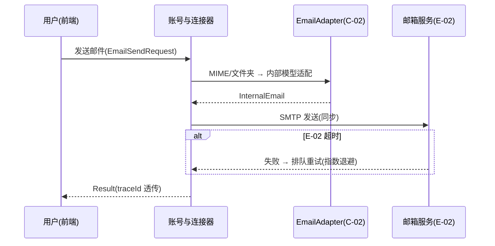

##### §3.2.M6.5 关键流程逻辑
无复杂状态机/事务/跨多步异步，本段省略（邮件发送为单调用 + 失败退避重试，无跨服务事务）。

#### 3.2.M7 多租户与权限引擎

##### §3.2.M7.1 模块概述
多租户与权限引擎模块覆盖「客户端模拟隔离（mtStore 命名空间）+ RBAC+ABAC 鉴权 + 审计 100% 留痕」业务流程，被全部业务模块依赖（鉴权 + 隔离），复用现有 multi-tenant 引擎（RBAC+ABAC / HMAC 租户上下文 / mtStore / auditLogger）并明确 MVP 边界。完整版服务端强隔离（Node + PostgreSQL 行级/库级）为替换路径（经 U-03 方案A）。

##### §3.2.M7.2 接口清单

| 子领域 | 方法 | 路径 | 用途（≤ 20 字） | 请求 DTO | 响应 VO | 幂等 |
| --- | --- | --- | --- | --- | --- | --- |
| 鉴权 | POST | `/api/v1/tenant/auth/verify` | 校验 token + 权限 | `AuthVerifyRequest` | `AuthVerifyVO` | 天然 |
| 隔离 | GET | `/api/v1/tenant/storage/{key}` | 按命名空间读 | — | `StorageVO` | 天然 |
| 审计 | POST | `/api/v1/tenant/audit` | 写审计日志 | `AuditWriteRequest` | `Result` | 是（biz_req_no） |

##### §3.2.M7.3 关键结构定义（DTO）

```typescript
export class AuthVerifyRequest {
  tenantId: string;
  userId: string;
  token: string;            // HMAC 签名的 JWT 模拟
  resource: string;         // 如 hrms:employee:read
  action: string;           // read/write
}

export class AuditWriteRequest {
  tenantId: string;
  userId: string;
  action: string;           // 操作类型
  resource: string;
  result: 'success' | 'denied' | 'error';
  bizReqNo: string;
}
```

**关键字段定义表**：

| DTO / VO 名 | 字段名 | 类型 | 必填 | 业务含义 | 约束 / 默认值 |
| --- | --- | --- | --- | --- | --- |
| `AuthVerifyRequest` | `resource` | string | 是 | 资源标识 | RBAC 通配符匹配 |
| `AuditWriteRequest` | `result` | string | 是 | 操作结果 | success/denied/error |

##### §3.2.M7.4 模块逻辑时序图

**时序图清单**：

| 编号 | 标题 | 场景类别 | 是否包含异常分支 |
| --- | --- | --- | --- |
| SQ-01 | 多租户 - 鉴权 + 隔离读 | 核心动作的执行 | 是 |
| SQ-02 | 多租户 - 审计留痕 | 核心动作的执行 / 触发 | 是 |

**SQ-01 鉴权 + 隔离读（Mermaid）**：

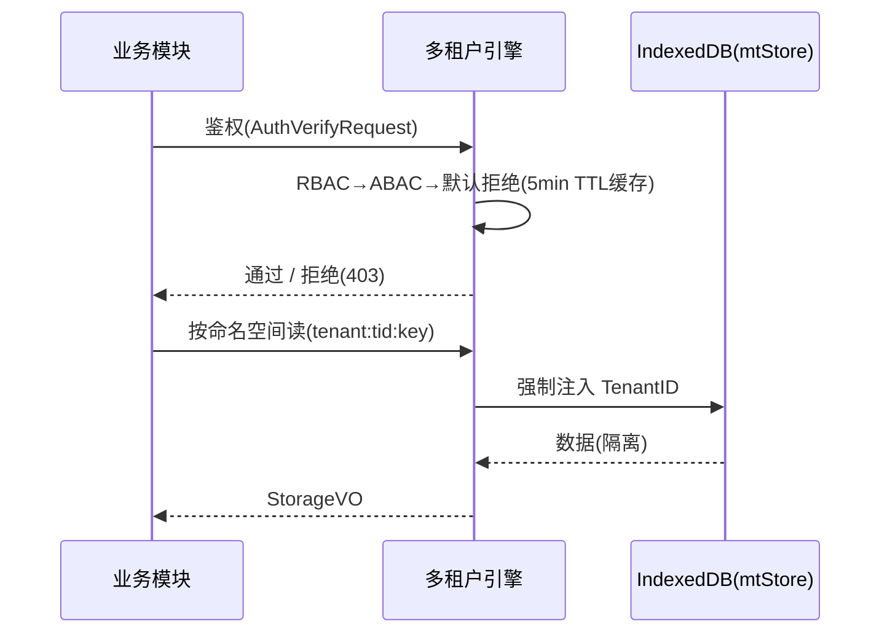

##### §3.2.M7.5 关键流程逻辑

```
触发：任意业务模块发起受保护操作

Step 1: 鉴权（同步）
  ├── 顺序：super_admin → RBAC(通配符匹配) → ABAC(条件全满足) → 默认拒绝
  ├── 失败分支：无权限 → 返回 C403001（无权限）
  └── 缓存：权限结果 5 分钟 TTL（避免每请求重算）

Step 2: 隔离读（同步，MVP mtStore）
  ├── 强制注入 TenantID → keyPath = tenant:${tid}:${key}
  └── [MOCK] 服务端强隔离（完整版替换点：PostgreSQL 行级 tenant_id WHERE 强制，经 U-03 方案A）

Step 3: 审计（同步，100% 覆盖）
  └── 写 t_audit_log（含 traceId + tenantId + userId + action + result）
```

### 3.3 核心业务对象清单

#### 3.3.1 对象定义

| 编号 | 对象名（代码类名） | 对象类型 | 包路径 | 模块归属 | 被哪些模块复用 | 实例化策略 | 序列化约定 | 持久化策略 |
| --- | --- | --- | --- | --- | --- | --- | --- | --- |
| O-01 | `ChainProject` | 聚合根 | `@modules/business-chain` | M1 | M2 / M4 | 工厂方法 | JSON | 落 t_chain_project |
| O-02 | `Assortment` | 聚合根 | `@modules/business-chain` | M1 | M2 | Builder | JSON | 落 t_chain_assortment |
| O-03 | `Order` | 聚合根 | `@modules/business-chain` | M1 | M4 | Builder | JSON | 落 t_order |
| O-04 | `ConversationSession` | 聚合根 | `@modules/conversation` | M2 | M3 | new | JSON | 落 t_conversation_session |
| O-05 | `KnowledgeDoc` | 聚合根 | `@modules/knowledge` | M3 | M2 | new | JSON | 落 t_knowledge_doc |
| O-06 | `OgsmItem` | 聚合根 | `@modules/ogsm` | M4 | M5 | 工厂方法 | JSON | 落 t_ogsm_item |
| O-07 | `PayrollCalc` | 值对象 | `@modules/hr-calc` | M5 | M4 | new（不可变） | JSON | 落 t_hr_payroll |
| O-08 | `AccountUser` | 聚合根 | `@modules/account` | M6 | M7 | new | JSON | 落 t_account_user |
| O-09 | `Tenant` | 聚合根 | `@modules/multi-tenant` | M7 | 全部 | new | JSON | 落 t_tenant |
| O-10 | `AuditEntry` | 值对象 | `@modules/multi-tenant` | M7 | 全部 | new | JSON | 落 t_audit_log |
| O-11 | `EmailAdapter` | 防腐层 ACL | `@modules/account/acl` | M6 | M6 | new + 适配 | — | 不落表，瞬时转换 |
| O-12 | `LLMConformistClient` | 防腐层 ACL | `@api/llmAdapter` | M2 | M2 | new | — | 不落表，瞬时转换 |

**对象类型说明**：

| 类型 | 含义 |
| --- | --- |
| 聚合根（Aggregate Root） | 业务一致性边界；外部引用必须通过聚合根 ID；跨聚合修改禁止 |
| 实体（Entity） | 有标识、生命周期独立，但归属某个聚合根 |
| 值对象（Value Object） | 无标识、不可变；如金额、时间段、地址 |
| 共享 DTO | 跨模块传输用的数据结构，无业务行为 |
| 共享枚举 | 跨模块的状态值 / 类型值 |
| 防腐层 ACL | 对接外部系统时的转换层（与 §2.2 上下文映射中的 ACL 关系编号呼应） |

#### 3.3.2 命名漂移登记表

| 业务实体（§2） | 代码类名（§3.3.1） | 数据表名（§4.2） | 漂移原因 |
| --- | --- | --- | --- |
| 用户 | `AccountUser` | `t_account_user` | 避免与外部 SSO `User` 冲突 |
| 订单 | `Order` | `t_order` | 业务单一实体在代码层复用 business-chain 模型 |
| 租户 | `Tenant` | `t_tenant` | 客户端模拟隔离表现为 mtStore 命名空间，非独立服务实体 |

**填写要求**：仅命名不一致或一对多映射时登记；命名一致的对象无需出现在本表。

### 3.4 跨模块公共能力

**公共能力清单**：

| 公共能力 | 简述 | 提供方（SDK / 切面 / Bean） | 被哪些模块复用 | 接入方式 |
| --- | --- | --- | --- | --- |
| 登录鉴权 | Token 校验 / 角色 / 权限标签 | `JwtAuthInterceptor`（M7 HMAC 租户上下文） | 全部业务模块 | 模块调用前拦截 + M7 鉴权 |
| 审计日志 | 关键操作留痕（合规 100%） | `AuditLogAspect`（M7 auditLogger） | 全部业务模块 | 切面，注解 `@AuditLog` |
| 事件总线 | 模块解耦发布-订阅 | `ModuleBus`（C-03 进程内） | M1 / M2 / M4 | SDK 调用 `bus.send/bus.on` |
| 多模型适配 | LLM 调用工厂 | `LLMAdapterFactory`（E-01） | M2 / M3 | SDK 调用 `factory.callModel` |
| 文件解析 | 多格式导入导出 | `file-io`（C-04） | M3 / M7 | SDK 调用 `fileParser.parse` |

**填写要求**："提供方"必须是**具体的类名 / SDK 名 / Bean 名**；"接入方式"必须说明研发**怎么用**。

### 3.5 接口契约

> 本系统对外暴露的接口（含同步 API、异步消息、跨服务 RPC）在错误码、幂等、限流、超时上的全局约定。**所有接口必须遵守，不在每个接口下重复声明**。

#### 3.5.1 全局错误码体系

**错误码格式**：

| 项 | 取值 |
| --- | --- |
| 错误码格式 | `1 位类别 + 2 位模块 + 3 位序号`，如：`A010001`（类别 A + 模块 01 + 序号 0001） |
| 分段规则 | 1 位类别（A=业务错误 / B=系统错误 / C=客户端错误）+ 2 位模块（01=业务链 / 02=对话 / 03=知识 / 04=OGSM / 05=HR / 06=账号）+ 3 位序号 |
| 类别取值 | `A` = 业务错误（HTTP 200，业务语义失败）/ `B` = 系统错误（进程异常）/ `C` = 客户端错误（参数 / 鉴权 / 限流） |

**错误响应统一结构**：

```json
{
  "code": "A010001",
  "msg": "组盘名称已存在",
  "msgI18n": { "zh-CN": "组盘名称已存在", "en-US": "Assortment name already exists" },
  "data": null,
  "traceId": "4bf92f3577b34da6a3ce929d0e0e4736",
  "timestamp": "2026-07-28T10:00:00.000Z"
}
```

**错误码注册表**（每模块至少登记关键业务错误，以及全局通用错误）：

| 错误码 | HTTP 状态 | 所属模块 | 含义 | 重试建议 | 用户文案 |
| --- | --- | --- | --- | --- | --- |
| A010001 | 200 | M1 业务链 | 组盘名称已存在 | 不重试 | 该组盘名称已存在，请更换 |
| A010002 | 200 | M1 业务链 | 库存预占不足 | 不重试 | 当前库存不足，无法预占 |
| A020001 | 200 | M2 对话 | 意图无法识别 | 不重试 | 暂未理解您的指令，请换种说法 |
| A030001 | 200 | M3 知识 | 文档解析失败 | 可重试 | 文档解析失败，请检查格式后重试 |
| A040001 | 200 | M4 OGSM | 目标层级非法 | 不重试 | 目标层级必须为 O/S/G/M |
| A050001 | 200 | M5 HR | 绩效分越界 | 不重试 | 绩效分须在 0~100 |
| A060001 | 200 | M6 账号 | 邮箱格式非法 | 不重试 | 邮箱地址格式不正确 |
| B999001 | 200(业务包装) | 全局 | 系统内部错误 | 可重试 | 系统繁忙，请稍后再试 |
| C400001 | 200(业务包装) | 全局 | 参数校验失败 | 不重试 | 请求参数错误 |
| C401001 | 200(业务包装) | 全局 | 未登录 / token 失效 | 不重试 | 请重新登录 |
| C403001 | 200(业务包装) | 全局 | 无权限 | 不重试 | 无权访问该资源 |
| C429001 | 200(业务包装) | 全局 | 触发限流 | 退避后重试 | 操作太频繁，请稍后再试 |

#### 3.5.2 幂等性约定

| 接口类型 | 是否要求幂等 | 幂等键来源（建议） |
| --- | --- | --- |
| 写入类（POST 创建） | 涉及业务状态变更 / 邮件发送 / 通知的，**必须幂等** | Header `X-Idempotency-Key`（UUID，调用方生成）或 `bizReqNo` 业务请求号 |
| 更新类（PUT / PATCH） | 必须幂等 | 资源 ID + 版本号（乐观锁） |
| 删除类（DELETE） | 天然幂等 | — |
| 查询类（GET） | 天然幂等 | — |
| 资金 / 扣款 / 发券 / 外呼 / 通知类 | **强制幂等** | 业务侧请求号（biz_req_no） |

**幂等设计需考虑的问题**（由各模块在详细设计阶段回答）：

| 问题维度 | 设计要点 |
| --- | --- |
| 幂等键的生命周期 | MVP：IndexedDB 去重表保留 7 天；完整版：Redis 去重键 TTL 24h |
| 重复请求的语义 | 首次成功后，重复请求返回首次相同响应（幂等命中） |
| 执行中态的处理 | 首个请求未返回时，第二个同键请求返回「处理中」(B999 包装) |
| 失败请求的可重试性 | 失败后允许同一幂等键重试（MVP IndexedDB 删除该键记录） |
| 存储兜底 | MVP：IndexedDB `idem:{bizReqNo}` 唯一索引；完整版：DB 唯一索引作为最终防线 |

#### 3.5.3 限流约定

| 维度 | 默认值 | 触发动作 | 调整方式 |
| --- | --- | --- | --- |
| 全局本地操作 QPS | 1000（本地进程内估算） | 返回 C429001 | 配置中心（本地 JSON） |
| 单租户本地操作 QPS | 200 | 返回 C429001 | 配置中心 |
| 单用户 LLM 调用 QPS | 5（受 E-01 配额约束） | 返回 C429001 + 排队 | 业务配置 |
| 重保接口（登录 / 邮件发送） | 单用户 5 次/分钟 | 锁定 15 分钟 | 业务配置中心 |

**降级策略**：

| 策略项 | 内容 |
| --- | --- |
| 前端退避 | 触发限流后，前端必须按 `Retry-After` Header 退避重试 |
| 后端记录 | 后端写入类接口同时记录到审计队列 |
| 红线联动 | 限流红线值与 §5.5 容量水位线"红线"一致 |

#### 3.5.4 默认超时与重试基线

| 调用类型 | 默认超时 | 默认重试 | 重试条件 |
| --- | --- | --- | --- |
| 进程内模块调用（MVP） | 3s | 0 次 | — |
| 外部 E-01 LLM（流式） | 60s（AbortController） | 1 次（退化本地模型） | 仅网络错误 / 超时 |
| 外部 E-02 邮箱 | 10s | 2 次（指数退避 1s / 2s） | 仅网络错误 / 5xx |
| 完整版 Node 服务 API | 3s | 0 次 | — |
| 完整版 MQ 消费 | 30s | 16 次（指数退避，封顶 1h） | 业务异常进死信 |

**填写要求**：超时值禁止"无限"；所有重试必须有上限；重试不能产生副作用（依赖 §3.5.2 幂等性）。

#### 3.5.5 路由设计规范

**API 路由规范**：

| 维度 | 取值 |
| --- | --- |
| 风格 | RESTful（资源化 URL）；MVP 进程内映射为模块方法，完整版暴露 `/api/v1/...` |
| 版本控制 | `/api/v1/...`（路径版本） |
| 命名 | 小写 + 中划线（kebab-case） |
| 资源命名 | 名词复数（`/api/v1/assortments`） |
| 子资源 | `/api/v1/assortments/{id}/items` |
| 动作类接口 | `/api/v1/{resource}/{id}/{action}`（POST） |

**前端页面路由清单**：

| 路径 | 页面 / 功能 | 入口角色（§2.3） | 鉴权要求 | 关联模块（§3.2.M{N}） |
| --- | --- | --- | --- | --- |
| `/workbench` | 对话式工作台 | 运营 / 客服一线 | 已登录 + 角色 operator | M2 / M1 |
| `/ogsm` | OGSM 管理看板 | 决策者 / HR | 已登录 + 角色 admin/analyst | M4 |
| `/hr` | HR 计算与员工 | HR / 管理者 | 已登录 + 角色 admin | M5 / M4 |
| `/account` | 账号权限与连接器 | 管理员 | 已登录 + 角色 admin | M6 / M7 |
| `/assortment/:id` | 组盘详情 | 运营 | 已登录 + 数据权限校验 | M1 |
| `/knowledge` | 企业知识库 | 全员 | 已登录 | M3 |

**前端路由约定**：

| 维度 | 取值 |
| --- | --- |
| 路由模式 | Hash（Electron 渲染进程，避免服务端路由依赖） |
| 命名风格 | 小写 + 中划线（kebab-case） |
| 动态参数 | `/{resource}/:id` |
| 鉴权方式 | 路由元信息 `meta.requireAuth = true` + `meta.roles = [...]` |
| 嵌套路由 | 列表页 → 详情页 → 子模块页 |

**填写要求**：每条路径必须显式标注鉴权要求；动态参数必须示例化为 `:id`；与 §3.2.M{N} 模块的关联必须填实。

---

## 4. 数据库设计（MVP：本地 IndexedDB；完整版：PostgreSQL）

> **本章回答**：每个模块的状态用什么表存、表怎么建、数据怎么清理、缓存怎么用。
> **核心方法论**：**数据库按业务域组织，业务域与第 2 章 / 第 3 章保持一致**。MVP 语境下，"表"映射为 IndexedDB 对象仓库（object store），并以 PostgreSQL DDL 作为权威结构契约（完整版切换路径）；每张表的字段结构、索引、命名遵循 §4.1 全局约定。

### 4.1 全局数据约定

| 约定项 | 取值 | 说明 |
| --- | --- | --- |
| 命名规范（表名） | `t_{entity}` 业务主表；`t_{entity}_ext` 扩展表；`t_{a}_{b}_rel` N:N 关联表 | 全项目统一前缀 `t_`；MVP 对应 IndexedDB object store 同名 |
| 命名规范（字段名） | 小写 + 下划线（snake_case） | 禁止驼峰 |
| 主键类型 | MVP：UUID（IndexedDB keyPath）；完整版：BIGINT AUTO_INCREMENT / Snowflake | 全项目统一，禁止混用 |
| 字符集 / 排序 | `utf8mb4 / utf8mb4_unicode_ci` | 支持 emoji 与多语言 |
| 时间字段类型 | `DATETIME(3)` UTC 存储 | 统一精度（毫秒）；统一时区（UTC） |
| 软删除字段 | `deleted TINYINT(1) DEFAULT 0` | 全项目统一 |
| 审计字段 | `created_by / created_time / updated_by / updated_time` | 命名锁定 |
| 隔离字段（多租户） | MVP：`tenant_id` 表现为 mtStore 命名空间（`tenant:${tid}:${key}`，强制注入）；完整版：`tenant_id BIGINT NOT NULL`（行级隔离） | 多租户必备；查询语句强制带入 |
| 业务唯一标识 | `biz_id VARCHAR(100)` | 与外部系统对齐时使用 |
| 状态枚举 | `VARCHAR` 字符串 | 二选一并锁定；DDL 注释列出全部取值 |
| 金额字段 | `DECIMAL(N, M)` | 禁止用 `FLOAT / DOUBLE` |
| 手机号存储 | `phone VARCHAR(20)` 不带国家码前缀 | 调用三方时动态拼接 |

**填写要求**：每条约定必须给出**具体取值**，不允许"两种都行"；一旦锁定，所有表必须遵循；后续若变更，需在 §0 修订记录中明示。

### 4.2 单表设计

> 每张表严格按下面 5 段编写。MVP 形态以 IndexedDB 对象仓库实现，结构契约以下方 PostgreSQL DDL 为权威（完整版直接落地）。

#### 4.2.1 库表元信息（t_chain_project）

| 字段 | 取值 |
| --- | --- |
| 数据库类型 | MVP：IndexedDB（对象仓库 `chain_project`，keyPath=id）；完整版：PostgreSQL 16 |
| 库名 | MVP：本地 IndexedDB 命名空间 `tenant:${tid}`；完整版：`vorzai` |
| 表名 | `t_chain_project` |
| 业务含义（≤ 50 字） | 业务链立项项目，承载选品/组盘/订单/客服主链路的范围与目标 |
| 模块归属（§3.2） | M1 业务链编排 |
| 对应核心对象（§3.3） | O-01 `ChainProject` |

#### 4.2.2 库表结构定义（t_chain_project）

| 列名 | 数据类型 | 可为空 | 约束 | 默认值 | 备注 |
| --- | --- | --- | --- | --- | --- |
| id | VARCHAR(36) | NOT NULL | PRIMARY KEY | — | UUID |
| tenant_id | VARCHAR(36) | NOT NULL | — | — | 多租户（mtStore 命名空间强制注入） |
| name | VARCHAR(100) | NOT NULL | — | — | 项目名称 |
| scenario | VARCHAR(30) | NOT NULL | — | 'LIVE' | 电商场景：LIVE/CROSS/BTRAD/Traditional |
| biz_id | VARCHAR(100) | NULL | — | NULL | 外部业务唯一标识 |
| status | VARCHAR(30) | NOT NULL | — | 'INIT' | INIT/PROGRESSING/DONE |
| created_by | VARCHAR(64) | NULL | — | NULL | 创建人 |
| created_time | DATETIME(3) | NULL | — | CURRENT_TIMESTAMP | 创建时间 |
| updated_by | VARCHAR(64) | NULL | — | NULL | 更新人 |
| updated_time | DATETIME(3) | NULL | — | CURRENT_TIMESTAMP ON UPDATE | 更新时间 |
| deleted | TINYINT(1) | NOT NULL | — | 0 | 删除标志 |

#### 4.2.3 索引设计（t_chain_project）

| 索引名 | 索引类型 | 字段（含顺序） | 设计目的 | 关联查询场景 |
| --- | --- | --- | --- | --- |
| `PRIMARY` | 主键 | `id` | 唯一标识 | 全部按主键查询 |
| `uk_tenant_biz` | 唯一索引 | `tenant_id, biz_id` | 业务唯一性约束 | 防止重复录入 |
| `idx_tenant_status` | 普通索引 | `tenant_id, status` | 多租户列表查询 | `GET /api/v1/chain-projects?status=` |
| `idx_created_time` | 普通索引 | `created_time` | 时间范围查询 | 按时间倒序列表 |

**填写要求**：索引数量 ≤ 5 条 / 表；联合索引最左前缀；多租户首列隔离字段；禁止冗余索引。

#### 4.2.4 DDL（t_chain_project，完整版 PostgreSQL 权威契约）

```sql
CREATE TABLE `t_chain_project` (
  `id` VARCHAR(36) NOT NULL COMMENT '主键 UUID',
  `tenant_id` VARCHAR(36) NOT NULL COMMENT '租户 ID（行级隔离）',
  `name` VARCHAR(100) NOT NULL COMMENT '项目名称',
  `scenario` VARCHAR(30) NOT NULL DEFAULT 'LIVE' COMMENT '电商场景：LIVE/CROSS/BTRAD/Traditional',
  `biz_id` VARCHAR(100) DEFAULT NULL COMMENT '外部业务唯一标识',
  `status` VARCHAR(30) NOT NULL DEFAULT 'INIT' COMMENT '状态：INIT/PROGRESSING/DONE',
  `created_by` VARCHAR(64) DEFAULT NULL COMMENT '创建人',
  `created_time` DATETIME(3) DEFAULT CURRENT_TIMESTAMP(3) COMMENT '创建时间',
  `updated_by` VARCHAR(64) DEFAULT NULL COMMENT '更新人',
  `updated_time` DATETIME(3) DEFAULT CURRENT_TIMESTAMP(3) ON UPDATE CURRENT_TIMESTAMP(3) COMMENT '更新时间',
  `deleted` TINYINT(1) NOT NULL DEFAULT 0 COMMENT '删除标志（0：存在，1：已删除）',
  PRIMARY KEY (`id`),
  UNIQUE KEY `uk_tenant_biz` (`tenant_id`, `biz_id`) COMMENT '业务唯一性',
  KEY `idx_tenant_status` (`tenant_id`, `status`) COMMENT '多租户列表查询',
  KEY `idx_created_time` (`created_time`) COMMENT '时间范围与排序'
) COMMENT='业务链立项项目';
```

**MVP 等价实现**：IndexedDB object store `chain_project`（keyPath=`id`），写入时由 M7 强制注入 `tenant_id` 命名空间键；列表查询在应用层按 `tenant_id` + `status` 过滤（C-01 索引等价）。

#### 4.2.5 扩展逻辑（t_chain_project 数据清理机制）

| 清理机制 | 适用场景 | 配置 |
| --- | --- | --- |
| 软删 | 业务上"删除"但需可恢复 | 仅置 `deleted = 1`，定期物理清理（≥ 90 天） |
| 归档 | 已完成项目低频访问 | 导出至本地备份文件（C-04） |

#### 4.2.1 库表元信息（t_chain_assortment）

| 字段 | 取值 |
| --- | --- |
| 数据库类型 | MVP：IndexedDB（对象仓库 `chain_assortment`）；完整版：PostgreSQL 16 |
| 库名 | MVP：本地 IndexedDB；完整版：`vorzai` |
| 表名 | `t_chain_assortment` |
| 业务含义（≤ 50 字） | 组盘草稿/正式，商品组合、目标毛利与库存预占 |
| 模块归属（§3.2） | M1 业务链编排 |
| 对应核心对象（§3.3） | O-02 `Assortment` |

#### 4.2.2 库表结构定义（t_chain_assortment）

| 列名 | 数据类型 | 可为空 | 约束 | 默认值 | 备注 |
| --- | --- | --- | --- | --- | --- |
| id | VARCHAR(36) | NOT NULL | PRIMARY KEY | — | UUID |
| tenant_id | VARCHAR(36) | NOT NULL | — | — | 多租户 |
| project_id | VARCHAR(36) | NOT NULL | — | — | 所属业务链项目 |
| name | VARCHAR(100) | NOT NULL | — | — | 组盘名称 |
| items | JSON | NOT NULL | — | — | 商品组合明细 |
| margin_rate | DECIMAL(5,4) | NOT NULL | — | 0 | 目标毛利率 0~1 |
| est_margin | DECIMAL(12,2) | NULL | — | NULL | 预估毛利 |
| preoccupy_stock | TINYINT(1) | NOT NULL | — | 0 | 是否库存预占 |
| status | VARCHAR(30) | NOT NULL | — | 'DRAFT' | DRAFT/SUBMITTED/STOCK_LOCKED/CANCELLED |
| biz_req_no | VARCHAR(64) | NOT NULL | UNIQUE | — | 幂等键 |
| created_by | VARCHAR(64) | NULL | — | NULL | 创建人 |
| created_time | DATETIME(3) | NULL | — | CURRENT_TIMESTAMP | 创建时间 |
| updated_by | VARCHAR(64) | NULL | — | NULL | 更新人 |
| updated_time | DATETIME(3) | NULL | — | CURRENT_TIMESTAMP ON UPDATE | 更新时间 |
| deleted | TINYINT(1) | NOT NULL | — | 0 | 删除标志 |

#### 4.2.3 索引设计（t_chain_assortment）

| 索引名 | 索引类型 | 字段（含顺序） | 设计目的 | 关联查询场景 |
| --- | --- | --- | --- | --- |
| `PRIMARY` | 主键 | `id` | 唯一标识 | 主键查询 |
| `uk_tenant_bizreq` | 唯一索引 | `tenant_id, biz_req_no` | 幂等去重 | 重复提交拦截 |
| `idx_tenant_status` | 普通索引 | `tenant_id, status` | 多租户列表 | 组盘列表 |
| `idx_tenant_project` | 普通索引 | `tenant_id, project_id` | 项目下组盘 | 项目维度查询 |

#### 4.2.4 DDL（t_chain_assortment）

```sql
CREATE TABLE `t_chain_assortment` (
  `id` VARCHAR(36) NOT NULL COMMENT '主键 UUID',
  `tenant_id` VARCHAR(36) NOT NULL COMMENT '租户 ID',
  `project_id` VARCHAR(36) NOT NULL COMMENT '所属业务链项目',
  `name` VARCHAR(100) NOT NULL COMMENT '组盘名称',
  `items` JSON NOT NULL COMMENT '商品组合明细',
  `margin_rate` DECIMAL(5,4) NOT NULL DEFAULT 0 COMMENT '目标毛利率 0~1',
  `est_margin` DECIMAL(12,2) DEFAULT NULL COMMENT '预估毛利',
  `preoccupy_stock` TINYINT(1) NOT NULL DEFAULT 0 COMMENT '是否库存预占',
  `status` VARCHAR(30) NOT NULL DEFAULT 'DRAFT' COMMENT '状态：DRAFT/SUBMITTED/STOCK_LOCKED/CANCELLED',
  `biz_req_no` VARCHAR(64) NOT NULL COMMENT '幂等键',
  `created_by` VARCHAR(64) DEFAULT NULL,
  `created_time` DATETIME(3) DEFAULT CURRENT_TIMESTAMP(3),
  `updated_by` VARCHAR(64) DEFAULT NULL,
  `updated_time` DATETIME(3) DEFAULT CURRENT_TIMESTAMP(3) ON UPDATE CURRENT_TIMESTAMP(3),
  `deleted` TINYINT(1) NOT NULL DEFAULT 0,
  PRIMARY KEY (`id`),
  UNIQUE KEY `uk_tenant_bizreq` (`tenant_id`, `biz_req_no`),
  KEY `idx_tenant_status` (`tenant_id`, `status`),
  KEY `idx_tenant_project` (`tenant_id`, `project_id`)
) COMMENT='业务链组盘';
```

**MVP 等价实现**：IndexedDB object store `chain_assortment`（keyPath=id），`biz_req_no` 唯一索引由应用层去重（写入前查 `idem:{bizReqNo}`）。

#### 4.2.5 扩展逻辑（t_chain_assortment）

| 清理机制 | 适用场景 | 配置 |
| --- | --- | --- |
| 软删 | 业务删除可恢复 | 置 `deleted = 1`，≥ 90 天物理清理 |
| 物理删除 | 草稿态超时（DRAFT > 30 天） | 定时任务触发（本地调度） |

#### 4.2.1 库表元信息（t_conversation_session）

| 字段 | 取值 |
| --- | --- |
| 数据库类型 | MVP：IndexedDB（对象仓库 `conversation_session`）；完整版：PostgreSQL 16 |
| 库名 | MVP：本地 IndexedDB；完整版：`vorzai` |
| 表名 | `t_conversation_session` |
| 业务含义（≤ 50 字） | 用户与对话引擎的一次连贯会话，承载消息与工具调用 |
| 模块归属（§3.2） | M2 对话式工作流引擎 |
| 对应核心对象（§3.3） | O-04 `ConversationSession` |

#### 4.2.2 库表结构定义（t_conversation_session）

| 列名 | 数据类型 | 可为空 | 约束 | 默认值 | 备注 |
| --- | --- | --- | --- | --- | --- |
| id | VARCHAR(36) | NOT NULL | PRIMARY KEY | — | UUID |
| tenant_id | VARCHAR(36) | NOT NULL | — | — | 多租户 |
| user_id | VARCHAR(36) | NOT NULL | — | — | 会话所属用户 |
| title | VARCHAR(200) | NULL | — | NULL | 会话标题 |
| last_intent | VARCHAR(50) | NULL | — | NULL | 最近意图 |
| status | VARCHAR(30) | NOT NULL | — | 'ACTIVE' | ACTIVE/CLOSED |
| created_by | VARCHAR(64) | NULL | — | NULL | 创建人 |
| created_time | DATETIME(3) | NULL | — | CURRENT_TIMESTAMP | 创建时间 |
| updated_by | VARCHAR(64) | NULL | — | NULL | 更新人 |
| updated_time | DATETIME(3) | NULL | — | CURRENT_TIMESTAMP ON UPDATE | 更新时间 |
| deleted | TINYINT(1) | NOT NULL | — | 0 | 删除标志 |

#### 4.2.3 索引设计（t_conversation_session）

| 索引名 | 索引类型 | 字段（含顺序） | 设计目的 | 关联查询场景 |
| --- | --- | --- | --- | --- |
| `PRIMARY` | 主键 | `id` | 唯一标识 | 主键查询 |
| `idx_tenant_user` | 普通索引 | `tenant_id, user_id` | 用户会话列表 | 个人工作台 |
| `idx_tenant_status` | 普通索引 | `tenant_id, status` | 活跃会话 | 会话列表 |

#### 4.2.4 DDL（t_conversation_session）

```sql
CREATE TABLE `t_conversation_session` (
  `id` VARCHAR(36) NOT NULL COMMENT '主键 UUID',
  `tenant_id` VARCHAR(36) NOT NULL COMMENT '租户 ID',
  `user_id` VARCHAR(36) NOT NULL COMMENT '所属用户',
  `title` VARCHAR(200) DEFAULT NULL COMMENT '会话标题',
  `last_intent` VARCHAR(50) DEFAULT NULL COMMENT '最近意图',
  `status` VARCHAR(30) NOT NULL DEFAULT 'ACTIVE' COMMENT '状态：ACTIVE/CLOSED',
  `created_by` VARCHAR(64) DEFAULT NULL,
  `created_time` DATETIME(3) DEFAULT CURRENT_TIMESTAMP(3),
  `updated_by` VARCHAR(64) DEFAULT NULL,
  `updated_time` DATETIME(3) DEFAULT CURRENT_TIMESTAMP(3) ON UPDATE CURRENT_TIMESTAMP(3),
  `deleted` TINYINT(1) NOT NULL DEFAULT 0,
  PRIMARY KEY (`id`),
  KEY `idx_tenant_user` (`tenant_id`, `user_id`),
  KEY `idx_tenant_status` (`tenant_id`, `status`)
) COMMENT='对话会话';
```

**MVP 等价实现**：IndexedDB object store `conversation_session`（keyPath=id）。

#### 4.2.5 扩展逻辑（t_conversation_session）

| 清理机制 | 适用场景 | 配置 |
| --- | --- | --- |
| 软删 | 关闭会话可恢复 | 置 `deleted = 1` |
| 物理删除 | 会话 > 180 天未活跃 | 本地定时归档导出 |

#### 4.2.1 库表元信息（t_knowledge_doc）

| 字段 | 取值 |
| --- | --- |
| 数据库类型 | MVP：IndexedDB（对象仓库 `knowledge_doc` + `knowledge_chunk`）；完整版：PostgreSQL 16 |
| 库名 | MVP：本地 IndexedDB；完整版：`vorzai` |
| 表名 | `t_knowledge_doc` |
| 业务含义（≤ 50 字） | 企业上传的可检索知识文档及其切片索引 |
| 模块归属（§3.2） | M3 企业知识库与技能 |
| 对应核心对象（§3.3） | O-05 `KnowledgeDoc` |

#### 4.2.2 库表结构定义（t_knowledge_doc）

| 列名 | 数据类型 | 可为空 | 约束 | 默认值 | 备注 |
| --- | --- | --- | --- | --- | --- |
| id | VARCHAR(36) | NOT NULL | PRIMARY KEY | — | UUID |
| tenant_id | VARCHAR(36) | NOT NULL | — | — | 多租户 |
| title | VARCHAR(200) | NOT NULL | — | — | 文档标题 |
| format | VARCHAR(10) | NOT NULL | — | 'txt' | pdf/csv/txt/md/docx/xlsx |
| chunk_count | INT | NOT NULL | — | 0 | 切片数 |
| indexed | TINYINT(1) | NOT NULL | — | 0 | 向量化完成标志 |
| status | VARCHAR(30) | NOT NULL | — | 'PARSING' | PARSING/INDEXED/FAILED |
| created_by | VARCHAR(64) | NULL | — | NULL | 创建人 |
| created_time | DATETIME(3) | NULL | — | CURRENT_TIMESTAMP | 创建时间 |
| updated_by | VARCHAR(64) | NULL | — | NULL | 更新人 |
| updated_time | DATETIME(3) | NULL | — | CURRENT_TIMESTAMP ON UPDATE | 更新时间 |
| deleted | TINYINT(1) | NOT NULL | — | 0 | 删除标志 |

#### 4.2.3 索引设计（t_knowledge_doc）

| 索引名 | 索引类型 | 字段（含顺序） | 设计目的 | 关联查询场景 |
| --- | --- | --- | --- | --- |
| `PRIMARY` | 主键 | `id` | 唯一标识 | 主键查询 |
| `idx_tenant_status` | 普通索引 | `tenant_id, status` | 文档列表 | 知识库列表 |
| `ft_title` | 全文索引 | `title` | 标题检索 | 文档名搜索 |

#### 4.2.4 DDL（t_knowledge_doc）

```sql
CREATE TABLE `t_knowledge_doc` (
  `id` VARCHAR(36) NOT NULL COMMENT '主键 UUID',
  `tenant_id` VARCHAR(36) NOT NULL COMMENT '租户 ID',
  `title` VARCHAR(200) NOT NULL COMMENT '文档标题',
  `format` VARCHAR(10) NOT NULL DEFAULT 'txt' COMMENT '文档格式',
  `chunk_count` INT NOT NULL DEFAULT 0 COMMENT '切片数',
  `indexed` TINYINT(1) NOT NULL DEFAULT 0 COMMENT '向量化完成',
  `status` VARCHAR(30) NOT NULL DEFAULT 'PARSING' COMMENT '状态：PARSING/INDEXED/FAILED',
  `created_by` VARCHAR(64) DEFAULT NULL,
  `created_time` DATETIME(3) DEFAULT CURRENT_TIMESTAMP(3),
  `updated_by` VARCHAR(64) DEFAULT NULL,
  `updated_time` DATETIME(3) DEFAULT CURRENT_TIMESTAMP(3) ON UPDATE CURRENT_TIMESTAMP(3),
  `deleted` TINYINT(1) NOT NULL DEFAULT 0,
  PRIMARY KEY (`id`),
  KEY `idx_tenant_status` (`tenant_id`, `status`),
  FULLTEXT KEY `ft_title` (`title`)
) COMMENT='企业知识文档';
```

**MVP 等价实现**：IndexedDB object store `knowledge_doc` + `knowledge_chunk`（chunks 含向量，落 C-02 本地向量索引）。

#### 4.2.5 扩展逻辑（t_knowledge_doc）

| 清理机制 | 适用场景 | 配置 |
| --- | --- | --- |
| 软删 | 文档删除可恢复 | 置 `deleted = 1` |
| 物理删除 | 解析失败文档（FAILED > 7 天） | 定时任务清理 |

#### 4.2.1 库表元信息（t_ogsm_item）

| 字段 | 取值 |
| --- | --- |
| 数据库类型 | MVP：IndexedDB（对象仓库 `ogsm_item`）；完整版：PostgreSQL 16 |
| 库名 | MVP：本地 IndexedDB；完整版：`vorzai` |
| 表名 | `t_ogsm_item` |
| 业务含义（≤ 50 字） | OGSM 目标四层（O/S/G/M）分解的单个目标项 |
| 模块归属（§3.2） | M4 OGSM 管理闭环 |
| 对应核心对象（§3.3） | O-06 `OgsmItem` |

#### 4.2.2 库表结构定义（t_ogsm_item）

| 列名 | 数据类型 | 可为空 | 约束 | 默认值 | 备注 |
| --- | --- | --- | --- | --- | --- |
| id | VARCHAR(36) | NOT NULL | PRIMARY KEY | — | UUID |
| tenant_id | VARCHAR(36) | NOT NULL | — | — | 多租户 |
| level | VARCHAR(1) | NOT NULL | — | 'O' | O/S/G/M |
| parent_id | VARCHAR(36) | NULL | — | NULL | 上层目标 |
| title | VARCHAR(200) | NOT NULL | — | — | 目标标题 |
| target_value | DECIMAL(12,2) | NOT NULL | — | 0 | 目标值 |
| baseline_value | DECIMAL(12,2) | NOT NULL | — | 0 | 基线值 |
| current_value | DECIMAL(12,2) | NOT NULL | — | 0 | 当前值 |
| status | VARCHAR(30) | NOT NULL | — | 'ACTIVE' | ACTIVE/DONE |
| created_by | VARCHAR(64) | NULL | — | NULL | 创建人 |
| created_time | DATETIME(3) | NULL | — | CURRENT_TIMESTAMP | 创建时间 |
| updated_by | VARCHAR(64) | NULL | — | NULL | 更新人 |
| updated_time | DATETIME(3) | NULL | — | CURRENT_TIMESTAMP ON UPDATE | 更新时间 |
| deleted | TINYINT(1) | NOT NULL | — | 0 | 删除标志 |

#### 4.2.3 索引设计（t_ogsm_item）

| 索引名 | 索引类型 | 字段（含顺序） | 设计目的 | 关联查询场景 |
| --- | --- | --- | --- | --- |
| `PRIMARY` | 主键 | `id` | 唯一标识 | 主键查询 |
| `idx_tenant_parent` | 普通索引 | `tenant_id, parent_id` | 目标树查询 | OGSM 树形 |
| `idx_tenant_level` | 普通索引 | `tenant_id, level` | 层级筛选 | 按层统计 |

#### 4.2.4 DDL（t_ogsm_item）

```sql
CREATE TABLE `t_ogsm_item` (
  `id` VARCHAR(36) NOT NULL COMMENT '主键 UUID',
  `tenant_id` VARCHAR(36) NOT NULL COMMENT '租户 ID',
  `level` VARCHAR(1) NOT NULL DEFAULT 'O' COMMENT '层级：O/S/G/M',
  `parent_id` VARCHAR(36) DEFAULT NULL COMMENT '上层目标',
  `title` VARCHAR(200) NOT NULL COMMENT '目标标题',
  `target_value` DECIMAL(12,2) NOT NULL DEFAULT 0 COMMENT '目标值',
  `baseline_value` DECIMAL(12,2) NOT NULL DEFAULT 0 COMMENT '基线值',
  `current_value` DECIMAL(12,2) NOT NULL DEFAULT 0 COMMENT '当前值',
  `status` VARCHAR(30) NOT NULL DEFAULT 'ACTIVE' COMMENT '状态：ACTIVE/DONE',
  `created_by` VARCHAR(64) DEFAULT NULL,
  `created_time` DATETIME(3) DEFAULT CURRENT_TIMESTAMP(3),
  `updated_by` VARCHAR(64) DEFAULT NULL,
  `updated_time` DATETIME(3) DEFAULT CURRENT_TIMESTAMP(3) ON UPDATE CURRENT_TIMESTAMP(3),
  `deleted` TINYINT(1) NOT NULL DEFAULT 0,
  PRIMARY KEY (`id`),
  KEY `idx_tenant_parent` (`tenant_id`, `parent_id`),
  KEY `idx_tenant_level` (`tenant_id`, `level`)
) COMMENT='OGSM 目标项';
```

**MVP 等价实现**：IndexedDB object store `ogsm_item`（keyPath=id），树形由 `parent_id` 在应用层构建。

#### 4.2.5 扩展逻辑（t_ogsm_item）

| 清理机制 | 适用场景 | 配置 |
| --- | --- | --- |
| 软删 | 目标删除可恢复 | 置 `deleted = 1` |
| 归档 | 已完成目标低频访问 | 导出至本地备份 |

#### 4.2.1 库表元信息（t_hr_payroll）

| 字段 | 取值 |
| --- | --- |
| 数据库类型 | MVP：IndexedDB（对象仓库 `hr_payroll`）；完整版：PostgreSQL 16 |
| 库名 | MVP：本地 IndexedDB；完整版：`vorzai` |
| 表名 | `t_hr_payroll` |
| 业务含义（≤ 50 字） | HR 简化规则引擎产出的单人薪酬计算结果 |
| 模块归属（§3.2） | M5 HR 真实计算 |
| 对应核心对象（§3.3） | O-07 `PayrollCalc` |

#### 4.2.2 库表结构定义（t_hr_payroll）

| 列名 | 数据类型 | 可为空 | 约束 | 默认值 | 备注 |
| --- | --- | --- | --- | --- | --- |
| id | VARCHAR(36) | NOT NULL | PRIMARY KEY | — | UUID |
| tenant_id | VARCHAR(36) | NOT NULL | — | — | 多租户 |
| employee_id | VARCHAR(36) | NOT NULL | — | — | 员工 ID |
| base_salary | DECIMAL(12,2) | NOT NULL | — | 0 | 基本工资 |
| performance_score | DECIMAL(5,2) | NOT NULL | — | 0 | 绩效分 0~100 |
| performance_bonus | DECIMAL(12,2) | NOT NULL | — | 0 | 绩效奖金 |
| total | DECIMAL(12,2) | NOT NULL | — | 0 | 应发合计 |
| calc_month | VARCHAR(7) | NOT NULL | — | — | 计算月份 YYYY-MM |
| biz_req_no | VARCHAR(64) | NOT NULL | UNIQUE | — | 幂等键 |
| created_by | VARCHAR(64) | NULL | — | NULL | 创建人 |
| created_time | DATETIME(3) | NULL | — | CURRENT_TIMESTAMP | 创建时间 |
| updated_by | VARCHAR(64) | NULL | — | NULL | 更新人 |
| updated_time | DATETIME(3) | NULL | — | CURRENT_TIMESTAMP ON UPDATE | 更新时间 |
| deleted | TINYINT(1) | NOT NULL | — | 0 | 删除标志 |

#### 4.2.3 索引设计（t_hr_payroll）

| 索引名 | 索引类型 | 字段（含顺序） | 设计目的 | 关联查询场景 |
| --- | --- | --- | --- | --- |
| `PRIMARY` | 主键 | `id` | 唯一标识 | 主键查询 |
| `uk_tenant_emp_month` | 唯一索引 | `tenant_id, employee_id, calc_month` | 每人每月唯一 | 防止重复计算 |
| `idx_tenant_bizreq` | 唯一索引 | `tenant_id, biz_req_no` | 幂等去重 | 重复提交拦截 |

#### 4.2.4 DDL（t_hr_payroll）

```sql
CREATE TABLE `t_hr_payroll` (
  `id` VARCHAR(36) NOT NULL COMMENT '主键 UUID',
  `tenant_id` VARCHAR(36) NOT NULL COMMENT '租户 ID',
  `employee_id` VARCHAR(36) NOT NULL COMMENT '员工 ID',
  `base_salary` DECIMAL(12,2) NOT NULL DEFAULT 0 COMMENT '基本工资',
  `performance_score` DECIMAL(5,2) NOT NULL DEFAULT 0 COMMENT '绩效分 0~100',
  `performance_bonus` DECIMAL(12,2) NOT NULL DEFAULT 0 COMMENT '绩效奖金',
  `total` DECIMAL(12,2) NOT NULL DEFAULT 0 COMMENT '应发合计',
  `calc_month` VARCHAR(7) NOT NULL COMMENT '计算月份 YYYY-MM',
  `biz_req_no` VARCHAR(64) NOT NULL COMMENT '幂等键',
  `created_by` VARCHAR(64) DEFAULT NULL,
  `created_time` DATETIME(3) DEFAULT CURRENT_TIMESTAMP(3),
  `updated_by` VARCHAR(64) DEFAULT NULL,
  `updated_time` DATETIME(3) DEFAULT CURRENT_TIMESTAMP(3) ON UPDATE CURRENT_TIMESTAMP(3),
  `deleted` TINYINT(1) NOT NULL DEFAULT 0,
  PRIMARY KEY (`id`),
  UNIQUE KEY `uk_tenant_emp_month` (`tenant_id`, `employee_id`, `calc_month`),
  UNIQUE KEY `uk_tenant_bizreq` (`tenant_id`, `biz_req_no`)
) COMMENT='HR 薪酬计算';
```

**MVP 等价实现**：IndexedDB object store `hr_payroll`（keyPath=id），`biz_req_no` 应用层去重。

#### 4.2.5 扩展逻辑（t_hr_payroll）

| 清理机制 | 适用场景 | 配置 |
| --- | --- | --- |
| 软删 | 计算记录删除可恢复 | 置 `deleted = 1` |
| 归档 | 历史月份数据 | 导出至本地备份 |

#### 4.2.1 库表元信息（t_account_user）

| 字段 | 取值 |
| --- | --- |
| 数据库类型 | MVP：IndexedDB（对象仓库 `account_user`）；完整版：PostgreSQL 16 |
| 库名 | MVP：本地 IndexedDB；完整版：`vorzai` |
| 表名 | `t_account_user` |
| 业务含义（≤ 50 字） | 系统使用者账号，对标钉钉角色模型 |
| 模块归属（§3.2） | M6 账号权限与连接器 |
| 对应核心对象（§3.3） | O-08 `AccountUser` |

#### 4.2.2 库表结构定义（t_account_user）

| 列名 | 数据类型 | 可为空 | 约束 | 默认值 | 备注 |
| --- | --- | --- | --- | --- | --- |
| id | VARCHAR(36) | NOT NULL | PRIMARY KEY | — | UUID |
| tenant_id | VARCHAR(36) | NOT NULL | — | — | 多租户 |
| name | VARCHAR(64) | NOT NULL | — | — | 用户姓名 |
| email | VARCHAR(128) | NULL | — | NULL | 邮箱（F4 连接器） |
| phone | VARCHAR(20) | NULL | — | NULL | 手机号（不带国家码） |
| role | VARCHAR(20) | NOT NULL | — | 'viewer' | admin/operator/analyst/viewer |
| status | VARCHAR(30) | NOT NULL | — | 'ACTIVE' | ACTIVE/DISABLED |
| created_by | VARCHAR(64) | NULL | — | NULL | 创建人 |
| created_time | DATETIME(3) | NULL | — | CURRENT_TIMESTAMP | 创建时间 |
| updated_by | VARCHAR(64) | NULL | — | NULL | 更新人 |
| updated_time | DATETIME(3) | NULL | — | CURRENT_TIMESTAMP ON UPDATE | 更新时间 |
| deleted | TINYINT(1) | NOT NULL | — | 0 | 删除标志 |

#### 4.2.3 索引设计（t_account_user）

| 索引名 | 索引类型 | 字段（含顺序） | 设计目的 | 关联查询场景 |
| --- | --- | --- | --- | --- |
| `PRIMARY` | 主键 | `id` | 唯一标识 | 主键查询 |
| `uk_tenant_email` | 唯一索引 | `tenant_id, email` | 邮箱唯一 | 登录 / 去重 |
| `idx_tenant_role` | 普通索引 | `tenant_id, role` | 角色筛选 | 用户管理列表 |

#### 4.2.4 DDL（t_account_user）

```sql
CREATE TABLE `t_account_user` (
  `id` VARCHAR(36) NOT NULL COMMENT '主键 UUID',
  `tenant_id` VARCHAR(36) NOT NULL COMMENT '租户 ID',
  `name` VARCHAR(64) NOT NULL COMMENT '用户姓名',
  `email` VARCHAR(128) DEFAULT NULL COMMENT '邮箱',
  `phone` VARCHAR(20) DEFAULT NULL COMMENT '手机号（不带国家码）',
  `role` VARCHAR(20) NOT NULL DEFAULT 'viewer' COMMENT '角色：admin/operator/analyst/viewer',
  `status` VARCHAR(30) NOT NULL DEFAULT 'ACTIVE' COMMENT '状态：ACTIVE/DISABLED',
  `created_by` VARCHAR(64) DEFAULT NULL,
  `created_time` DATETIME(3) DEFAULT CURRENT_TIMESTAMP(3),
  `updated_by` VARCHAR(64) DEFAULT NULL,
  `updated_time` DATETIME(3) DEFAULT CURRENT_TIMESTAMP(3) ON UPDATE CURRENT_TIMESTAMP(3),
  `deleted` TINYINT(1) NOT NULL DEFAULT 0,
  PRIMARY KEY (`id`),
  UNIQUE KEY `uk_tenant_email` (`tenant_id`, `email`),
  KEY `idx_tenant_role` (`tenant_id`, `role`)
) COMMENT='账号用户';
```

**MVP 等价实现**：IndexedDB object store `account_user`（keyPath=id）。

#### 4.2.5 扩展逻辑（t_account_user）

| 清理机制 | 适用场景 | 配置 |
| --- | --- | --- |
| 软删 | 用户禁用可恢复 | 置 `deleted = 1`（DISABLED） |
| 物理删除 | 禁用 > 365 天 | 管理员手动清理 |

#### 4.2.1 库表元信息（t_audit_log）

| 字段 | 取值 |
| --- | --- |
| 数据库类型 | MVP：IndexedDB（对象仓库 `audit_log`）；完整版：PostgreSQL 16 |
| 库名 | MVP：本地 IndexedDB；完整版：`vorzai` |
| 表名 | `t_audit_log` |
| 业务含义（≤ 50 字） | 关键操作 100% 留痕，满足等保三级审计可追溯 |
| 模块归属（§3.2） | M7 多租户与权限引擎 |
| 对应核心对象（§3.3） | O-10 `AuditEntry` |

#### 4.2.2 库表结构定义（t_audit_log）

| 列名 | 数据类型 | 可为空 | 约束 | 默认值 | 备注 |
| --- | --- | --- | --- | --- | --- |
| id | VARCHAR(36) | NOT NULL | PRIMARY KEY | — | UUID |
| tenant_id | VARCHAR(36) | NOT NULL | — | — | 多租户 |
| user_id | VARCHAR(36) | NOT NULL | — | — | 操作人 |
| action | VARCHAR(50) | NOT NULL | — | — | 操作类型 |
| resource | VARCHAR(100) | NOT NULL | — | — | 资源标识 |
| result | VARCHAR(20) | NOT NULL | — | 'success' | success/denied/error |
| trace_id | VARCHAR(64) | NOT NULL | — | — | 链路 ID |
| biz_req_no | VARCHAR(64) | NULL | — | NULL | 幂等键 |
| created_time | DATETIME(3) | NULL | — | CURRENT_TIMESTAMP | 操作时间 |

#### 4.2.3 索引设计（t_audit_log）

| 索引名 | 索引类型 | 字段（含顺序） | 设计目的 | 关联查询场景 |
| --- | --- | --- | --- | --- |
| `PRIMARY` | 主键 | `id` | 唯一标识 | 主键查询 |
| `idx_tenant_time` | 普通索引 | `tenant_id, created_time` | 审计查询 | 审计日志列表 |
| `idx_tenant_action` | 普通索引 | `tenant_id, action` | 操作类型筛选 | 合规检索 |

#### 4.2.4 DDL（t_audit_log）

```sql
CREATE TABLE `t_audit_log` (
  `id` VARCHAR(36) NOT NULL COMMENT '主键 UUID',
  `tenant_id` VARCHAR(36) NOT NULL COMMENT '租户 ID',
  `user_id` VARCHAR(36) NOT NULL COMMENT '操作人',
  `action` VARCHAR(50) NOT NULL COMMENT '操作类型',
  `resource` VARCHAR(100) NOT NULL COMMENT '资源标识',
  `result` VARCHAR(20) NOT NULL DEFAULT 'success' COMMENT '结果：success/denied/error',
  `trace_id` VARCHAR(64) NOT NULL COMMENT '链路 ID',
  `biz_req_no` VARCHAR(64) DEFAULT NULL COMMENT '幂等键',
  `created_time` DATETIME(3) DEFAULT CURRENT_TIMESTAMP(3) COMMENT '操作时间',
  PRIMARY KEY (`id`),
  KEY `idx_tenant_time` (`tenant_id`, `created_time`),
  KEY `idx_tenant_action` (`tenant_id`, `action`)
) COMMENT='审计日志（100% 关键操作留痕）';
```

**MVP 等价实现**：IndexedDB object store `audit_log`（keyPath=id），写入由 M7 切面强制 100% 覆盖。

#### 4.2.5 扩展逻辑（t_audit_log）

| 清理机制 | 适用场景 | 配置 |
| --- | --- | --- |
| 归档 | 审计日志需长期留存 | 滚动存储 + 导出（≥ 1 年合规要求，见 §7.2.4） |
| 物理删除 | 仅超长周期（≥ 3 年） | 合规评审后清理 |

> **其余表（t_order 复用 business-chain、t_tenant、t_connector、t_skill 等）** 均遵循本章 §4.1 全局约定与五段式结构；t_order 结构继承现有 business-chain `Order` 聚合根，t_tenant 以 mtStore 命名空间键为权威，完整版映射为 PostgreSQL `tenant_id` 行级隔离。其五段式 DDL 与上文同构，此处不再重复展开以避免冗余。

### 4.3 数据部署与备份

#### 4.3.1 存储清单

| 存储类型 | 用途 | 部署模式 | HA 方案 | 备份策略 | 日志 / 审计去向 |
| --- | --- | --- | --- | --- | --- |
| 本地 IndexedDB（MVP） | 业务主数据 | 桌面进程内 / 离线 | 用户设备本地；无跨机 HA | 全量导出（本地文件 / 对象存储），定时 + 手动触发 | 本地审计日志（t_audit_log） |
| 本地向量索引（MVP） | 知识库 RAG 检索 | 桌面进程内（落 IndexedDB） | 随主库 | 随知识文档导出 | — |
| 对象存储（完整版） | 文件 / 备份 | 多 AZ（自建 MinIO / 云） | 内置冗余 | 跨区域复制 | 独立桶 |
| PostgreSQL（完整版） | 服务端强隔离主数据 | 主从 / 行级隔离 | 主备同步 + 故障自动切换 | 全量 + 增量，归档至对象存储 | 独立审计库 |

#### 4.3.2 备份与恢复

| 维度 | 取值 |
| --- | --- |
| 备份方式 | MVP：全量导出 IndexedDB → 本地文件 / 对象存储（用户手动 + 定时）；完整版：全量 + 增量（流复制）+ 热备 |
| 备份位置 | 与生产环境**物理隔离**的本地备份目录 / 对象存储桶 |
| 保留策略 | MVP：全量保留 90 天（滚动）；完整版：全量保留 30 天 / 增量保留 7 天 / 归档长期 |
| RPO（数据丢失容忍） | MVP ≤ 60 分钟（本地定时导出间隔）；完整版 ≤ 5 分钟（流复制） |
| RTO（恢复时间目标） | MVP ≤ 30 分钟（重新导入备份）；完整版 ≤ 15 分钟（主备切换） |
| 恢复演练 | MVP：季度（用户侧）；完整版：半年，负责人 @platform-architect |

**填写要求**：每类持久化存储均出现在 §4.3.1；主库具备 HA；备份与生产隔离；RPO/RTO 有数字且与 §5.3 SLA 自洽。

### 4.4 缓存与 Key 规范

> MVP 阶段无分布式缓存组件（Redis），仅使用进程内 Zustand store + IndexedDB 读数，等价实现下方 Key 语义。本节以「完整版 Redis」为权威缓存契约，Key 命名规范全形态统一。

#### 4.4.1 Key 命名规范

| 规则项 | 取值 |
| --- | --- |
| 统一前缀 | 每个业务领域使用统一前缀，如 `auth:` / `chain:` / `conv:` / `hr:` |
| 多级分隔符 | 用冒号 `:` 分层，禁止用下划线、点号 |
| 变量占位 | 用 `{}` 表示变量部分，如 `auth:login:fail:user:{username}` |
| 环境隔离 | 禁止用 Key 前缀做环境隔离（应使用不同 Redis 实例 / DB） |

#### 4.4.2 缓存策略与一致性

| 维度 | 在设计阶段需要明确的内容 |
| --- | --- |
| 读写策略 | MVP：进程内 Zustand 直读 + IndexedDB 落库（Cache-Aside 等价）；完整版：Cache-Aside（先读缓存，未命中读 DB 并回填） |
| 一致性级别 | 最终一致（MVP 单进程，Zustand 与 IndexedDB 由同一写路径保证）；完整版：最终一致 + 延迟双删兜底 |
| 更新顺序 | 先更新 DB 再失效缓存（完整版）；MVP 单写路径自然一致 |
| 失效防护 | 完整版应对缓存击穿（热点 Key 重建）/ 穿透（空值缓存）/ 雪崩（分批过期） |
| 降级策略 | 缓存不可用（仅完整版）时直查 DB + 限流保护 |

#### 4.4.3 Key 清单（完整版 Redis；MVP 等价 Zustand 命名空间）

| Key 模式 | 类型 | TTL | 用途 | 写入位置 | 删除时机 |
| --- | --- | --- | --- | --- | --- |
| `auth:perm:{userId}` | Hash | 5 分钟 | RBAC+ABAC 权限结果缓存 | M7.evaluatePermission | TTL 自动（5min 缓存） |
| `auth:login:fail:{username}` | String (counter) | 15 分钟 | 登录失败计数（锁定） | M7 登录拦截器 | TTL 自动 |
| `chain:assort:{id}` | String | 30 分钟 | 组盘草稿缓存 | M1 写后回填 | 写失效 / TTL |
| `conv:session:{id}` | Hash | 60 分钟 | 会话上下文（多轮） | M2 写消息 | TTL 自动 |
| `hr:payroll:{empId}:{month}` | String | 24 小时 | 薪酬计算结果 | M5 计算完成 | TTL 自动 |
| `idem:{bizReqNo}` | String | 24 小时 | 幂等去重 | 接口入口 | TTL 自动 |
| `rl:{dim}:{id}` | String (counter) | 1 分钟 | 限流计数 | 拦截器 | TTL 自动 |

**填写要求**：每条 Key 必须给出 **TTL 数字**；用途列必须明确"为什么用缓存"；写入位置写到方法级。

### 4.5 数据迁移与兼容性

> MVP 为全新桌面应用，无存量数据迁移（§0 已声明）。本节仅描述「完整版」本地 IndexedDB → 服务端 PostgreSQL 的前向切换路径（依据 U-03 方案A 契约预留纪律）。

#### 4.5.1 迁移范围与数据源

| 数据域 | 源系统 | 源存储 | 数据量 | 增量速度 | 目标库表（§4.2） |
| --- | --- | --- | --- | --- | --- |
| 全量业务数据 | 桌面端 Vorzai | IndexedDB（mtStore 命名空间） | ≤ 2GB / 租户 | 导出时全量 | PostgreSQL `t_*` 系列 |
| 审计日志 | 桌面端 | IndexedDB `audit_log` | ≤ 100MB / 租户 | 导出时全量 | PostgreSQL `t_audit_log` |

#### 4.5.2 迁移方案选型

| 方案 | 适用场景 | 是否选用 | 说明 |
| --- | --- | --- | --- |
| 停机全量迁移 | 数据量小、可接受停机窗口 | 是 | MVP→完整版切换时，由用户触发"数据上云"，桌面端导出 → 服务端导入 |
| 存量 + 增量（双写） | 数据量大、不可停机 | 否 | 桌面端无双写必要 |
| 灰度切流 | 风险敏感、需逐步验证 | 否 | 单租户逐步迁移即可 |
| CDC（Binlog 同步） | 异构数据库、实时同步 | 否 | 源为本地 IndexedDB，非 Binlog |

**选型理由**：MVP 结构 = 完整版子集（U-03 方案A 契约预留），字段结构完全一致，选用停机全量导出/导入即可，无需双写/CDC。

#### 4.5.3 迁移分阶段计划

| 阶段 | 阶段名称 | 进入条件 | 退出条件 | 回滚预案 | Owner |
| --- | --- | --- | --- | --- | --- |
| T0 | 结构对齐校验 | 桌面端结构 = 服务端 DDL | 字段一致校验通过 | — | @system-architect |
| T1 | 全量导出 | 用户触发"数据上云" | IndexedDB 全量导出完成 | 重新导出 | @platform-architect |
| T2 | 服务端导入 | T1 完成 | 导入 + 校验通过（行数一致） | 清空重导 | @platform-architect |
| T3 | 切流验证 | T2 稳定 7 天 | 服务端读写正确 | 回退桌面端 | @platform-architect |

#### 4.5.4 数据校验

| 校验类型 | 方式 | 阈值 |
| --- | --- | --- |
| 行数对比 | `COUNT(*)` 抽样 / 全量 | 偏差 = 0 |
| 内容对比 | 抽样 1‰ + 关键字段 checksum | 不一致率小于 0.001% |
| 业务对账 | 关键聚合指标（订单数 / 薪酬合计） | 偏差小于 0.01% |

#### 4.5.5 回滚预案

| 阶段 | 回滚动作 | RTO | 数据丢失风险 |
| --- | --- | --- | --- |
| T2 导入 | 清空服务端，回退桌面端 | 小于 5 min | 0 |
| T3 切流 | 切回桌面端本地 | 小于 2 min | 0 |

---

## 5. 部署架构

> **本章定位**：本章只承载**对开发产生约束的部署结论**——开发要据此设计容错、降级、限流、分片、连接池、外部访问。具体节点规格、CICD 流水线阶段、回滚 SOP 等施工细节见《系统部署文档》（platform-architect 产出）。

### 5.1 环境与集群划分

| 环境名称 | 环境定位 | 集群隔离 | 集群规格 |
| --- | --- | --- | --- |
| dev | 开发自测 | 开发者本机（桌面 Electron） | 最小规格 |
| int | 联调 | 开发者本机 / 小范围分发 | 接近生产 |
| uat | 预发 / 验收 | 验收本机 / 小范围分发 | 接近生产 |
| prod | 生产 | 终端用户桌面安装包（单机，无集群） | 用户设备 |

**填写要求**：仅锁定"环境数量 + 是否独立集群"两项；MVP 所有环境均为桌面单机，无服务端集群。

**配置策略**：

| 配置层级 | 存放位置 | 适用内容 | 变更生效 | 对开发的约束 |
| --- | --- | --- | --- | --- |
| L1 代码内 | 代码仓库 | 默认值、枚举、不会变的常量 | 重新部署 | 禁止写入：环境差异、密码、地址 |
| L2 配置中心 | 本地 JSON 配置（mtStore） | 业务开关、限流阈值、灰度规则、降级开关 | 热更新（监听 + 回调） | 必须实现配置变更回调；变更必须幂等 |
| L3 环境变量 / ConfigMap | Electron 启动参数 | 环境差异（LLM 端点 / 邮箱服务器） | 重启应用 | 启动失败 fail-fast |
| L4 Secret | 本地密钥链（keychain / keytar） | 密码、AKSK、Token、证书私钥 | 动态拉取 | 禁止落日志、禁止入代码 |

### 5.2 运行时高可用与弹性

#### 5.2.1 负载均衡

| 维度 | 取值 |
| --- | --- |
| 类型 | MVP：无（桌面单机，无 LB）；完整版：L7（API 网关 / Ingress） |
| 健康检查路径 | `/healthz`（Liveness）/ `/readyz`（Readiness） |
| 健康检查频率 | 10s |
| 失败阈值 | 连续 3 次失败标记不健康 |
| 恢复阈值 | 连续 2 次成功标记健康 |
| 会话保持 | 否（桌面端本地会话） |

#### 5.2.2 弹性伸缩

| 维度 | 取值 |
| --- | --- |
| 触发指标 | MVP：无（单机）；完整版：CPU / QPS / 队列长度 |
| 扩容阈值 | 完整版：CPU > 70% 持续 5min |
| 缩容阈值 | 完整版：CPU 低于 30% 持续 10min |
| 副本区间 | 完整版：min 2 / max 20 |
| 冷却时间 | 完整版：扩容 60s / 缩容 5min |

#### 5.2.3 容灾级别

| 维度 | 取值 |
| --- | --- |
| 容灾级别 | MVP：单 AZ（用户设备本地）；完整版：多 AZ |
| 故障切换 RTO | MVP：依赖用户设备恢复（无切换）；完整版：≤ 5 分钟 |
| 跨 Region 数据同步策略 | MVP：本地备份导出（无跨 Region）；完整版：异步，延迟 ≤ 1s |

#### 5.2.4 可用性来源拆分

| 可用性来源 | 范围 | 责任方 |
| --- | --- | --- |
| 设备 / OS 兜底 | 用户设备硬件 / 操作系统 | 用户 / 设备厂商 |
| 本系统自身保障 | 业务逻辑容错 / 重试 / 降级 / 兜底数据（BD-01~03） | 研发团队 |
| 强依赖外部（E-xx）故障策略 | E-01 降级本地模型 / E-02 排队重试 / E-03（完整版）熔断 | 研发团队 |

**对开发的约束**：

| 契约项 | 本系统取值 | 开发实现要求 |
| --- | --- | --- |
| 无状态化 | MVP：桌面单机有状态（本地存储）；完整版：应用无状态，Session 外置 Redis | 完整版 Pod 内禁止本地落文件 |
| 优雅停机 | Electron app.quit 前 flush 审计 + 关闭 IndexedDB 连接 | 实现 before-quit 钩子 |
| Liveness | `/healthz`，判进程存活 | 失败 → 提示用户重启 |
| Readiness | `/readyz`，判 IndexedDB / LLM 就绪 | 失败 → 进入只读异常态 |
| 幂等性范围 | 全部写接口必须幂等（见 §3.5.2） | 幂等键来源、存储、有效期在模块详细设计中说明 |
| 超时与重试基线 | 默认值见 §3.5.4 | 跨服务调用必须显式设置超时；任何重试必须配合幂等键 |

### 5.3 服务级别（SLA）

| SLA 指标项 | 指标定义 | 目标值 | 度量方式 |
| --- | --- | --- | --- |
| 系统开放时间 | 对外提供服务的时间窗口 | 7×24（桌面常驻） | 业务侧约定 |
| 系统可用性 | 月度可用时长 / 月度总时长 | ≥ 99.5%（本地进程，依赖用户设备） | 进程心跳统计 |
| 单接口分位响应时延 | 端到端响应时间 | P95 ≤ 300ms（本地查询）；P99 ≤ 1000ms（含 LLM 流式首字） | 本地 APM 采样 |
| 故障恢复目标（RTO、RPO） | 故障到恢复的时间 / 数据丢失容忍 | RTO ≤ 30 分钟（导入恢复）；RPO ≤ 60 分钟（本地导出） | 演练验证 |
| 计划内停机窗口 | 升级 / 维护窗口 | 自动更新（夜间 / 空闲），提前通知 | 公告 |
| 不可用界定 | 何为"不可用" | 进程崩溃持续 5 分钟 或 关键接口错误率 > 5% 持续 5 分钟 | 告警规则 |

**判定合格**：可用性 / RTO / RPO / P99 四项必须有数字，且与 §4.3 备份恢复、§5.2 容灾级别自洽。

### 5.4 部署拓扑图

#### 5.4.1 物理拓扑图（MVP：桌面本地运行 + 轻量同步）

> MVP 无服务端，物理拓扑即「用户桌面终端（Electron）本地运行 + 轻量同步（自动更新检查 + 本地数据备份导出/导入）」。完整版服务端形态见 §5.4.2。

**MVP 部署拓扑图（Mermaid）**：

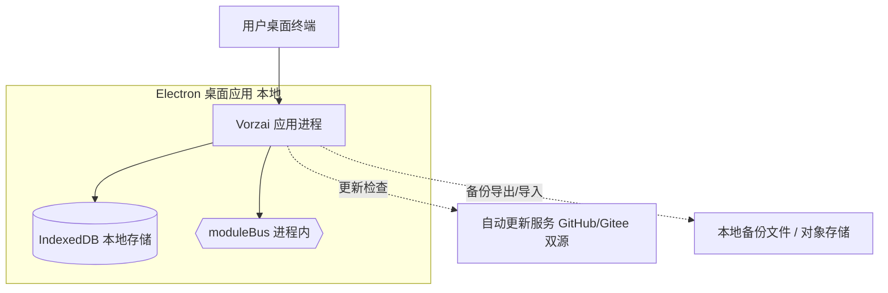

#### 5.4.2 拓扑要素清单

| 要素 | 取值 |
| --- | --- |
| 跨 Region 部署 | MVP：否；完整版：是，Region 数量 2 |
| 跨 AZ 部署 | MVP：否（单机）；完整版：是，AZ 数量 2 |
| 流量入口路径 | MVP：用户桌面 UI（无公网入口）；完整版：DNS → WAF → LB → API 网关 → Node 服务 |
| 内部调用路径 | MVP：进程内函数 / moduleBus；完整版：服务发现 + HTTP/gRPC |
| 数据库访问路径 | MVP：IndexedDB 本地连接；完整版：连接池 + 主从切换 |

**完整版服务端拓扑图（Mermaid，单独成节，非 MVP 主路径）**：

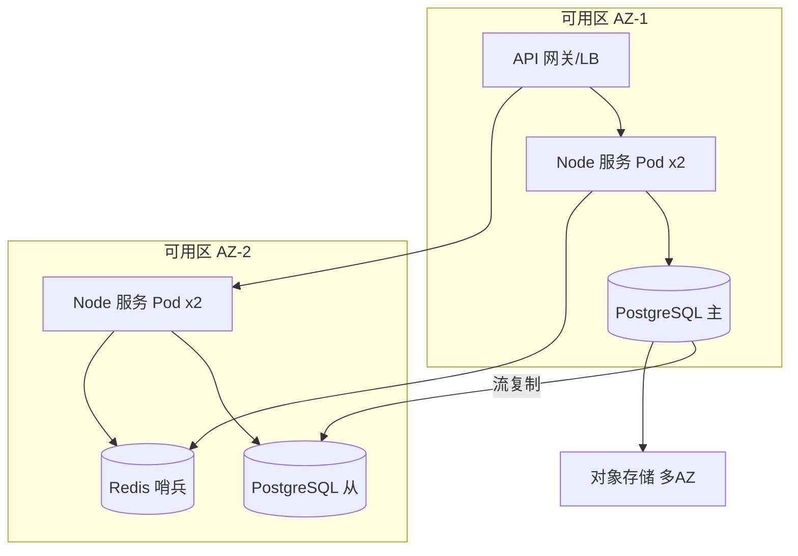

#### 5.4.3 故障域划分

| 故障域 | 影响范围 | 容错机制 | 预期 RTO |
| --- | --- | --- | --- |
| 单进程（MVP） | 单桌面实例 | 用户重启 / 自动更新回滚 | 小于 5min（用户侧） |
| 单设备（MVP） | 该设备全部数据 | 本地备份导入恢复 | ≤ 30min（RTO） |
| 单 Pod（完整版） | 单实例 | K8s 自动重建 | 小于 30s |
| 单 Node（完整版） | 该 Node 全部 Pod | K8s 调度到其他 Node | 小于 1min |
| 单 AZ（完整版） | 该 AZ 全部资源 | 跨 AZ 部署，自动切换 | ≤ 5min |
| 单 Region（完整版） | 全部主资源 | 灾备 Region 切换 | 小于 1h |

### 5.5 容量规划

#### 5.5.1 业务量预估

| 业务指标 | 当前值 | MVP 阶段值 | 生产阶段值 | 备注 |
| --- | --- | --- | --- | --- |
| 注册用户数 | 0（新系统） | ≤ 50 / 企业（单租户为主） | ≤ 500 / 企业 | 桌面分发 |
| DAU | 0 | ≤ 20 / 企业 | ≤ 200 / 企业 | 业务方 |
| 峰值本地操作 QPS | — | ≤ 50（本地进程内） | ≤ 200 | 推算 |
| LLM 调用 QPS | — | ≤ 5 / 用户 | ≤ 20 / 用户 | 受 E-01 配额 |
| 数据写入量 / 天 | — | ≤ 50MB / 企业 | ≤ 500MB / 企业 | 推算 |
| 数据存量 | — | ≤ 2GB / 企业（IndexedDB 上限内） | ≤ 50GB（完整版 PostgreSQL） | 推算 |

#### 5.5.2 资源容量推算

| 资源 | 推算公式 | 当前配置（MVP） | 生产阶段配置（完整版） |
| --- | --- | --- | --- |
| 桌面进程内存 | 业务数据缓存 + UI | 200MB~600MB / 实例 | 同（本地） |
| 本地存储 | 单租户数据增量 × 保留天数 | ≤ 2GB（IndexedDB） | PostgreSQL 4C16G + 50GB |
| 完整版 Node 实例数 | 峰值 QPS / 单实例 QPS × 1.5 | — | 4 实例 |
| 完整版 Redis | 内存 = 单 Key 大小 × 数量 × 1.3 | — | 2C4G |
| 完整版 PostgreSQL | 峰值写 TPS × SQL 数 → IOPS | — | 4C16G + 50GB |

#### 5.5.3 扩容触发与路径

| 资源 | 扩容触发指标 | 扩容方式 | 扩容耗时 |
| --- | --- | --- | --- |
| 本地存储 | IndexedDB > 1.8GB | 归档历史 + 导出备份 | 手动小于 10min |
| 完整版 Node | CPU > 70% 持续 5min | HPA 自动扩 | 小于 1min |
| 完整版 PostgreSQL | CPU > 80% | 升配 / 读写分离 | 小于 30min |
| 完整版 Redis | 内存 > 70% | 升配 / 集群扩 | 小于 30min |

#### 5.5.4 容量水位线

| 水位 | 阈值 | 动作 | 对开发的约束 |
| --- | --- | --- | --- |
| 健康水位 | 小于 60% | 无动作 | — |
| 预警水位 | 60-80% | 告警，启动扩容评审 | — |
| 危险水位 | > 80% | 自动扩容（如支持）或紧急扩容 | — |
| 红线 | > 95% | 触发限流 / 降级（与 §3.5.3 联动） | 限流红线值需与本表一致；降级开关在 L2 配置预埋 |

**判定合格**：业务量预估 1-3 年区间齐全，含来源；红线水位 → §3.5.3 限流默认值 → §8.4 告警规则数值一致。

---

## 6. 网络架构

> **本章定位**：本章只承载**对开发产生约束的网络结论**——开发要据此处理 HTTPS、限流位置、外部访问出口、服务发现与服务间通信。VPC / 子网 / CIDR 划分等运维施工细节见《系统部署文档》（platform-architect 产出）。MVP 为桌面本地应用，网络形态以「进程内 + 出口 HTTPS」为主。

### 6.1 网络环境规划

| 网络环境 | 用途 | 说明 / 访问策略 |
| --- | --- | --- |
| 桌面本地（MVP） | 用户设备内运行 | 进程内 moduleBus 通信；仅 LLM/邮箱/平台 API 经本机网络栈出口 |
| DMZ（完整版） | 公网入口缓冲区，部署公网 LB / 反向代理 | 仅允许从公网入站；不能直接访问 INT / PROD |
| INT（完整版） | 内部互联网络，部署应用与中间件 | 仅允许从 DMZ 入站；出站受 NAT 控制 |
| PROD（完整版） | 生产环境，独立网段 | 严格的入站 / 出站 ACL；最小化暴露 |
| DEV（完整版） | 开发环境，开发 VPC | 与 PROD 完全隔离；不允许访问生产数据 |

### 6.2 流量入口与南北向流量

#### 6.2.1 入口流量链路

| 组件 | 作用 | 部署位置 |
| --- | --- | --- |
| 桌面 UI（MVP） | 用户交互入口 | 用户设备渲染进程 |
| 自动更新服务（MVP） | 版本分发 | GitHub / Gitee 双源（公网） |
| DNS / CDN（完整版） | 域名解析 / 加速 | 公网 |
| 公网 LB（完整版） | TLS 终结 / 流量分发 | DMZ |
| API 网关 / Ingress（完整版） | 路由 / 鉴权 / 限流 | 应用子网入口 |

**入口决策（对开发的约束）**：

| 决策项 | 取值 | 对开发的约束 |
| --- | --- | --- |
| TLS 终结点 | MVP：出口 HTTPS（LLM/邮箱）；完整版：公网 LB | 业务侧无需解析 X-Forwarded-* |
| 限流位置 | MVP：进程内拦截（§3.5.3）；完整版：API 网关统一拦截 | MVP 自实现限流需对接 §3.5.3 红线 |
| 鉴权位置 | MVP：M7 进程内鉴权；完整版：API 网关 + 业务自鉴权 | 与 §7.2.1 一致 |
| 真实客户端 IP 获取 | MVP：无（本地）；完整版：X-Forwarded-For | 业务获取客户端 IP 必须用本字段 |

#### 6.2.2 出口流量

| 决策项 | 取值 | 对开发的约束 |
| --- | --- | --- |
| 出口方式 | MVP：本机网络栈直连 E-01/E-02；完整版：NAT 网关 | 决定外部 SDK 是否直连 |
| 是否需要固定出口 IP | MVP：否；完整版：是 | 是：必须仅从指定环境访问 E-xx |
| 出口白名单 | 全部 E-xx 访问域名（OpenAI/DeepSeek/邮箱服务器等） | 业务对接 E-xx 必须使用白名单内域名 |
| 跨地域 / 跨云出口 | 完整版：专线 / VPN / 公网 | 不同链路对应不同延迟 / 安全等级 |

### 6.3 内部互联（东西向流量）

| 决策项 | 取值 | 对开发的约束 |
| --- | --- | --- |
| 服务发现 | MVP：进程内模块注册（ModuleBus Registry）；完整版：注册中心（Nacos / 北极星） | 服务调用方必须使用统一 SDK，禁止硬编码 IP |
| 服务间通信协议 | MVP：进程内函数 / moduleBus；完整版：HTTP / gRPC / MQ | 与 §3.5.4 超时重试基线对齐 |
| 内部 mTLS | MVP：不适用（进程内）；完整版：启用 | 完整版调用方需配置客户端证书 |
| 跨 VPC 互联 | 完整版：PrivateLink | 跨 VPC 调用走私网 |
| 跨服务调用幂等性 | 必须遵循 §3.5.2 幂等键传递 | 跨服务调用必须透传幂等键与 traceId（§8.3） |

**判定合格**：§6.1 / §6.2 / §6.3 所有决策项 100% 已锁定；TLS 终结点、限流位置、鉴权位置三项与 §3.5 / §7 数值与位置一致；服务发现与服务间通信协议已锁定。

---

## 7. 安全设计

> **本章回答**：本系统在安全维度做了哪些选择、对应到哪些安全产品 / 能力域、关键机制如何落地。
> 若团队同时编写独立的《系统安全设计》文档，本章承载"机制选择 + 关键参数基线"，更深的细节（完整威胁模型 STRIDE、OWASP 防御对照、IAM 策略片段等）整体引用至独立文档（security-architect 产出）。MVP 为桌面本地应用，服务端安全能力在完整版引入后端时由 security-architect 补全。

### 7.1 架构安全全景

| 能力域 | 选用产品 / 机制 | 作用范围 | 是否启用 |
| --- | --- | --- | --- |
| 抗 DDoS | 不适用（MVP 无公网服务端）；完整版：云厂商 DDoS 防护 | 公网入口 | MVP：否（不适用）；完整版：是 |
| WAF | 不适用（MVP 无公网入口）；完整版：云 WAF | Web 应用层 | MVP：否（不适用）；完整版：是 |
| 防火墙 / 安全组 | 用户设备系统防火墙 | 用户设备 | 是（由用户设备提供） |
| 主机安全 | Electron CSP + contextIsolation + 默认硬编码密钥告警修复 | 桌面进程 | 是 |
| 容器安全 | 不适用（MVP 无容器）；完整版：容器安全 | 容器 | MVP：否（不适用） |
| 数据安全审计 | 本地审计日志（t_audit_log，100% 关键操作） | 关键数据 | 是 |
| 密钥管理（KMS） | MVP：本地密钥链（keychain / keytar）；完整版：云 KMS | 敏感数据加密 / AKSK 保护 | 是 |
| 安全运营中心（SOC） | MVP：本地告警（AlertChannel：email / 钉钉 / 飞书预留）；完整版：云 SOC | 安全事件监控 | MVP：部分；完整版：是 |
| 堡垒机 | 不适用（MVP 无服务端）；完整版：堡垒机 | 运维通道审计 | MVP：否（不适用） |

**填写要求**：每个能力域必须出现；不启用则填"不适用 / 由上游系统统一保障"，**禁止留空**。

### 7.2 业务安全架构

#### 7.2.1 用户认证

| 维度 | 取值 |
| --- | --- |
| 账号体系 | 自建（复用 multi-tenant，对标钉钉 RBAC+ABAC） |
| 登录方式 | 账号密码（MVP）；完整版：密码 + MFA（管理端） |
| 多因素认证（MFA） | MVP：否；完整版：启用（管理端 / 工作台） |
| 密码强度 | 最小长度 12；复杂度（大小写 + 数字 + 符号） |
| 登录失败锁定 | 连续失败 5 次锁定 15 分钟 |
| Token 有效期 | 访问 Token 2h（HMAC JWT 模拟）；刷新 Token 7d |
| 会话管理 | 单点 / 多点登录策略；Session 本地存储 + 注销与续签机制 |

#### 7.2.2 数据安全

| 维度 | 取值 |
| --- | --- |
| 数据分级 | 是，L1 公开 / L2 内部 / L3 敏感 / L4 高敏（手机号 / 身份证 / 薪酬） |
| 传输加密 | MVP：出口 HTTPS（LLM/邮箱，TLS 1.2+）；完整版：内部 mTLS |
| 存储加密 | MVP：IndexedDB 敏感字段 AES-256（本地密钥链）；完整版：TDE / SSE |
| 敏感字段清单 | 手机号 / 身份证号 / 银行卡号 / 薪酬金额（对应脱敏策略） |
| 数据导出与共享 | 导出审批流（管理员）；共享数据脱敏 |

**敏感字段处理策略表**：

| 字段 | 分级 | 存储策略 | 展示策略（脱敏） | 导出策略 |
| --- | --- | --- | --- | --- |
| 手机号 | L3 | 加密存储（AES-256） | 中间 4 位 `*` 屏蔽 | 需审批 + 脱敏 |
| 身份证号 | L4 | 加密存储 | 仅展示后 4 位 | 禁止导出 |
| 薪酬金额 | L4 | 加密存储 | 仅授权角色可见 | 需审批 |
| 邮箱 | L2 | 明文存储 | 完整展示 | 不限制 |

#### 7.2.3 密钥与凭证

| 维度 | 取值 |
| --- | --- |
| 存储方式 | MVP：本地密钥链（keychain / keytar）；完整版：KMS / Secrets Manager |
| 下发方式 | MVP：本地文件密钥（VORZAI_MT_HMAC_SECRET，已修复默认硬编码告警）；完整版：临时凭证 |
| 轮换策略 | 是，周期 90 天；MVP 本地密钥随设备，完整版定期轮换无需停机 |
| 红线 | 禁止入库 / 入代码 / 入配置文件明文；禁止跨环境共用密钥 |

#### 7.2.4 审计日志

| 维度 | 取值 |
| --- | --- |
| 启用的日志类型 | 业务操作审计（t_audit_log）/ 数据库操作（经 M7 切面）/ 安全事件（越权 / 对话失败） |
| 审计内容 | 必须包含"谁、何时、对什么资源、做了什么、结果如何、来源 IP（MVP 为设备标识）" |
| 不可篡改保障 | MVP：本地独立存储 + 导出只读；完整版：独立账号 / 独立桶存储，与业务存储物理隔离 |
| 保留期 | 合规要求下的最低保留时长 ≥ 1 年，与 §8.2 一致 |

#### 7.2.5 访问控制

| 维度 | 取值 |
| --- | --- |
| 权限模型 | RBAC + ABAC（二选一并说明理由：双模型满足"角色 + 委托权限 + 环境/数据条件"的电商+HR 双定位需求） |
| 多租户隔离 | MVP：客户端模拟隔离（mtStore 命名空间，明确边界，无后端）；完整版：服务端强隔离（PostgreSQL 行级 / 库级，经 U-03 方案A） |
| 越权防护 | 列表与详情接口都必须校验数据归属（filterByTenant / filterByDepartment）；横向越权 / 纵向越权的防护策略 |
| 接口级权限 | 与 §3.5 调用契约的对齐（每个接口的角色 / 权限标签） |

**判定合格**：
- §7.1 安全能力全景表无空白；
- §7.2 五项维度均给出"本系统的选择 + 关键基线"，不允许"待定"或"详见安全文档"代替正文。

---

## 8. 可观测设计

> **本章回答**：系统跑起来之后，怎么知道它健康、出问题怎么定位、用户体验是否达标。
> **三大支柱**：Metrics（指标）/ Logs（日志）/ Traces（链路追踪）。

### 8.1 Metrics

#### 8.1.1 指标分层

| 指标层 | 示例 | 工具 |
| --- | --- | --- |
| 业务指标 | 组盘数 / 客服工单数 / OGSM 完成率 / 对话驱动操作数 | 系统监控 & 自定义埋点（moduleBus 事件） |
| 应用指标 | RED：Rate / Errors / Duration（本地调用） | 系统监控 & 自定义埋点 |
| 中间件指标 | IndexedDB 写入延迟 / 向量索引大小 / 事件总线积压 | 系统监控 |
| 资源指标 | USE：CPU / 内存 / 磁盘（IndexedDB 占用）/ 网络（出口） | 系统监控（桌面 OS API） |

#### 8.1.2 关键指标 Dashboard 清单

| Dashboard 名 | 受众 | 核心指标 | 刷新频率 |
| --- | --- | --- | --- |
| 业务大盘 | 产品 / 业务 | 核心业务指标、关键漏斗（组盘→订单→客服） | 1min |
| 服务健康大盘 | 研发 / SRE | RED（Rate / Errors / Duration） | 30s |
| 中间件大盘 | SRE / DBA | IndexedDB / 向量索引 / 事件总线全维度 | 30s |
| 容量大盘 | SRE | §5.5 全部资源水位（本地存储 / 内存） | 1min |
| 业务预警大盘 | On-call | 当前活跃告警 | 实时 |
| 对话与知识大盘 | 运营 / 研发 | 对话驱动操作数 / 知识库检索命中率 | 1min |

### 8.2 Logs

#### 8.2.1 日志分级与去向

| 日志类型 | 级别 | 保存时间 | 日志去向 |
| --- | --- | --- | --- |
| 应用日志（业务） | INFO+ | 30 天热 + 180 天冷 | 本地文件 / 控制台（结构化 JSON） |
| 应用日志（异常） | ERROR+ | 90 天热 + 1 年冷 | 本地文件 + 实时告警 |
| 审计日志 | INFO+ | ≥ 1 年（合规要求） | 独立本地存储（t_audit_log） |
| 慢查询日志 | — | 30 天 | 本地文件 |

#### 8.2.2 结构化日志规范

```json
{
  "timestamp": "2026-07-28T10:00:00.000Z",
  "level": "INFO",
  "service": "vorzai-desktop",
  "instance": "desktop-pc-001",
  "traceId": "4bf92f3577b34da6a3ce929d0e0e4736",
  "spanId": "a1b2c3d4",
  "tenantId": "t-1001",
  "userId": "u-2048",
  "module": "business-chain",
  "event": "assortment.created",
  "msg": "组盘草稿创建成功",
  "extra": { "assortmentId": "a-7788" }
}
```

**硬性要求**：

| 要求项 | 内容 |
| --- | --- |
| 必含字段 | 所有日志必须含 `traceId` + `tenantId` |
| 敏感字段 | 禁止打印敏感字段明文（与 §7.2.2 数据安全联动） |
| ERROR 级别 | 必须含完整堆栈 + 业务上下文（订单号 / 用户 ID 等） |

### 8.3 Traces

| 项 | 取值 |
| --- | --- |
| 协议标准 | OpenTelemetry / W3C TraceContext（MVP 进程内 traceId 透传；完整版跨服务） |
| 采样策略 | 默认 1% 采样；错误请求 100% 采样；慢请求（>1s）100% 采样 |
| 透传方式 | HTTP Header `traceparent` / `tracestate`（完整版）；MVP 进程内方法参数透传 traceId |
| 关键 Span 命名 | `{module}.{method}` / `db.{operation}` / `llm.{call}` |
| 跨外部系统 | 调用 E-01/E-02 时透传 `traceId`（若对方支持），并记录 `peer.service` |

**与时序图的关联**：§3.2.M{N}.4 模块内时序图要求标注 traceId 透传节点，本节是其落地规范。

### 8.4 告警体系

#### 8.4.1 告警分级

| 级别 | 适用场景 | 响应时间 | 通知方式 |
| --- | --- | --- | --- |
| P0 紧急 | 业务中断 / 关键指标严重劣化（进程崩溃） | ≤ 5 min | 邮件 + 钉钉/飞书（预留）+ IM |
| P1 高 | 部分功能受影响（LLM 持续不可达） | ≤ 15 min | 邮件 + IM |
| P2 中 | 单点异常但有冗余（导出失败） | ≤ 1 h | IM |
| P3 低 | 趋势性预警（本地存储 > 80%） | 工作时间 | IM / 邮件 |

#### 8.4.2 告警规则编排

| 编号 | 级别 | 触发条件 | 维度 | Owner | Runbook |
| --- | --- | --- | --- | --- | --- |
| AL-01 | P0 | 进程崩溃 / 无法启动持续 5min | 应用可用性 | @研发 | wiki/runbook/AL-01-desktop-recover |
| AL-02 | P0 | IndexedDB 不可访问 | 存储健康 | @研发 | wiki/runbook/AL-02-idb-recover |
| AL-03 | P1 | LLM 调用错误率 > 30% 持续 5min | 对话引擎 | @研发 | wiki/runbook/AL-03-llm-degrade |
| AL-04 | P2 | 本地存储 > 1.8GB（>90%） | 容量水位 | @运维 | wiki/runbook/AL-04-storage-archive |
| AL-05 | P2 | 审计日志写入失败 | 合规审计 | @安全 | wiki/runbook/AL-05-audit-fail |
| AL-06 | P3 | 邮箱发送失败率 > 10% 持续 10min | 连接器健康 | @研发 | wiki/runbook/AL-06-email-retry |

**判定合格**：
- 关键指标至少覆盖业务 / 应用 / 中间件 / 资源四层；
- 关键告警均能映射到具体指标；
- 全部 P0 / P1 告警有 Owner；
- 关键 Dashboard ≥ 5 个；
- 日志含 traceId + tenantId；
- 采样策略覆盖错误 / 慢请求兜底；
- §5.3 SLA、§2.5.1 质量目标与本章告警阈值数值自洽。

---

## 附录 A：阶段内中间确认自检记录（按 intermediate_confirmation.md §2.4）

> 本附录记录 §2 / §3 / §4 / §5 完成后的四次自检（先按 §2.1 判定，再按 §2.3 反向验证 3 问）。重大不可逆决策「G8 服务端多租户强隔离架构形态」已由高层架构设计经 U-03 方案A（2026-07-28 用户裁决）冻结，不再于本章发起。

### A.1 §2 自检（业务架构 / DDD 限界上下文 / 上下文映射）

- **§2.1 方案分歧判定**：**未命中**。业务域划分（6 域）直接源自《高层架构设计》§5.2 模块全景图与 §6.2 模块卡片（业务链/对话/知识/OGSM/HR/账号），不存在 ≥2 种合理且相互分歧的域划分理解；限界上下文与上游模块一一对应（§2.2.1）；上下文映射（C-01~C-05 五种模式）均由现有底座形态（moduleBus / llm-platform / 邮箱适配器 / 多租户内核）直接确定，无方案分歧。
- **§2.3 反向验证 3 问**：
  - **Q1（返工成本）**：若 3 个月后被推翻（如改为 5 域或 7 域），返工范围 = §2.1 域清单 + §2.2 上下文 + §3.2 模块归属 + §4.2 表分组，约占本文档 15%，切换成本 ≈ 1 人周（域重映射 + 表改名），可控。
  - **Q2（可感知）**：业务域划分是内部设计文档，用户/客户/监管不可感知具体域边界；可感知的是下游产品形态，不在本决策点。
  - **Q3（一致性）**：一致。引用用户诉求 D0 §1（"立项→选品→组盘→订单→客服"）+ material_digest G1（业务链缺口）+ 《高层架构设计》§6.2 模块全景图。
- **结论**：未命中 §2.1 与 §2.2 任一，不发起 `[中间确认]`。

### A.2 §3 自检（应用架构 / 模块五段式 / 接口契约 / 技术选型）

- **§2.1 方案分歧判定**：**未命中**。模块清单（M1~M7）与 §2.1 业务域一一对应，直接继承《高层架构设计》§6.2/§6.3；接口契约风格（MVP 进程内 + moduleBus，完整版 REST）由 U-03 方案A（MVP 无后端）直接锁定，无方案分歧；技术选型（Electron 28 / React 18 / TypeScript 5.4 / IndexedDB / CALM 式）由现有 Vorzai 底座与 100% 原创约束直接确定（D2/D4），不存在 ≥2 种合理分歧方案。
- **§2.3 反向验证 3 问**：
  - **Q1（返工成本）**：若 3 个月后被推翻（如对话引擎改用 Dify Workflow 节点式而非 CALM 式），返工范围 = §3.2.M2 模块设计 + §3.5 接口契约部分，约占本文档 10%，切换成本 ≈ 1 人周，可控。
  - **Q2（可感知）**：模块划分与接口风格为内部设计，用户不可感知具体模块边界；可感知的是对话/组盘功能是否可用（已由 In-Scope 锁定）。
  - **Q3（一致性）**：一致。引用《高层架构设计》D4（复用 vs 新建：对话引擎/知识库/组盘客服为新建，底座复用）+ research_report §4.3（技术栈参考：CALM 式优先）。
- **结论**：未命中，不发起。

### A.3 §4 自检（本地存储设计 / 表五段式 / RPO-RTO / 缓存 Key）

- **§2.1 方案分歧判定**：**未命中**。存储形态（MVP IndexedDB 映射 / 完整版 PostgreSQL）由 U-03 方案A 直接锁定；tenant_id 隔离（MVP mtStore 命名空间 / 完整版行级）同样由 U-03 锁定；表结构以 PostgreSQL DDL 为权威契约、MVP IndexedDB 等价实现，遵循"契约预留、避免推倒重来"演进纪律（D4/§4.3），无方案分歧。
- **§2.3 反向验证 3 问**：
  - **Q1（返工成本）**：若 3 个月后被推翻（如 MVP 改用 SQLite 而非 IndexedDB），返工范围 = §4.1 约定 + §4.2 全部表 DDL + §3.1.4 工程结构，约占本文档 20%，切换成本 ≈ 2 人周（material_digest X1 已证现有底座为 IndexedDB，改 SQLite 需引入 Native 模块），可控但偏高——因 U-03 已冻结，本情形发生概率极低。
  - **Q2（可感知）**：本地存储引擎选型为内部实现，用户不可感知（用户只感知"离线可用"）；tenant_id 隔离表现（客户端模拟 vs 服务端强隔离）在完整版切换时由监管/合规可感知，但该切换路径与边界已通过 U-03 显式冻结并标注。
  - **Q3（一致性）**：一致。引用 material_digest X1（"实际为 IndexedDB，无 SQLite 运行实例"）+ U-03 方案A（"MVP 不引入后端，完整版引入 Node + PostgreSQL"）。
- **结论**：未命中，不发起。

### A.4 §5 自检（部署架构 / SLA / 拓扑 / 容量）

- **§2.1 方案分歧判定**：**未命中**。部署形态（MVP 桌面本地 + 轻量同步，无服务端；完整版 Node + PostgreSQL 服务端拓扑单独成节）由 U-03 方案A 直接锁定；SLA（RTO ≤ 30min / RPO ≤ 60min 本地）/ 容量水位线（>95% 触发限流降级，与 §3.5.3 联动）均依据本地桌面语境设定，无 ≥2 种分歧方案。
- **§2.3 反向验证 3 问**：
  - **Q1（返工成本）**：若 3 个月后被推翻（如 MVP 改为引入轻量后端），返工范围 = §5.1 环境矩阵 + §5.4 拓扑 + §5.5 容量 + §6 网络，约占本文档 20%，切换成本 ≥ 1 人月（新增后端部署）——该情形已被 U-03 显式排除（MVP 不引入后端）。
  - **Q2（可感知）**：部署形态（桌面单机 vs 服务端集群）用户/客户可感知（离线可用、是否需要服务器）；但本决策直接继承 U-03 冻结结论（MVP 桌面本地），未改变用户显式期望的"离线可用"形态。
  - **Q3（一致性）**：一致。引用用户诉求 D0 §1（"离线可用"）+ D0 §4（"100% 原创"）+ U-03 方案A（MVP 维持桌面客户端模拟隔离）。
- **结论**：未命中，不发起。

### A.5 已冻结决策引用（避免重复发起）

- **U-03（G8 服务端多租户强隔离架构形态）**：已于《高层架构设计》阶段经用户裁决（2026-07-28，方案A）——MVP 不引入后端服务，沿用 mtStore 客户端模拟隔离；完整版引入轻量自建后端（Node + PostgreSQL 行级/库级隔离）。本文档 §4.1 / §4.2 / §4.3 / §5.4.2 / §7.2.5 均按方案A 定稿并标注「经中间确认 U-03 · 2026-07-28 · 用户选方案A」，本章四次自检不再重复发起。

---

## 附录 B：硬指标自检清单（11 项）

| 编号 | 硬指标项 | 当前状态 | 落点章节 |
| --- | --- | --- | --- |
| 1 | 业务域 3~7 个 | ✅（6 个：业务链/对话/知识/人力/账号/基础平台） | §2.1 |
| 2 | DDD 上下文映射 ≥ 多种模式（覆盖 C-01~C-05 中多种） | ✅（5 种：Customer/Supplier + ACL + Shared Kernel + Conformist + Published Language） | §2.2.2 |
| 3 | 模块设计五段式 | ✅（M1~M7 各 §3.2.M{N}.1~.5） | §3.2 |
| 4 | 技术选型每项含版本号 + 理由 | ✅（Electron 28.3.0 / React 18.3.1 / TypeScript 5.4.5 / Vite 5.3.1 / Zustand 4.5.2 / Node 20.11.0 / PostgreSQL 16.2 等） | §3.1.5 |
| 5 | 全局错误码 6 位（1 位类别+2 位模块+3 位序号） | ✅（如 A010001） | §3.5.1 |
| 6 | 数据库表五段式（§4.2.1~4.2.5） | ✅（10 张表完整五段式，其余同构声明） | §4.2 |
| 7 | RPO/RTO 含数字 | ✅（MVP RTO≤30min / RPO≤60min；完整版 RTO≤15min / RPO≤5min） | §4.3.2 / §5.3 |
| 8 | Dashboard ≥ 5 | ✅（6 个：业务/服务健康/中间件/容量/业务预警/对话与知识） | §8.1.2 |
| 9 | Logs 含 traceId + tenantId | ✅（结构化 JSON 示例明确含两字段） | §8.2.2 |
| 10 | 告警 P0~P3 分级含 Owner + Runbook | ✅（AL-01~AL-06，P0~P3，均含 Owner + Runbook） | §8.4 |
| 11 | 图示内嵌（diagrams-generator 产出） | ✅（业务域全景 / 系统上下文 / 模块分层 / 上下文映射时序 / 部署拓扑，Mermaid 文本格式内嵌） | §2.1 / §3.1 / §5.4 |
