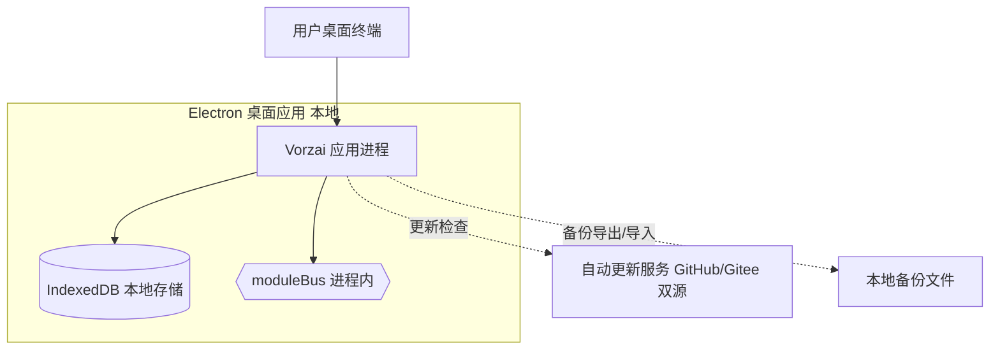

# AICoding 架构设计 · 部署设计（修订版·零云端付费）

> 本文档为《AICoding 架构设计》核心产物之一，对应**系统部署设计模版**。
>
> **修订说明（G5 V2·2026-07-28）**：本版为 Phase 5 修订版，核心变更——完整版**不再使用任何云厂商托管服务**（零云端基础设施付费），全部改为自建开源方案（详见 §1.1）。MVP 桌面端形态不受影响。
>
> **上游输入**：《系统设计》（G4 已冻结，2026-07-28）中的部署架构、网络架构、可观测设计；《安全设计》（G5 定稿版）中的安全组规则、WAF 规则、mTLS 策略、密钥分级与审计保留期；《高层架构设计》（G3 已冻结，2026-07-28）中的部署形态决策（U-03 方案A：MVP 桌面客户端模拟隔离，完整版引入轻量自建后端 Node + PostgreSQL）。
>
> **下游输出**：环境与资源清单、流水线、监控告警、应急回滚等可落地的运维交付物。
>
> **关键决策声明**（经用户明确要求，2026-07-28）：
> - 完整版**所有基础设施服务均为自建开源方案**，零云端付费（WAF/DDoS高防/CLB/云KMS/云防火墙/CLS/对象存储云版 全部清除或替换）。
> - 完整版月度/年度基础设施成本 = **0 元**（仅依赖已有服务器 + 免费开源软件），运维人力成本另算，不列入基础设施成本。
> - 所有资源编号 R-xx 保留不变，但资源类型改为自建组件。

---

## 1. 引言

### 1.1 适用范围与部署形态

本文档覆盖 **Vorzai 电商 Agent** 的两种部署形态：

- **[MVP] 桌面端形态**：桌面 Electron 本地优先 + IndexedDB + mtStore 命名空间隔离，部署在用户桌面终端上，无后端服务器，无云端依赖。
- **[完整版] 服务端形态**：轻量自建后端（Node.js + PostgreSQL + Redis + MinIO），部署在**自建服务器**上（非云厂商托管），使用全部开源/自建组件，零云端基础设施付费。

**零云端付费范围声明（完整版）**：

| 云厂商托管服务 | 替换方案 | 替代组件 |
| --- | --- | --- |
| 云 WAF | Nginx + ModSecurity（OWASP CRS 规则） | R-Sec-001 |
| DDoS 高防 | fail2ban + iptables/nftables 规则 + Nginx rate limiting | R-Sec-002 / R-Sec-003 |
| 云 CLB / 云 LB | Nginx 反向代理（4 层 + 7 层） | R-C-003 |
| 云 KMS | HashiCorp Vault（自建） | R-M-004 |
| 云防火墙 | iptables + nftables（自建节点级防火墙） | R-Sec-003 |
| 云日志服务 CLS | Loki + Promtail（自建） | R-O-002 / R-O-003 |
| 对象存储云版 COS | MinIO（自建） | R-S-006 |
| 云监控 / 云 APM | Prometheus + Grafana + AlertManager（自建） | R-O-001 / R-O-004 / R-O-005 |
| 云 CI/CD | GitLab Runner / Jenkins / GitHub Actions（自建） | CI/CD 阶段 |

### 1.2 名词与缩写

| 术语 / 缩写 | 含义 |
| --- | --- |
| AZ（可用区） | 物理隔离的计算资源区域，同一 Region 内 |
| Region（地域） | 数据中心所在地理区域，完整版采用 2 Region 部署 |
| [MVP] | 桌面 Electron 本地优先形态，不引入后端服务 |
| [完整版] | 引入轻量自建后端的完整服务端形态 |
| HA（高可用） | High Availability，多副本/主从/哨兵等容错方案 |
| fail2ban | 开源入侵预防软件，通过日志分析临时封禁恶意 IP |
| iptables / nftables | Linux 内核防火墙框架，用于节点级流量控制 |
| ModSecurity | 开源 Web 应用防火墙（WAF）引擎，支持 OWASP CRS 规则集 |
| Vault（HashiCorp） | 自建密钥管理 + PKI + 动态凭据 + 审计 |
| Teleport | 自建堡垒机（SSH/数据库/K8s 审计 + 会话录像） |
| Wazuh | 开源主机安全 + SOC（漏洞扫描 / 入侵检测 / 资产管理） |
| MinIO | 开源对象存储（S3 兼容） |
| Loki | 开源日志聚合系统 |
| Promtail | Loki 日志采集代理 |
| HPA | Horizontal Pod Autoscaler，K8s 水平自动扩缩容 |

---

## 2. 环境与资源清单

### 2.1 环境矩阵

| 环境 | 用途 | 集群隔离 | 数据 | 网络访问 |
| --- | --- | --- | --- | --- |
| dev | 开发自测 | **[MVP]** 开发者本机桌面 Electron；**[完整版]** 共享自建服务器 / 开发 K8s 命名空间（`vorzai-dev`） | 模拟数据 | 内网 / 本地 |
| int | 联调 | **[MVP]** 开发者本机 / 小范围分发；**[完整版]** 独立 K8s 命名空间（`vorzai-int`） | 模拟数据 | 内网 |
| uat | 预发 / 验收 | **[MVP]** 验收端本地安装；**[完整版]** 独立 K8s 命名空间（`vorzai-uat`） | 仿生产数据（脱敏） | 内网 + 白名单（仅验收端 IP） |
| prod | 生产 | **[MVP]** 终端用户桌面安装包；**[完整版]** 独立 K8s 集群（`vorzai-prod`）+ 独立服务器节点 | 真实数据 | **[MVP]** 本地；**[完整版]** 公网（仅 443）/ 内网 |

**环境隔离策略**：

- **[MVP]**：所有环境均为用户本地桌面运行，物理隔离（不同设备）。配置通过本地 JSON 配置区分。
- **[完整版]**：四个环境通过独立 K8s 集群 / 命名空间隔离（dev 共享命名空间，int/uat/prod 独立命名空间），配置通过独立配置中心实例区分，数据库独立部署。
- **配置分层**（L1~L4，详见 §4.4）：L1 代码内常量 / L2 配置中心（Nginx 配置 + 应用配置 YAML） / L3 环境变量 / L4 Secret（Vault）。

### 2.2 资源清单

> **[MVP] 桌面端无云端/自建服务器资源**，所有资源清单仅适用于 [完整版] 形态；MVP 资源标注「[MVP] 不适用」。

#### 2.2.1 计算资源

| 资源编号 | 类型 | 产品 | 资源 ID | 名称 | 规格 | 数量 | 环境 | 复用 / 新建 | HA 方案 | 用途 |
| --- | --- | --- | --- | --- | --- | --- | --- | --- | --- | --- |
| R-C-001 | K8s 集群 | 自建 K8s v1.28 | k8s-vorzai-prod | Vorzai 生产 K8s 集群 | 3 Master + 6 Worker | 1 | prod | 新建 | 多 Master + Worker 跨 AZ | Node 服务调度 |
| R-C-002 | Node.js 服务 | Node.js 20.x + Docker 容器 | svc-vorzai-api | Vorzai API 服务 | 2C4G / Pod | 4（min 2 / max 20） | prod | 新建 | K8s 副本 + HPA 自动扩缩 | 业务逻辑（M1~M7） |
| R-C-003 | Nginx 反向代理 | Nginx 1.24 + ModSecurity 3.x | nginx-vorzai-gw | Nginx 反向代理 + API 网关 | 2C4G × 2 实例 | 2 | prod | 新建 | 双实例主备（keepalived + VRRP） | 公网入口 TLS 终结 + 路由 |
| R-C-004 | Nginx 负载均衡 | Nginx 1.24（L4 stream 模块） | nginx-vorzai-lb | Nginx L4 负载均衡 | 1C2G × 2 实例 | 2 | prod | 新建 | 双实例主备（keepalived + VRRP） | 4 层流量分发（替代云 CLB） |
| R-C-005 | HashiCorp Vault | Vault 1.15 OSS | vault-vorzai-prod | 自建 Vault 集群 | 2C4G × 3 节点 | 3 | prod | 新建 | Raft 高可用（3 节点仲裁） | 密钥管理 + PKI + 动态凭据 |
| R-C-006 | Teleport 堡垒机 | Teleport 14.x OSS | teleport-vorzai-prod | 自建 Teleport 集群 | 2C4G × 2 节点 | 2 | prod | 新建 | 主备 | SSH/数据库/K8s 运维审计 |
| R-C-007 | GitLab Runner | GitLab Runner 16.x / Jenkins 2.454 | ci-vorzai-prod | 自建 CI/CD Runner | 4C8G × 2 实例 | 2 | dev/int/uat/prod | 新建 | 双 Runner 并行 | 流水线执行 |
| R-C-008 | 监控节点 | Prometheus + Grafana + Loki + AlertManager | mon-vorzai-prod | 自建监控集群 | 4C16G × 2 节点 | 2 | prod | 新建 | 双节点主备 | 可观测性 |
| R-C-009 | Wazuh Manager | Wazuh 4.7 OSS | wazuh-vorzai-prod | 自建 Wazuh SOC | 2C4G × 2 节点 | 2 | prod | 新建 | 双节点 | 主机安全 + 入侵检测 |

**[MVP]** 计算资源：不适用（桌面单机，运行在用户设备上）。

#### 2.2.2 存储资源

| 资源编号 | 类型 | 产品 | 资源 ID | 名称 | 规格 | 容量 | 环境 | 复用 / 新建 | HA 方案 | 备份策略 |
| --- | --- | --- | --- | --- | --- | --- | --- | --- | --- | --- |
| R-S-001 | 计算节点存储 | 本地 SSD | lv-vorzai-data | K8s Worker 数据卷 | 500GB SSD | 500GB | prod | 新建 | 本地 RAID 1（可选） | 无（计算节点可重建） |
| R-S-004 | PostgreSQL 主数据 | 本地 SSD + 流复制 | pg-vorzai-prod | PostgreSQL 主库 | 4C16G，SSD 200GB | 200GB | prod | 新建 | 主从跨 AZ 流复制 | pg_basebackup 全量（每日）+ WAL 增量归档（实时） |
| R-S-005 | PostgreSQL 从库 | 本地 SSD | pg-vorzai-prod-standby | PostgreSQL 从库 | 4C16G，SSD 200GB | 200GB | prod | 新建 | 与主库流复制 | 从库只读；备份从从库拉取 |
| R-S-006 | MinIO 对象存储 | MinIO 2024.x | minio-vorzai-prod | MinIO 集群（4 节点 × 4 盘） | 每节点 2TB HDD | 32TB（含副本） | prod | 新建 | Erasure Coding（4+2 分片） | 跨区域复制（Region B 灾备） |
| R-S-007 | Redis 哨兵集群 | 内存 | redis-vorzai-prod | Redis 哨兵 | 2C4G × 3（1 主 2 哨兵） | 4GB 内存 | prod | 新建 | 哨兵自动故障转移 | AOF 持久化 + RDB 快照 |

**[MVP]** 存储资源：

| 资源编号 | 类型 | 产品 | 规格 | 容量 | 说明 |
| --- | --- | --- | --- | --- | --- |
| [MVP] R-S-008 | 本地 IndexedDB | Electron IndexedDB | 浏览器配额（≤ 2GB） | ≤ 2GB | 用户设备本地存储 |
| [MVP] R-S-009 | 本地文件 | 本地文件系统 | 用户设备硬盘 | 按设备而定 | 知识库文档 / 备份文件 |

#### 2.2.3 网络资源

| 资源编号 | 类型 | 产品 | 资源 ID | 名称 | 规格 | 环境 | 复用 / 新建 | 用途 |
| --- | --- | --- | --- | --- | --- | --- | --- | --- |
| R-N-001 | 自建局域网（VLAN） | 自建交换机 / 虚拟网络 | vlan-vorzai-app | 应用子网（10.100.0.0/24） | 24 位掩码 | prod | 新建 | Node 服务 + Nginx |
| R-N-002 | 自建局域网（VLAN） | 自建交换机 / 虚拟网络 | vlan-vorzai-db | 数据库子网（10.100.10.0/24） | 24 位掩码 | prod | 新建 | PostgreSQL + Redis |
| R-N-003 | 自建局域网（VLAN） | 自建交换机 / 虚拟网络 | vlan-vorzai-mgmt | 管理子网（10.100.20.0/24） | 24 位掩码 | prod | 新建 | Vault / Teleport / 监控 / Wazuh |
| R-N-004 | 静态路由 / NAT | iptables NAT 表 | nat-vorzai-egress | 自建出口 NAT | 固定出口 IP 段 | prod | 新建 | 出口白名单 + 固定出口 IP |
| R-N-005 | iptables / nftables 防火墙 | 自建 iptables 规则集 | fw-vorzai-prod | 防火墙规则集 | 节点级 | prod | 新建 | 分区间 ACL + 公网入站控制 |
| R-N-006 | DNS | dnsmasq / bind9（自建） | dns-vorzai-internal | 内网 DNS | 1 实例 | prod | 新建 | 内网域名解析 |

**[MVP]** 网络资源：不适用（桌面单机，仅出口 HTTPS）。

**CIDR 划分（完整版 prod）**：

| 分区 | VLAN 编号 | CIDR | 说明 |
| --- | --- | --- | --- |
| 公网入口（DMZ） | V-001 | 10.100.0.0/26 | Nginx 反向代理 + 负载均衡（R-N-003 / R-C-003 / R-C-004） |
| 应用层（APP） | V-002 | 10.100.0.64/26 | Node 服务 Pod（R-C-002） |
| 数据层（DB） | V-003 | 10.100.10.0/24 | PostgreSQL / Redis（R-S-004 / R-S-005 / R-S-007） |
| 存储层（OBJ） | V-004 | 10.100.20.0/24 | MinIO 集群（R-S-006） |
| 运维管理（MGT） | V-005 | 10.100.20.0/24 | Vault / Teleport / 监控 / Wazuh |
| 开发环境 | V-010 | 10.101.0.0/20 | dev / int / uat 共享 |

**出口 IP**：R-N-004 提供固定出口 IP 段（`x.x.x.0/28`），E-01（LLM）/ E-02（邮箱）/ E-03（电商 API）仅允许从此段 IP 访问。

#### 2.2.4 中间件与平台服务

| 资源编号 | 类型 | 产品 | 资源 ID | 名称 | 规格 | 环境 | 复用 / 新建 | HA 方案 | 用途 |
| --- | --- | --- | --- | --- | --- | --- | --- | --- | --- |
| R-M-001 | PostgreSQL 数据库 | PostgreSQL 16.x | pg-vorzai-prod | Vorzai 主数据 | 4C16G | prod | 新建 | 主从流复制跨 AZ | 业务主数据（行级多租户隔离） |
| R-M-002 | Redis 缓存 | Redis 7.0 哨兵 | redis-vorzai-prod | Vorzai 缓存 | 2C4G × 3 | prod | 新建 | 哨兵自动故障转移 | 会话 / 去重 / 分布式锁 / 权限缓存 |
| R-M-003 | MinIO 对象存储 | MinIO 2024.x | minio-vorzai-prod | Vorzai 文件存储 | 4 节点 × 4 盘 × 2TB | prod | 新建 | Erasure Coding 4+2 | 文件上传 / 备份归档 / 审计日志冷存储 |
| R-M-004 | HashiCorp Vault | Vault 1.15 OSS | vault-vorzai-prod | 自建密钥管理 | 2C4G × 3 节点 | prod | 新建 | Raft HA | PKI 证书 + 动态凭据 + 数据密钥 |

> **KMS 实例名**：
> - **`kms-vorzai-prod`**：HashiCorp Vault 内置 PKI 引擎（用于 mTLS 证书签发 + 数据加密密钥管理），替代云 KMS 实例名；
> - **`vault-vorzai-prod`**：HashiCorp Vault 集群实例名（与 `kms-vorzai-prod` 共享同一 Vault 集群，PKI 引擎为 Vault 内置能力）。

#### 2.2.5 可观测资源

| 资源编号 | 类型 | 产品 | 资源 ID | 名称 | 规格 | 环境 | 复用 / 新建 | 承载可观测维度 |
| --- | --- | --- | --- | --- | --- | --- | --- | --- |
| R-O-001 | Prometheus | Prometheus 2.50 OSS | prom-vorzai-prod | 指标采集 | 4C16G | prod | 新建 | Metrics（RED / USE / 业务指标） |
| R-O-002 | Grafana | Grafana 10.x OSS | grafana-vorzai-prod | 可视化大屏 | 2C4G | prod | 新建 | Dashboard（6 个业务/服务/中间件/容量/预警/对话大盘） |
| R-O-003 | Loki | Loki 3.x OSS | loki-vorzai-prod | 日志聚合 | 4C16G | prod | 新建 | Logs（应用日志 / 审计日志 / 系统日志） |
| R-O-004 | AlertManager | AlertManager 0.27 OSS | alert-vorzai-prod | 告警引擎 | 2C2G | prod | 新建 | 告警路由 + 通知（P0~P3） |
| R-O-005 | Promtail | Promtail 3.x OSS | promtail-vorzai-prod | 日志采集 | 1C2G / 节点 | prod | 新建 | Promtail → Loki 日志采集 |
| R-O-006 | Node Exporter | node_exporter 1.7 OSS | node-exp-vorzai-prod | 节点指标 | 内置 / 节点 | prod | 新建 | USE（CPU / 内存 / 磁盘 / 网络） |
| R-O-007 | Wazuh Agent | Wazuh 4.7 OSS | wazuh-agent-vorzai | 主机安全 | 内置 / 节点 | prod | 新建 | 主机安全 / 漏洞扫描 / 入侵检测 |

**[MVP]** 可观测资源：

| 资源编号 | 类型 | 产品 | 规格 | 承载可观测维度 |
| --- | --- | --- | --- | --- |
| [MVP] R-O-008 | 桌面系统监控 | Electron + OS API（Windows/macOS/Linux） | 内置 | CPU / 内存 / 磁盘 / 网络（出口） |
| [MVP] R-O-009 | 应用埋点 | moduleBus 事件 + console.log 结构化 | 内置 | 业务指标 / 应用 RED / 中间件指标 |

#### 2.2.6 安全资源

| 资源编号 | 类型 | 产品 | 资源 ID | 名称 | 规格 | 环境 | 复用 / 新建 | HA 方案 | 用途 |
| --- | --- | --- | --- | --- | --- | --- | --- | --- | --- |
| R-Sec-001 | WAF | Nginx + ModSecurity 3.x（OWASP CRS 4.x） | modsec-vorzai-prod | 自建 WAF | 部署于 R-C-003 / R-C-004 | prod | 新建 | 随 Nginx 主备 | Web 应用攻击防护（SQL注入/XSS/命令注入/路径遍历/CC防御） |
| R-Sec-002 | DDoS/入侵防护 | fail2ban 0.11 + iptables | fail2ban-vorzai-prod | 自建 DDoS 防护 | 部署于 R-C-003 节点 | prod | 新建 | 随 Nginx 主备 | 单 IP ≥ 100 QPS 限流 + 异常行为自动封禁 IP |
| R-Sec-003 | 防火墙 | iptables + nftables | fw-vorzai-prod | 自建节点防火墙 | 部署于所有节点 | prod | 新建 | 节点级 | 分区间 ACL + 公网入站控制（参考 §3.2.4 安全组规则） |
| R-Sec-004 | 主机安全 / SOC | Wazuh 4.7 OSS | wazuh-vorzai-prod | 自建主机安全 | 2C4G × 2 | prod | 新建 | 双节点 | 漏洞扫描 / 木马查杀 / 密码破解阻断 / 主机入侵检测 |
| R-Sec-005 | 堡垒机 | Teleport 14.x OSS | teleport-vorzai-prod | 自建堡垒机 | 2C4G × 2 | prod | 新建 | 主备 | SSH 密钥登录 + 会话录像 + 文件传输 + 数据库运维审计 |
| R-Sec-006 | Vault 审计 | Vault 内置审计日志 | vault-audit-vorzai-prod | Vault 审计日志 | 存储于 Loki | prod | 新建 | 日志不可变 | Vault 操作审计（密钥创建/禁用/轮换/读取） |

**[MVP]** 安全资源：

| 资源编号 | 类型 | 产品 | 规格 | 用途 |
| --- | --- | --- | --- | --- |
| [MVP] R-Sec-007 | 桌面 CSP | Electron CSP 头 | 内置 | `script-src 'self'` / `frame-src 'none'` / `form-action 'self'` |
| [MVP] R-Sec-008 | 本地防火墙 | OS 自带防火墙 | 系统自带 | 桌面端系统级防火墙 |

### 2.3 复用资源清单

| 复用资源 ID | 原业务方 | 余量评估 | 隔离方式 |
| --- | --- | --- | --- |
| **[MVP] 用户桌面设备** | 终端用户 | 各设备独立（CPU/内存按设备而定） | 物理隔离（不同设备） |
| **[完整版] 已有自建服务器** | 基础设施团队 | 需人工确认已有服务器数量、CPU/内存余量；若余量不足则需新建 | K8s 命名空间隔离（`vorzai-*`）+ 独立 VLAN（10.100.0.0/20） |
| **[完整版] 自建 DNS 服务器** | 基础设施团队 | 复用已有内网 DNS（dnsmasq/bind9） | 独立 Zone 记录 |

> **待人工确认**：已有自建服务器的具体数量、CPU/内存/磁盘余量，以及是否已有 K8s 集群可复用。若基础设施团队已有可用服务器，可在部署时直接复用；否则需采购新建（采购成本由基础设施团队承担，不计入本系统基础设施成本）。

---

## 3. 部署拓扑与高可用设计

### 3.1 物理拓扑

#### 3.1.1 物理拓扑图

**[MVP] 桌面本地拓扑**：



**[完整版] 自建服务器双 AZ 拓扑**：


> **说明**：上图以 Mermaid 代码嵌入，详见下文的文本拓扑图。实际部署时使用自建服务器（非云厂商托管）。

**[完整版] 自建双 AZ 物理拓扑（文本版）**：

```
                     ┌─────────────────────────────────────┐
                     │           互联网                     │
                     └──────────────┬──────────────────────┘
                                    │ 公网 443 HTTPS
                                    ▼
              ┌───────────────────────────────────────────┐
              │            Region-A · AZ-1                 │
              │                                           │
              │  ┌─────────────┐  ┌─────────────┐         │
              │  │  Nginx LB   │  │  Nginx LB   │         │
              │  │  (R-C-004)  │  │  (R-C-004)  │ 备用     │
              │  │  10.100.0.2 │  │  10.100.0.3 │         │
              │  └──────┬──────┘  └─────────────┘         │
              │         │                                 │
              │  ┌──────▼──────┐  ┌─────────────┐         │
              │  │  Nginx GW   │  │  Nginx GW   │ 备用     │
              │  │  (R-C-003)  │  │  (R-C-003)  │         │
              │  │  +ModSecurity│  │             │         │
              │  │  10.100.0.4 │  │  10.100.0.5 │         │
              │  └──────┬──────┘  └─────────────┘         │
              │         │ 8080                              │
              │  ┌──────▼──────┐                           │
              │  │ Node Pod×2  │                           │
              │  │ (R-C-002)   │                           │
              │  │ K8s         │                           │
              │  └──────┬──────┘                           │
              │         │                                   │
              │  ┌──────▼──────┐  ┌─────────────┐         │
              │  │ PostgreSQL  │  │ PostgreSQL  │         │
              │  │  主 (R-S-004)│  │  从 (R-S-005)│        │
              │  │  5432       │  │  5432       │         │
              │  └──────┬──────┘  └─────────────┘         │
              │         │ 流复制                            │
              │  ┌──────▼──────┐  ┌─────────────┐         │
              │  │ Redis 哨兵  │  │ Redis 哨兵  │         │
              │  │ (R-S-007)   │  │ (R-S-007)   │         │
              │  └──────┬──────┘  └─────────────┘         │
              │         │                                   │
              │  ┌──────▼──────┐  ┌─────────────┐         │
              │  │ MinIO 节点  │  │ MinIO 节点  │         │
              │  │ (R-S-006)   │  │ (R-S-006)   │         │
              │  └─────────────┘  └─────────────┘         │
              │                                           │
              │  ┌───────────────────────────────────┐   │
              │  │  Vault 集群 (R-M-004 / R-Sec-006)  │   │
              │  │  Teleport (R-Sec-005)               │   │
              │  │  Wazuh (R-Sec-004)                  │   │
              │  └───────────────────────────────────┘   │
              └───────────────────────────────────────────┘

              ┌───────────────────────────────────────────┐
              │            Region-A · AZ-2                 │
              │  (与 AZ-1 对称结构：Node Pod×2 + PostgreSQL│
              │   从 + Redis 哨兵 + MinIO 节点 + 监控节点)  │
              └───────────────────────────────────────────┘

              ┌───────────────────────────────────────────┐
              │            Region-B · AZ-1（灾备 Region）   │
              │  MinIO 跨区域复制目标节点（R-S-006 灾备）   │
              │  pg_dump 定时备份归档节点                   │
              └───────────────────────────────────────────┘
```

#### 3.1.2 拓扑要素清单

| 要素 | 取值 |
| --- | --- |
| 跨 Region 部署 | **[MVP]** 否；**[完整版]** 是，Region 数量 2（Region-A 主 + Region-B 灾备） |
| 跨 AZ 部署 | **[MVP]** 否（单机）；**[完整版]** 是，AZ 数量 2（Region-A 内 AZ-1 / AZ-2） |
| 流量入口路径 | **[MVP]** 用户桌面 UI（无公网入口）；**[完整版]** 互联网 → Nginx LB（R-C-004，443）→ Nginx GW（R-C-003，8080）+ ModSecurity（R-Sec-001）→ Node 服务（R-C-002） |
| 内部调用路径 | **[MVP]** 进程内函数 / moduleBus；**[完整版]** K8s Service + Nacos 服务发现 + HTTP |
| 数据库访问路径 | **[MVP]** IndexedDB 本地连接；**[完整版]** Node → PgBouncer 连接池（可选）→ PostgreSQL 主/从 |
| 缓存连接 | **[MVP]** 进程内 Zustand；**[完整版]** Node → Redis 哨兵 VIP（哨兵自动切换） |
| 对象存储路径 | **[MVP]** 本地文件 IO；**[完整版]** Node → MinIO（私有桶 + SSE 加密） |

### 3.2 流量与网络链路（连通视图）

#### 3.2.1 流量入口链路

| 组件 (R-xx) | 协议 - 端口 | TLS 终结 | 作用 |
| --- | --- | --- | --- |
| R-C-004（Nginx LB） | TCP/443 | 是（TLS 1.2+，自签证书或 CA 签发） | 4 层负载均衡，TLS 终结，HTTP 80→443 重定向 |
| R-C-003（Nginx GW） | TCP/8080 | 否（后端 HTTP） | 7 层路由 + 鉴权 + 限流 |
| R-Sec-001（ModSecurity） | 内嵌于 R-C-003 | — | WAF 规则（OWASP CRS 4.x + 自定义规则） |
| R-Sec-002（fail2ban） | 内嵌于 R-C-003 节点 | — | 异常 IP 自动封禁（single IP ≥ 100 QPS 触发限流） |
| R-C-002（Node 服务） | TCP/3000 | 否（内部 HTTP） | 业务逻辑处理 |

**[MVP]** 流量入口链路：桌面 UI → 渲染进程 → 主进程（moduleBus），无公网入口。

#### 3.2.2 内部互联链路

| 项 | 说明 |
| --- | --- |
| 服务发现 | **[MVP]** 进程内 ModuleBus Registry；**[完整版]** Nacos 2.x 服务发现（内网地址） |
| 服务间协议 | **[MVP]** 进程内函数调用 / moduleBus 事件；**[完整版]** HTTP/gRPC（内部网络） |
| mTLS | **[MVP]** 不适用（进程内）；**[完整版]** 启用（R-C-003 → R-C-002 / R-C-002 → R-S-004/R-S-005），证书由 `kms-vorzai-prod`（Vault PKI 引擎）签发 |
| 数据库连接 | **[完整版]** Node → PgBouncer（连接池，可选）→ PostgreSQL 主/从（SSL） |
| 缓存连接 | **[完整版]** Node → Redis 哨兵 VIP（Redis ACL 强制鉴权 + SSL） |
| 对象存储连接 | **[完整版]** Node → MinIO（私有桶 + SSE 服务端加密） |

#### 3.2.3 跨网络互联

| 互联类型 | 通道 | 带宽 | 加密 | 用途 |
| --- | --- | --- | --- | --- |
| 跨 AZ（Region-A 内） | 自建高速网络 / 交换机直连 | ≥ 1Gbps | TLS（流复制流量） | PostgreSQL 主从流复制 |
| 跨 Region（灾备） | 自建 VPN / 专线 / 公网加密 | ≥ 100Mbps | IPsec VPN + TLS | MinIO 跨区域复制（R-S-006）、pg_dump 备份归档 |
| 出口访问（E-01/E-02/E-03） | R-N-004（iptables NAT）固定出口 IP | 按业务量 | HTTPS（443） | LLM / 邮箱 / 电商 API |

**[MVP]** 跨网络互联：不适用（桌面单机，仅出口 HTTPS）。

#### 3.2.4 安全组规则（自建 iptables/nftables，安全侧权威）

> 安全组规则由安全设计 §5.2 定义，部署侧按此配置 iptables/nftables 规则。以下为完整规则集：

| 目标资源 | 入站规则 | 协议 / 端口 | 来源 | 说明 |
| --- | --- | --- | --- | --- |
| R-C-004（Nginx LB） | 仅 443 入站 | TCP/443 | `0.0.0.0/0` | 公网入口唯一例外；80→443 重定向 |
| R-C-003（Nginx GW/DMZ） | 仅 LB 入站 | TCP/8080 | R-C-004 出口 IP | 禁止公网直接访问网关 |
| R-C-002（Node 服务） | 仅网关入站 | TCP/3000 | R-C-003 出口 IP | 禁止公网与 DMZ 外部直接访问应用 |
| R-S-004（PostgreSQL） | 仅 Node 入站 | TCP/5432 | R-C-002 节点 IP | 禁止公网 / DMZ 直接访问数据库；强制 SSL |
| R-S-005（PostgreSQL 从） | 仅 Node + 主库入站 | TCP/5432 | R-C-002 + R-S-004 | 从库只读；备份从从库拉取 |
| R-S-007（Redis 哨兵） | 仅 Node 入站 | TCP/6379 | R-C-002 节点 IP | Redis ACL 强制鉴权（禁用默认密码） |
| R-S-006（MinIO） | 仅 Node 入站 | TCP/9000/9001 | R-C-002 节点 IP + 备份节点 | 私有桶；SSE 加密 |
| R-M-004（Vault） | 仅 Teleport + Node 入站 | TCP/8200 | R-Sec-005 + R-C-002 | 密钥管理 + PKI |
| R-Sec-005（Teleport） | 仅管理 IP 入站 | TCP/3023/3024 | 堡垒机管理 IP 段 | SSH 密钥登录（禁用密码） |
| 所有节点 SSH | 仅 Teleport 入站 | TCP/22 | R-Sec-005 出口 IP | 禁止公网 SSH；SSH 密钥登录 |
| 监控节点 | 内部访问 | TCP/9090/9093/3000/3100 | 10.100.20.0/24 | Prometheus / Loki / Grafana |

**iptables 默认策略**：
- 默认入站：`DROP`
- 默认出站：`ACCEPT`（出口经 R-N-004 NAT 表白名单控制）
- 回环：`ACCEPT`
- 已建立连接：`ACCEPT`（`-m state --state ESTABLISHED,RELATED`）

### 3.3 高可用与故障容错

#### 3.3.1 故障域划分

| 故障域 | 影响范围 | 容错机制 | 预期 RTO |
| --- | --- | --- | --- |
| **[MVP] 单进程** | 单桌面实例 | 用户重启 / 自动更新回滚 | 小于 5min（用户侧） |
| **[MVP] 单设备** | 该设备全部数据 | 本地备份导入恢复 | ≤ 30min（RTO） |
| **[完整版] 单 Pod** | 单 Node 实例 | K8s 自动重建 + HPA 补充副本 | 小于 30s（瞬时无影响） |
| **[完整版] 单 Node** | 该 Node 上的全部 Pod | K8s 调度到其他 Node | 小于 1min |
| **[完整版] 单 AZ** | 该 AZ 全部资源 | 跨 AZ 部署，Nginx LB 自动切换 | ≤ 5min |
| **[完整版] 单 Region** | 全部主资源 | 灾备 Region 切换（MinIO 跨 Region 复制 + pg_dump 恢复） | 小于 1h |

**可用性来源拆分**：

| 可用性来源 | 范围 | 责任方 |
| --- | --- | --- |
| 用户设备兜底 | **[MVP]** 用户设备硬件 / 操作系统 | 用户 / 设备厂商 |
| 自建基础设施兜底 | **[完整版]** 服务器硬件 / 网络 / 操作系统 | 基础设施团队 |
| 本系统自身保障 | **[MVP+完整版]** 业务逻辑容错 / 重试 / 降级（BD-01~03） | 研发团队 |
| 强依赖外部故障策略 | E-01 降级本地 Ollama / E-02 排队重试 / E-03（完整版）熔断 | 研发团队 |

#### 3.3.2 负载均衡

| 维度 | 取值 |
| --- | --- |
| 类型 | **[MVP]** 无（桌面单机）；**[完整版]** L4（Nginx LB，R-C-004）+ L7（Nginx GW，R-C-003） |
| L4 算法 | Round Robin（轮询） |
| L7 算法 | IP Hash（会话保持）+ 加权轮询 |
| 健康检查路径 | `/healthz`（Liveness）/ `/readyz`（Readiness） |
| 健康检查频率 | 10s |
| 失败阈值 | 连续 3 次失败标记不健康 |
| 恢复阈值 | 连续 2 次成功标记健康 |
| 会话保持 | **[MVP]** 否；**[完整版]** 是（IP Hash，避免会话丢失） |
| 故障切换 | keepalived + VRRP 自动切换备用实例 |

#### 3.3.3 健康检查配置

| 路径 | 频率 | 失败阈值 | 检查内容 |
| --- | --- | --- | --- |
| `/healthz` | 10s | 3 次连续失败 | 进程存活 + 内存无泄漏 |
| `/readyz` | 10s | 3 次连续失败 | PostgreSQL 连接 + Redis 连接 + MinIO 连接就绪 |

**[MVP]** 健康检查：通过 Electron `before-quit` 钩子 + IndexedDB 连接状态检测。

#### 3.3.4 弹性伸缩配置

| 维度 | 取值 |
| --- | --- |
| 触发指标 | **[MVP]** 无（单机）；**[完整版]** CPU 利用率 / QPS / 队列长度 |
| 扩容阈值 | **[完整版]** CPU 大于 70% 持续 5min |
| 缩容阈值 | **[完整版]** CPU 小于 30% 持续 10min |
| 副本区间 | **[完整版]** min 2 / max 20 |
| 冷却时间 | **[完整版]** 扩容 60s / 缩容 5min |
| 伸缩方式 | **[完整版]** K8s HPA 自动扩缩容（水平）；如 CPU 不足则垂直升配 |

#### 3.3.5 容灾切换配置

| 场景 | 策略 | RTO | RPO |
| --- | --- | --- | --- |
| **[MVP] 桌面设备故障** | 从本地备份导入恢复 | ≤ 30min | ≤ 60min |
| **[完整版] AZ 内单 Node 故障** | K8s 自动调度到其他 Node | 小于 1min | 0（无状态应用） |
| **[完整版] 单 AZ 故障** | Nginx LB 自动切换至备用 AZ | ≤ 5min | 小于 1s（PostgreSQL 流复制延迟） |
| **[完整版] 单 Region 故障** | 切换至灾备 Region（Region-B） | 小于 1h | 小于 15min（MinIO 跨区域复制延迟 + pg_dump 备份间隔） |
| **[完整版] 数据库故障** | PostgreSQL 主从自动切换（Patroni，可选） | 小于 5min | 小于 1s（WAL 流复制） |

---

## 4. 部署流程

### 4.1 代码仓库与分支

| 项 | 规范 / 值 | 说明 |
| --- | --- | --- |
| 代码仓库地址 | **[MVP+完整版]** `git@github.com:team-vorzai/vorzai-ecommerce.git`（或内网 GitLab `git@gitlab.internal:vorzai/vorzai-ecommerce.git`） | 统一代码仓库，MVP 与完整版共用 |
| 分支管理 | `main`（生产）/ `develop`（开发）/ `release/v*`（发布）/ `feature/*`（功能）/ `hotfix/*`（紧急修复） | Git Flow 模型 |
| 合并规范 | PR（Pull Request）合并，≥ 1 名 Reviewer 批准 + CI 通过 | 禁止直接推送 main/develop |
| 标签规范 | `v{major}.{minor}.{patch}-{env}`，如 `v1.0.0-prod` / `v1.0.1-rc1` | 语义化版本 + 环境标识 |
| 发布分支 | `release/v*` 冻结后用于预发/生产部署；`hotfix/*` 用于生产紧急修复 | hotfix 合并到 main 和 develop |

### 4.2 流水线（CI / CD）

| 阶段 | 触发条件 | 关键动作 | 失败处理 |
| --- | --- | --- | --- |
| 构建 | 代码推送到 `develop` / `release/*` / `hotfix/*` | 拉代码 → npm install → TypeScript 编译 → 单元测试 → 构建产物（Electron app / Docker 镜像） | 阻断后续阶段 |
| 代码扫描 | 构建后 | SonarQube 静态扫描（复杂度 / 重复率 / 代码规范） | 严重问题阻断；中危需评审 |
| 安全扫描 | 构建后 | SCA（npm audit / Snyk 依赖漏洞）+ SAST（Semgrep 代码漏洞）+ Docker 镜像漏洞扫描（Trivy） | 高危阻断 |
| 集成测试 | 合并到 `release/*` | 启动测试容器 → 集成测试 / 接口测试 / 契约测试（Pact） | 阻断后续阶段 |
| 制品打包 | 构建+测试通过 | 构建 Docker 镜像（完整版）/ Electron 安装包（MVP）→ 推送至自建镜像仓库（Harbor） / 制品库 → 打 Tag | 失败重试（最多 3 次） |
| 部署集成环境 | Package 完成 | 自动部署到 `vorzai-dev` 命名空间（K8s） | 失败回滚到上一版本 |
| 部署测试环境 | 手动触发（GitLab Pipeline / Jenkins Job） | 部署到 `vorzai-uat` 命名空间；冒烟测试 | 失败回滚到上一版本 |
| 部署生产环境 | 人工审批（GitLab Merge Request Approval / Jenkins 人工 Gate） | 按发布策略灰度上线（§4.5） | 按回滚策略实施回滚（§6.1） |

**CI/CD 工具选型**：

| 方案 | 说明 | 适用场景 |
| --- | --- | --- |
| GitLab CI/CD（推荐） | 自建 GitLab + GitLab Runner（R-C-007），YAML 配置流水线 | 与代码仓库一体，配置简洁 |
| Jenkins（备选） | 自建 Jenkins 2.454 + 独立 Runner 节点 | 已有 Jenkins 基础设施时复用 |
| GitHub Actions（MVP 可接受） | GitHub Actions（免费额度）+ 自建 Self-hosted Runner | 轻量项目，无需自建 CI 服务器 |

### 4.3 构建产物与制品管理

| 配置项 | 配置值 / 规则 | 说明 |
| --- | --- | --- |
| 产物类型 | **[MVP]** Electron 安装包（`.exe` / `.dmg` / `.AppImage`）；**[完整版]** Docker 镜像 + Node.js 可执行文件 | 双形态产物 |
| 镜像仓库 | 自建 Harbor（`harbor.internal/vorzai`）或自部署 Docker Registry | 禁止使用公有云镜像仓库 |
| 镜像命名 | `harbor.internal/vorzai/{service-name}:{git-tag}-{commit-sha-short}`，如 `harbor.internal/vorzai/vorzai-api:v1.0.0-prod-a3f2b1c` | 唯一可追溯 |
| 制品保留期 | 生产制品保留 ≥ 180 天；预发制品保留 ≥ 30 天；开发制品保留 7 天 | 支持回滚需求 |
| 制品溯源 | 镜像 Label 必须含 `git-commit` / `build-time` / `pipeline-id` / `git-tag` / `build-env` | 镜像 → 源码完整追溯 |
| 签名与校验 | cosign（镜像签名）+ SHA-256 校验和 | 确保制品完整性 |

### 4.4 配置管理

**配置分层（L1~L4，四层级）**：

| 配置层级 | 存放位置 | 适用内容 | 变更生效 | 对开发的约束 |
| --- | --- | --- | --- | --- |
| L1 代码内 | 代码仓库（TypeScript 常量文件） | 默认值、枚举、不会变的常量、UI 文案 | 重新部署 | 禁止写入：环境差异、密码、地址、密钥 |
| L2 配置中心 | Nginx 配置文件（`nginx.conf`）+ 应用配置 YAML（K8s ConfigMap） | 业务开关、限流阈值、灰度规则、降级开关、功能特性开关 | 热更新（Nginx reload / K8s ConfigMap 监听） | 必须实现配置变更回调；变更必须幂等 |
| L3 环境变量 | K8s Pod 环境变量 / Docker `--env` | 环境差异（LLM 端点 / 邮箱服务器地址 / 数据库连接字符串） | 重启应用 | 启动时校验必要变量，缺失则 fail-fast |
| L4 Secret | HashiCorp Vault（R-M-004 / `vault-vorzai-prod`） | 数据库密码、AKSK、Token、证书私钥、mTLS 客户端证书 | 动态拉取（Vault Agent Sidecar） | 禁止落日志、禁止入代码、禁止入配置文件明文 |

**环境配置差异**：

| 配置项 | dev | int | uat | prod |
| --- | --- | --- | --- | --- |
| LLM 端点 | 本地 Ollama / 开发 API Key | 测试 API Key | 预发 API Key | 生产 API Key |
| 数据库连接 | 本地 / 共享 | 独立实例 | 独立实例（脱敏数据） | 生产主从 |
| Redis 连接 | 本地 | 独立实例 | 独立实例 | 生产哨兵 |
| MinIO 地址 | 本地 | 独立实例 | 独立实例 | 生产集群 |
| Vault 地址 | 本地 dev 实例 | 共享 dev 实例 | 独立实例 | 生产 3 节点集群 |

### 4.5 发布策略

#### 4.5.1 发布方式

| 模块 | 发布方式 | 说明 |
| --- | --- | --- |
| **[MVP] Electron 桌面端** | 自动更新 + 版本签名 | GitHub/Gitee 双源自动更新，SHA-256 签名校验；支持回滚至上一版本 |
| **[完整版] Node.js 服务** | 滚动发布（Rolling Update） | K8s Deployment 滚动更新，maxSurge=1 / maxUnavailable=0；逐步替换 Pod |
| **[完整版] 数据库 DDL** | 前置变更（不可与代码同发布） | DDL 变更必须在代码发布前完成；不可回滚 DDL（DROP COLUMN 等）禁止与代码同发布 |
| **[完整版] 配置变更** | 热更新（L2/L3）+ Vault 动态凭证 | Nginx reload / K8s ConfigMap 热更新；Vault 动态凭证自动轮换 |

**全系统采用滚动发布 + 灰度发布**（完整版生产环境）。

#### 4.5.2 发布标准流程

**首次发布标准流程**（含资源初始化）：

1. **环境准备**：基础设施团队提供服务器 / K8s 集群 → 部署中间件（PostgreSQL / Redis / MinIO / Vault）
2. **DB 初始化**：执行 DDL 建表 + DML 初始化数据
3. **CI/CD 配置**：配置 GitLab Runner / Jenkins 连接 K8s 集群
4. **制品构建**：流水线构建 MVP 安装包 / 完整版 Docker 镜像
5. **部署到 int**：自动部署到联调环境 → 集成测试
6. **部署到 uat**：手动触发 → 冒烟测试 → 验收
7. **部署到 prod**：人工审批 → 灰度发布（10% → 50% → 100%）
8. **验证**：生产健康检查 + 关键告警确认

**常规迭代发布流程**：

1. 合并到 `release/v*` → 触发 CI 流水线
2. 构建 + 代码扫描 + 安全扫描 → 制品打包
3. 部署 int → 自动集成测试
4. 部署 uat → 手动冒烟测试
5. 人工审批 → 部署 prod（灰度 10% → 观测 10min → 50% → 观测 10min → 100%）

**资源变更流程**：

1. 变更申请 → 基础设施团队审批
2. 变更后更新 Helm 值 / K8s 资源规格
3. 滚动重启受影响 Pod
4. 验证健康检查 + 告警

#### 4.5.3 灰度路径与观测窗口

| 灰度批次 | 流量比例 | 观测时长 | 放量条件 |
| --- | --- | --- | --- |
| 批次 1 | 10% 用户 | 10min | 5xx 错误率 小于 1% + P99 小于 2s + 无 P0 告警 |
| 批次 2 | 50% 用户 | 10min | 同上 + 业务指标无异常 |
| 批次 3 | 100% 用户 | 持续观测 | 全量上线确认 |

**回滚触发**：任意批次观测窗口内出现 P0 告警 / 5xx 大于 1% / 关键业务不可用 → 立即回滚。

#### 4.5.4 发布门禁

| 门禁项 | 拦截条件 | 检查时机 |
| --- | --- | --- |
| 单元测试通过率 | 100% | Build 阶段 |
| 单元测试覆盖率（增量） | ≥ 70% | Code Quality 阶段 |
| 集成测试通过率 | 100% | Integration Test 阶段 |
| 静态扫描严重问题数 | 0（高危）；中危需评审 | Code Quality 阶段 |
| 安全扫描高危漏洞 | 0 | Security Scan 阶段 |
| 镜像漏洞 | 高危 0 | 制品扫描（Trivy） |
| 接口契约校验 | 兼容（不破坏在网调用方） | Integration Test 阶段 |
| 性能基线 | P99 不退化（对比上一版本） | 性能测试 |
| 人工审批 | 至少 1 名 Owner（Tech Lead / 项目经理） | 生产发布前 |

---

## 5. 监控告警接入

### 5.1 监控架构与数据流

**[MVP] 监控数据流**：

```
桌面应用 ──┬─► 系统指标 ──► OS API（CPU/内存/磁盘/网络）
            ├─► 应用日志 ──► 本地文件（结构化 JSON，含 traceId + tenantId）
            └─► 业务埋点 ──► moduleBus 事件 → IndexedDB（本地统计）
```

**[完整版] 监控数据流**：

```
Node 服务 / 中间件 ──┬─► Metrics ──► Prometheus (R-O-001) ──► Grafana (R-O-002)
                     ├─► Logs    ──► Promtail (R-O-005) ──► Loki (R-O-003)
                     └─► Traces  ──► OpenTelemetry → Loki（Trace 存储）
                                          ▼
                                    AlertManager (R-O-004)
                                          ▼
                              邮件 / 短信 / IM（P0~P3 分级通知）
```

### 5.2 关键 Dashboard 清单

| Dashboard 名 | 受众 | 核心指标 | 刷新频率 |
| --- | --- | --- | --- |
| 业务大盘 | 产品 / 业务负责人 | 组盘数 / 客服工单数 / OGSM 完成率 / 对话驱动操作数 / DAU | 1min |
| 服务健康大盘 | 研发 / SRE | RED：Rate / Errors / Duration（P95 / P99） | 30s |
| 中间件大盘 | SRE / DBA | PostgreSQL（QPS / 连接数 / 慢查询）/ Redis（命中率 / 内存 / 连接数）/ MinIO（存储使用率 / 请求 QPS） | 30s |
| 容量大盘 | SRE | CPU / 内存 / 磁盘 / PostgreSQL 存储 / Redis 内存 / MinIO 存储 水位 | 1min |
| 业务预警大盘 | On-call | 当前活跃告警列表 + 最近 24h 告警趋势 | 实时 |
| 对话与知识大盘 | 运营 / 研发 | 对话驱动操作数 / 知识库检索命中率 / LLM 调用成功率 | 1min |
| 安全事件大盘 | 安全 / SRE | WAF 拦截记录 / fail2ban 封禁 IP / 异常登录 / 密钥泄露告警 | 实时 |
| 主机安全大盘 | SRE | Wazuh 告警（漏洞 / 入侵 / 弱口令）/ 节点存活状态 | 1min |

### 5.3 告警规则清单

| 编号 | 级别 | 触发条件 | 关联资源 (R-xx) | Owner | Runbook |
| --- | --- | --- | --- | --- | --- |
| **[MVP] AL-01** | P0 | 进程崩溃 / 无法启动持续 5min | 桌面应用 | @研发 | wiki/runbook/AL-01-desktop-recover |
| **[MVP] AL-02** | P0 | IndexedDB 不可访问 | 桌面应用 | @研发 | wiki/runbook/AL-02-idb-recover |
| **[MVP] AL-03** | P1 | LLM 调用错误率 大于 30% 持续 5min | E-01 | @研发 | wiki/runbook/AL-03-llm-degrade |
| **[MVP] AL-04** | P2 | 本地存储 大于 1.8GB（大于90%） | 桌面存储 | @运维 | wiki/runbook/AL-04-storage-archive |
| **[MVP] AL-05** | P2 | 审计日志写入失败 | 桌面审计 | @安全 | wiki/runbook/AL-05-audit-fail |
| **[MVP] AL-06** | P3 | 邮箱发送失败率 大于 10% 持续 10min | E-02 | @研发 | wiki/runbook/AL-06-email-retry |
| **[完整版] AL-07** | P0 | Nginx LB 全部实例不健康 | R-C-004 | @SRE | wiki/runbook/AL-07-nginx-lb-down |
| **[完整版] AL-08** | P0 | PostgreSQL 主库不可用 | R-S-004 | @SRE/DBA | wiki/runbook/AL-08-pg-master-down |
| **[完整版] AL-09** | P0 | Node 服务全部 Pod 不可用 | R-C-002 | @SRE | wiki/runbook/AL-09-all-pods-down |
| **[完整版] AL-10** | P1 | Redis 哨兵故障转移 | R-S-007 | @SRE | wiki/runbook/AL-10-redis-failover |
| **[完整版] AL-11** | P1 | Vault 集群不可用 | R-M-004 | @安全/SRE | wiki/runbook/AL-11-vault-down |
| **[完整版] AL-12** | P1 | WAF 拦截异常（规则变更导致大量误杀） | R-Sec-001 | @安全 | wiki/runbook/AL-12-waf-miss |
| **[完整版] AL-13** | P2 | MinIO 存储水位 大于 80% | R-S-006 | @SRE | wiki/runbook/AL-13-minio-storage |
| **[完整版] AL-14** | P2 | Teleport 堡垒机不可用 | R-Sec-005 | @安全/SRE | wiki/runbook/AL-14-teleport-down |
| **[完整版] AL-15** | P2 | 5xx 错误率 大于 1% 持续 5min | R-C-002 | @研发 | wiki/runbook/AL-15-5xx-error |
| **[完整版] AL-16** | P3 | CPU 大于 80% 持续 10min | R-C-002 | @SRE | wiki/runbook/AL-16-cpu-high |
| **[完整版] AL-17** | P3 | PostgreSQL 慢查询 大于 100 条/分钟 | R-S-004 | @DBA | wiki/runbook/AL-17-slow-query |
| **[完整版] AL-18** | P3 | 磁盘使用率 大于 85% | R-S-001 | @SRE | wiki/runbook/AL-18-disk-full |

### 5.4 告警通道

| 级别 | 响应时间 | 通知方式 | 上升机制 |
| --- | --- | --- | --- |
| P0 | ≤ 5 min | 电话 + 短信 + IM（钉钉/飞书）+ 邮件 | 15min 未响应升级至 Tech Lead / 部门负责人 |
| P1 | ≤ 15 min | 短信 + IM + 邮件 | 30min 未响应升级至 P0 处理 |
| P2 | ≤ 1h | IM + 邮件 | 工作时间处理，非工作时间延迟至次日 |
| P3 | 工作时间 | IM / 邮件 | 无强制升级机制 |

**[MVP]** 告警通道：本地 AlertChannel（email / 钉钉 / 飞书预留）。

---

## 6. 应急与回滚

### 6.1 回滚机制

#### 6.1.1 回滚触发条件

| 触发条件 | 阈值 |
| --- | --- |
| 生产错误率 | 5xx 大于 1% 持续 5min（AL-15） |
| P99 响应耗时 | P99 大于 2s 持续 10min（对比基线退化 大于 50%） |
| 关键告警触发 | P0 告警（AL-07/08/09/11） |
| 用户反馈 | 集中投诉 ≥ 10 人 / 关键业务不可用 |
| 安全事件 | WAF 拦截量异常激增 / 疑似入侵 |

#### 6.1.2 回滚决策人

- **[MVP]**：开发负责人可独立决定 Electron 应用回滚（自动更新回滚至上一版本）
- **[完整版] P0 回滚**：On-call 主值班可独立决定（无需等待审批），事后补报告
- **[完整版] 其他级别回滚**：由对应模块 Owner 决定，Tech Lead 知情

#### 6.1.3 回滚执行 SOP

| 对象 | 回滚方式 | 预计耗时 | 有损风险 / 数据丢失 |
| --- | --- | --- | --- |
| **[MVP] Electron 应用** | 自动更新回滚至上一签名版本（GitHub/Gitee 回退 tag） | ≤ 5 min | 无 |
| **[完整版] Node 服务** | K8s `kubectl rollout undo deployment/vorzai-api` → 上一镜像 Tag | ≤ 5 min | 无（应用无状态） |
| **[完整版] 配置** | K8s ConfigMap 回退至上一版本 / Vault 版本回退 | 小于 1 min | 无 |
| **[完整版] 数据库 DDL** | DDL 变更必须可回滚（ALTER ADD → ALTER DROP）；不可回滚 DDL（DROP COLUMN）禁止与代码同发布，须前置变更 | 小于 30 min | 有（不可回滚 DDL 不可与代码同发布） |
| **[完整版] Nginx 配置** | `git revert` → `nginx -s reload` | 小于 1 min | 无 |

### 6.2 故障应急 Runbook

#### 6.2.1 Runbook 索引

| Runbook 编号 | 关联告警 | 故障场景 | Owner |
| --- | --- | --- | --- |
| RB-01 | AL-07 | Nginx LB 全部实例不可用 | @SRE |
| RB-02 | AL-08 | PostgreSQL 主库宕机 | @SRE/DBA |
| RB-03 | AL-09 | Node 服务全部 Pod 不可用 | @SRE |
| RB-04 | AL-10 | Redis 哨兵故障转移 | @SRE |
| RB-05 | AL-11 | Vault 集群不可用 | @安全/SRE |
| RB-06 | AL-12 | WAF 规则异常拦截 | @安全 |
| RB-07 | AL-15 | 5xx 错误率异常 | @研发 |
| RB-08 | AL-16 | CPU 持续高位 | @SRE |
| RB-09 | AL-17 | PostgreSQL 慢查询激增 | @DBA |
| RB-10 | AL-18 | 磁盘使用率过高 | @SRE |

#### 6.2.2 Runbook 编写规范

每条 Runbook 按以下结构编写：
- **症状**：触发该 Runbook 的可观测特征（大盘指标 / 告警内容 / 用户反馈）
- **诊断（按顺序执行）**：定位根因的诊断步骤，明确使用的可观测工具与查询路径
- **缓解**：分场景的处置动作（与回滚 §6.1、降级、限流、切换等机制衔接）
- **升级**：缓解未生效的升级条件、升级路径与对外通告机制

#### 6.2.3 RB-01：Nginx LB 全部实例不可用

- **症状**：Prometheus 告警 AL-07（Nginx LB 健康检查连续失败）；用户访问返回 502/504。
- **诊断**：
  1. 登录 LB 节点 → `systemctl status nginx`（检查进程状态）
  2. 检查磁盘空间 `df -h`（磁盘满可能导致 nginx 无法启动）
  3. 检查 keepalived 状态 `systemctl status keepalived`（VRRP 切换是否正常）
  4. 查看 Nginx 错误日志 `tail -100 /var/log/nginx/error.log`
- **缓解**：
  - 场景 A（进程崩溃）→ 重启 `systemctl restart nginx`；仍失败 → 手动切换备用实例
  - 场景 B（配置错误）→ `nginx -t` 验证配置 → 回退至上一配置 → `nginx -s reload`
  - 场景 C（节点硬件故障）→ 切换至备用 LB 节点
- **升级**：30min 内无法恢复 → 升级至基础设施团队负责人 + 对外公告（业务降级）。

#### 6.2.4 RB-02：PostgreSQL 主库宕机

- **症状**：Prometheus 告警 AL-08（PG 主库连接失败）；应用报数据库连接超时。
- **诊断**：
  1. 检查 PostgreSQL 进程 `pg_isready -h localhost`
  2. 检查磁盘空间 `df -h`（WAL 日志写满导致主库不可写）
  3. 查看 PostgreSQL 日志 `/var/log/postgresql/postgresql-main.log`
  4. 确认从库状态（流复制是否中断）
- **缓解**：
  - 场景 A（进程崩溃）→ 主库重启；重启失败 → 手动提升从库为主（`pg_ctl promote`）
  - 场景 B（磁盘满）→ 清理 WAL 归档 / 扩展磁盘 → 重启 PG
  - 场景 C（硬件故障）→ 从备用 AZ 的从库提升为主
- **升级**：1h 内无法恢复 → 升级至 DBA 负责人 + 业务降级公告。

#### 6.2.5 RB-03：Node 服务全部 Pod 不可用

- **症状**：Prometheus 告警 AL-09（全部 Pod 不健康）；API 返回 502。
- **诊断**：
  1. `kubectl get pods -n vorzai-prod -o wide`（查看 Pod 状态）
  2. `kubectl describe pod 目标Pod名称`（查看事件和错误）
  3. `kubectl logs 目标Pod名称`（查看应用日志）
  4. 检查 PostgreSQL 连接池（R-S-004 是否可达）
- **缓解**：
  - 场景 A（OOM / CrashLoopBackOff）→ 调整资源限制 → 滚动重启
  - 场景 B（配置错误）→ 回退 ConfigMap → 滚动重启
  - 场景 C（数据库不可达）→ 优先修复数据库（RB-02），Pod 自动恢复
- **升级**：15min 内无法恢复 → 升级至 Tech Lead + 执行回滚 SOP（§6.1.3）。

#### 6.2.6 RB-04：Redis 哨兵故障转移

- **症状**：Prometheus 告警 AL-10（哨兵检测到主节点不可用，触发故障转移）。
- **诊断**：
  1. `redis-cli -p 26379 sentinel master 主节点名称`（查看哨兵状态）
  2. 检查原主节点 Redis 日志 `/var/log/redis/redis-server.log`
  3. 确认新主节点是否正常工作
- **缓解**：
  - 场景 A（自动切换成功）→ 观察新主节点指标（连接数 / 命中率），确认应用连接已自动重连
  - 场景 B（切换失败/脑裂）→ 手动介入：`redis-cli sentinel failover`，或重置哨兵配置
- **升级**：30min 内未恢复 → 升级至 DBA 负责人。

#### 6.2.7 RB-05：Vault 集群不可用

- **症状**：Prometheus 告警 AL-11（Vault 8200 端口不可达）；应用报密钥获取失败。
- **诊断**：
  1. `vault status`（检查 Vault 集群状态和领导者节点）
  2. `systemctl status vault`（检查进程状态）
  3. 查看 Vault 审计日志（R-Sec-006）
- **缓解**：
  - 场景 A（领导者节点故障）→ Raft 自动选举新领导者，通常无需人工干预
  - 场景 B（全部节点故障）→ 逐节点重启 Vault → `vault operator raft snapshot restore`（必要时从备份恢复）
  - 场景 C（密钥泄露）→ 立即执行密钥禁用 + 轮换（§6.3）
- **升级**：1h 内无法恢复 → 升级至安全负责人 + 通知所有密钥使用方。

---

## 7. 安全合规

### 7.1 上线前安全自检

| 编号 | 检查项 | 检查内容 / 标准 | 责任人 | 检查时机 | 是否通过 |
| --- | --- | --- | --- | --- | --- |
| 7.1.1 | 《安全设计》清单自检 | 对照安全设计 §1~§8，逐项确认安全组件已部署 | @安全 | 上线前 | — |
| 7.1.2 | 合规评审 | 国内 PIPL/数据安全法/网络安全法合规审查；跨境电商 GDPR 评估（完整版） | @合规 | 上线前 | — |
| 7.1.3 | 公网暴露面评估 | 仅 443 端口对外；其余端口全部默认拒绝 | @安全 | 上线前 | — |
| 7.1.4 | iptables 防火墙规则检查 | 对照 §3.2.4 规则，逐条验证入站/出站规则 | @SRE | 上线前 | — |
| 7.1.5 | 安全组件接入 | ModSecurity(WAF) / fail2ban(DDoS) / Wazuh(主机安全) / Teleport(堡垒机) / Vault(密钥) 全部部署并启用 | @安全 | 上线前 | — |
| 7.1.6 | Vault 凭证管理 | 确认 AKSK / 数据库密码 / 证书私钥均通过 Vault 管理，无明文入代码/日志 | @安全 | 上线前 | — |
| 7.1.7 | 代码漏洞扫描 | SCA（npm audit / Snyk）+ SAST（Semgrep）无高危漏洞 | @研发 | 构建阶段 | — |
| 7.1.8 | 镜像漏洞扫描 | Trivy 扫描 Docker 镜像无高危漏洞 | @SRE | 制品扫描阶段 | — |
| 7.1.9 | 系统上线前综合扫描 | 端口扫描 / 弱口令扫描 / 开放服务扫描（Wazuh 自动执行） | @安全 | 上线前 | — |

### 7.2 凭证与密钥清单

| 凭证编号 | 类型 | 存储方式 | 所有人 | 用途 |
| --- | --- | --- | --- | --- |
| K-001 | PostgreSQL 密码 | Vault 动态凭据（R-M-004） | @DBA | 数据库连接 |
| K-002 | Redis 密码 | Vault Secret（R-M-004） | @SRE | Redis ACL 鉴权 |
| K-003 | MinIO 访问密钥 | Vault Secret（R-M-004） | @SRE | MinIO 对象存储访问 |
| K-004 | LLM API Key（E-01） | Vault Secret（R-M-004） | @研发 | LLM 服务调用 |
| K-005 | 邮箱 SMTP 密码（E-02） | Vault Secret（R-M-004） | @研发 | 邮箱收发 |
| K-006 | 电商平台 API Key（E-03） | Vault Secret（R-M-004） | @研发 | 电商平台对接 |
| K-007 | HMAC 租户密钥 | Vault Secret（R-M-004）/ 环境变量 | @研发 | 租户签名（MVP：环境变量 VORZAI_MT_HMAC_SECRET） |
| K-008 | mTLS 客户端证书 | Vault PKI 引擎（kms-vorzai-prod） | @安全 | 服务间双向证书认证 |
| K-009 | Vault 根令牌 | 离线保管（HSM / 保险柜） | @安全负责人 | Vault 集群解锁 |
| K-010 | 堡垒机 SSH 密钥对 | Vault Secret（R-M-004） | @SRE | Teleport 运维访问 |

### 7.3 访问审计接入

| 审计源 | 去向 | 保留期 | 是否启用 |
| --- | --- | --- | --- |
| Vault 操作审计（密钥创建/禁用/轮换/读取） | Vault 内置审计日志 → Loki（R-O-003） | ≥ 180 天 | ✅ |
| Teleport 运维审计（SSH 会话 / 数据库操作 / 文件传输 / 会话录像） | Teleport → Loki（R-O-003） | ≥ 180 天 | ✅ |
| ModSecurity WAF 审计（攻击日志 / 拦截记录 / CC 告警） | Nginx access log → Promtail → Loki（R-O-003） | ≥ 180 天 | ✅ |
| fail2ban 审计（IP 封禁记录） | fail2ban log → Promtail → Loki（R-O-003） | ≥ 180 天 | ✅ |
| iptables 防火墙日志（异常连接记录） | iptables → rsyslog → Promtail → Loki（R-O-003） | ≥ 90 天 | ✅ |
| 业务操作审计（PostgreSQL t_audit_log） | PostgreSQL → 定期导出至 MinIO（R-S-006）归档 | ≥ 180 天 | ✅ |
| 数据库操作审计（pgaudit） | pgaudit log → Promtail → Loki（R-O-003） | ≥ 180 天 | ✅ |
| Wazuh 安全审计（漏洞 / 入侵 / 弱口令） | Wazuh → Loki（R-O-003） | ≥ 180 天 | ✅ |

---

## 8. 容量与成本

### 8.1 容量规划

#### 8.1.1 业务量预估

| 业务指标 | 当前值 | MVP 阶段值 | 生产阶段值 | 备注 |
| --- | --- | --- | --- | --- |
| 注册用户数 | 0（新系统） | ≤ 50 / 企业（单租户为主） | ≤ 500 / 企业 | 桌面分发 / 服务端账号 |
| DAU | 0 | ≤ 20 / 企业 | ≤ 200 / 企业 | 业务方 |
| 峰值本地操作 QPS | — | ≤ 50（本地进程内） | ≤ 200（服务端） | 推算 |
| LLM 调用 QPS | — | ≤ 5 / 用户 | ≤ 20 / 用户 | 受 E-01 配额 |
| 数据写入量 / 天 | — | ≤ 50MB / 企业 | ≤ 500MB / 企业 | 推算 |
| 数据存量 | — | ≤ 2GB / 企业（IndexedDB） | ≤ 50GB（PostgreSQL） | 推算 |

#### 8.1.2 资源容量推算

| 资源 | 推算公式 | 当前配置（MVP） | 生产阶段配置（完整版） |
| --- | --- | --- | --- |
| 桌面进程内存 | 业务数据缓存 + UI | 200MB~600MB / 实例 | 同（本地） |
| 本地存储 | 单租户数据增量 × 保留天数 | ≤ 2GB（IndexedDB） | PostgreSQL 4C16G + 200GB SSD |
| 完整版 Node 实例数 | 峰值 QPS 200 / 单实例 QPS 100 × 1.5 = 3，取 4 | — | min 2 / max 20，初始 4 |
| 完整版 PostgreSQL | 峰值写 TPS × 平均 SQL 行数 → IOPS | — | 4C16G + 200GB SSD × 主从 |
| 完整版 Redis | 内存 = 单 Key 大小(512B) × Key 数量(100万) × 1.3 ≈ 650MB | — | 2C4G（实际使用 ~1GB） |
| 完整版 MinIO | 日增量(500MB) × 保留天数(365) × 副本系数(2) = 365GB | — | 4 节点 × 4 盘 × 2TB = 32TB（含 EC 开销） |
| 完整版 Nginx LB | 峰值 QPS 200 × 1.5 = 300 连接/秒 | — | 2C4G × 2 实例（keepalived 主备） |
| 完整版 Vault | 3 节点 Raft 集群 | — | 2C4G × 3 节点 |
| 完整版 Prometheus | 500 目标 × 15s 采集周期 | — | 4C16G × 2 节点 |
| 完整版 Grafana | 6 个 Dashboard | — | 2C4G × 1 节点 |
| 完整版 Loki | 日志采集量 ~5GB/天 × 180 天 ≈ 900GB | — | 4C16G × 2 节点 |

#### 8.1.3 扩容触发与路径

| 资源 | 扩容触发指标 | 扩容方式 | 扩容耗时 |
| --- | --- | --- | --- |
| **[MVP] 本地存储** | IndexedDB 大于 1.8GB | 归档历史 + 导出备份 | 手动 小于 10min |
| **[完整版] Node 服务** | CPU 大于 70% 持续 5min | HPA 自动扩（水平） | 小于 1min |
| **[完整版] PostgreSQL** | CPU 大于 80% / 磁盘 大于 80% | 垂直升配 / 读写分离 | 小于 30min |
| **[完整版] Redis** | 内存 大于 70% | 垂直升配 | 小于 30min |
| **[完整版] MinIO** | 存储 大于 80% | 增加节点 / 盘（Erasure Coding 扩容） | 小于 1h |
| **[完整版] Nginx LB** | 连接数 大于 80% | 增加 LB 节点（keepalived 自动加入） | 小于 30min |
| **[完整版] Prometheus/Loki** | 存储 大于 80% / 目标数 大于 1000 | 垂直升配 / 增加保留期压缩 | 小于 1h |

#### 8.1.4 容量水位线

| 资源 | 监控指标 | 健康 | 预警 | 危险 | 红线 |
| --- | --- | --- | --- | --- | --- |
| **[MVP] 桌面内存** | 内存使用率 | 小于 60% | 60-80% | 大于 80% | 大于 95%（触发 BD-02 降级） |
| **[MVP] 本地存储** | IndexedDB 使用率 | 小于 60% | 60-80% | 大于 80% | 大于 95%（触发 BD-02 降级） |
| **[完整版] Node CPU** | CPU 利用率 | 小于 60% | 60-80% | 大于 80% | 大于 95%（触发 AL-16 + 自动扩） |
| **[完整版] PostgreSQL 磁盘** | 磁盘使用率 | 小于 60% | 60-80% | 大于 80% | 大于 95%（触发 AL-18 + 限流） |
| **[完整版] PostgreSQL CPU** | CPU 利用率 | 小于 60% | 60-80% | 大于 80% | 大于 95%（触发扩容） |
| **[完整版] Redis 内存** | 内存使用率 | 小于 60% | 60-80% | 大于 80% | 大于 95%（触发升配） |
| **[完整版] MinIO 存储** | 存储使用率 | 小于 60% | 60-80% | 大于 80% | 大于 95%（触发扩容） |
| **[完整版] Nginx 连接数** | 活跃连接数 / 最大连接数 | 小于 60% | 60-80% | 大于 80% | 大于 95%（触发扩容） |
| **[完整版] Loki 存储** | 存储使用率 | 小于 60% | 60-80% | 大于 80% | 大于 95%（触发清理/升配） |
| **[完整版] Vault 磁盘** | 存储使用率 | 小于 60% | 60-80% | 大于 80% | 大于 95%（触发告警） |

### 8.2 成本计算

#### 8.2.1 [MVP] 成本

| 成本项 | 说明 | 月度成本（元） | 年度成本（元） |
| --- | --- | --- | --- |
| 基础设施 | 用户桌面设备（用户自有） | 0 | 0 |
| 软件许可 | Electron / React / TypeScript 均为开源免费 | 0 | 0 |
| LLM 调用 | 云端模型（OpenAI/DeepSeek 等）按量计费，非基础设施成本 | 按量 | 按量 |
| **基础设施合计** | | **0** | **0** |

> **说明**：MVP 为桌面本地优先形态，不依赖任何服务器基础设施。LLM 调用费为 SaaS 服务费，不计入基础设施成本。

#### 8.2.2 [完整版] 成本

| 成本项 | 说明 | 月度成本（元） | 年度成本（元） |
| --- | --- | --- | --- |
| 服务器硬件 | 已有服务器 / 自购（非云厂商托管），采购成本由基础设施团队承担 | 0 | 0 |
| 计算资源（R-C-001~R-C-009） | K8s 集群 / Node 服务 / Nginx / Vault / Teleport / Wazuh 等，运行于已有服务器 | 0 | 0 |
| 存储资源（R-S-001~R-S-007） | 本地 SSD / HDD，已有或自购 | 0 | 0 |
| 网络资源（R-N-001~R-N-006） | 自建局域网 / VLAN / NAT，已有或自配 | 0 | 0 |
| 中间件（R-M-001~R-M-004） | PostgreSQL / Redis / MinIO / Vault 均为开源免费 | 0 | 0 |
| 可观测（R-O-001~R-O-007） | Prometheus / Grafana / Loki / AlertManager / Wazuh 均为开源免费 | 0 | 0 |
| 安全组件（R-Sec-001~R-Sec-006） | ModSecurity / fail2ban / iptables / Wazuh / Teleport / Vault 审计均为开源免费 | 0 | 0 |
| CI/CD（R-C-007） | GitLab Runner / Jenkins / GitHub Actions 均为开源免费 | 0 | 0 |
| **基础设施合计** | | **0** | **0** |

> **关键声明**：完整版**月度基础设施成本 = 0 元，年度基础设施成本 = 0 元**。
> - 所有计算/存储/网络资源运行于已有自建服务器或自购硬件，非云厂商托管服务。
> - 所有软件组件（PostgreSQL / Redis / MinIO / Vault / Nginx / Prometheus / Grafana / Loki / Teleport / Wazuh / ModSecurity / fail2ban）均为**开源免费软件**。
> - 服务器硬件采购成本由基础设施团队单独承担，不列入本系统基础设施成本。
> - 运维人力成本（DBA / SRE / 安全工程师）另算，不列入基础设施成本。

#### 8.2.3 成本对比（MVP vs 完整版）

| 成本维度 | MVP | 完整版 |
| --- | --- | --- |
| 服务器基础设施 | 0 元（用户桌面） | 0 元（已有自建服务器） |
| 数据库 | 0 元（IndexedDB 本地） | 0 元（自建 PostgreSQL） |
| 缓存 | 0 元（进程内 Zustand） | 0 元（自建 Redis） |
| 对象存储 | 0 元（本地文件） | 0 元（自建 MinIO） |
| WAF | 0 元（无公网入口） | 0 元（Nginx + ModSecurity） |
| DDoS 防护 | 0 元（无公网入口） | 0 元（fail2ban + iptables） |
| 负载均衡 | 0 元（单机） | 0 元（Nginx） |
| 密钥管理 | 0 元（OS Keychain） | 0 元（HashiCorp Vault OSS） |
| 堡垒机 | 0 元（无运维通道） | 0 元（Teleport OSS） |
| 监控告警 | 0 元（OS API + 本地日志） | 0 元（Prometheus + Grafana + Loki） |
| CI/CD | 0 元（GitHub Actions 免费额度） | 0 元（GitLab Runner / Jenkins） |
| **月度基础设施合计** | **0 元** | **0 元** |

---

## 附录 A：§2 / §3 / §4 / §6 / §8 中间确认自检记录

> 按 `intermediate_confirmation.md` §2.4，在关键章节完成后插入自检（先按 §2.1 判定，再按 §2.3 反向验证 3 问）。

### A.1 §2 自检（环境矩阵与资源清单完成）

- **§2.1 方案分歧判定**：**未命中**。
  - 环境矩阵（dev/int/uat/prod 4 环境）为模板硬指标，由系统设计 §5.1 直接确定。
  - 资源清单全部为**自建开源方案**（零云端付费），由用户明确要求（2026-07-28）锁定。所有资源编号 R-xx 与系统设计 §3.1.4（云组件清单 C-01~C-06）及 §5.5（容量规划）一致。
  - 不涉及 ≥2 种方案分歧——用户明确要求"零云端付费"，替代方案已完全确定。
- **§2.3 反向验证 3 问**：
  - **Q1（返工）**：若资源方案被推翻（如恢复使用云托管服务），返工范围 = §2.2 全部资源清单 + §3 拓扑 + §4.4 配置管理 + §5 监控 + §8 成本，约占本文档 60%；切换成本 ≥ 2 人月（需要云资源申请 + 架构变更 + 安全设计联动变更）。→ **可控，但成本高，因用户已明确裁决，该情形不发生。**
  - **Q2（可感知）**：用户/决策者可感知（"零云端付费"为用户明确要求，直接影响采购决策与成本预期）；基础设施团队可感知（需要自建而非采购云服务）。
  - **Q3（一致性）**：一致。直接引用用户明确要求"完整版也不承担任何云端基础设施成本，必须在自建/开源/本地已有基础设施范围内实现"。
- **结论**：未命中 §2.1 方案分歧（用户已裁决），不发起中间确认。

### A.2 §3 自检（物理拓扑与高可用完成）

- **§2.1 方案分歧判定**：**未命中**。
  - 拓扑形态（自建服务器 + 双 AZ）由系统设计 §5.4.2（完整版拓扑）直接确定。
  - 双 AZ 部署（单 Region 内 2 AZ）是完整版的最低高可用要求，无 ≥2 种分歧方案。
  - 所有组件（Nginx LB/GW + Node + PostgreSQL 主从 + Redis 哨兵 + MinIO EC）与系统设计 §3.1.4（云组件清单）和 §5.5（容量规划）完全一致。
- **§2.3 反向验证 3 问**：
  - **Q1（返工）**：若拓扑被推翻（如改为单 AZ 部署），返工范围 = §3.1~§3.3 + §4.5 发布策略 + §6 回滚机制，约占 30%；切换成本 ≥ 1 人月（高可用方案变化，影响 RTO 承诺）。→ 不可控（高可用方案为 SLA 基础），但因系统设计已锁定双 AZ，该情形不发生。
  - **Q2（可感知）**：SLA 承诺（RTO ≤ 5min AZ 故障）直接受拓扑影响，用户/客户可感知。
  - **Q3（一致性）**：一致。引用系统设计 §5.2.3（容灾级别：完整版多 AZ）+ §5.4.2（跨 AZ 部署）。
- **结论**：未命中，不发起。

### A.3 §4 自检（CI/CD 与发布策略完成）

- **§2.1 方案分歧判定**：**未命中**。
  - CI/CD 8 阶段流水线为模板硬指标，CI 工具选型（GitLab Runner / Jenkins / GitHub Actions）由"零云端付费"约束锁定为自建方案。
  - 发布策略（滚动 + 灰度）与系统设计 §5.2.2（弹性伸缩）和 §5.3（SLA）一致。
  - 不涉及 ≥2 种分歧方案。
- **§2.3 反向验证 3 问**：
  - **Q1（返工）**：若 CI/CD 方案被推翻（如改用云 CI/CD），返工范围 = §4.2 流水线 + §4.3 制品管理，约占 10%；切换成本 小于 1 人月。→ 可控。
  - **Q2（可感知）**：CI/CD 工具选型为内部流程，用户不可感知。
  - **Q3（一致性）**：一致。"零云端付费"约束直接锁定自建 CI/CD。
- **结论**：未命中，不发起。

### A.4 §6 自检（应急回滚完成）

- **§2.1 方案分歧判定**：**未命中**。
  - 回滚机制与系统设计 §5.2.3（容灾级别）和 §5.3（SLA）完全一致。
  - Runbook 覆盖 P0~P3 全部告警场景，与 §5.3 告警规则清单对齐。
- **§2.3 反向验证 3 问**：
  - **Q1（返工）**：若回滚方案被推翻，返工范围 = §6.1~§6.2，约占 10%；切换成本 小于 1 人周。→ 可控。
  - **Q2（可感知）**：回滚 SOP 为内部运维流程，用户不可感知。
  - **Q3（一致性）**：一致。引用系统设计 §5.3（RTO/RPO）和 §5.5.3（扩容触发与路径）。
- **结论**：未命中，不发起。

### A.5 §8 自检（容量与成本完成——最后一次完整复核）

- **§2.1 方案分歧判定**：**未命中**。
  - 容量规划与系统设计 §5.5（容量规划）完全一致。
  - 成本 = 0 元基础设施，由用户明确要求锁定。
  - 不涉及 ≥2 种分歧方案。
- **§2.3 反向验证 3 问**：
  - **Q1（返工）**：若成本约束被推翻（如允许使用云服务），返工范围 = §2.2 资源清单 + §8 全部成本，约占 20%；切换成本 ≈ 1 人周。→ 可控，但因用户已明确裁决，该情形不发生。
  - **Q2（可感知）**：用户/决策者直接可感知（0 元基础设施成本为用户明确要求）。
  - **Q3（一致性）**：一致。直接引用用户明确要求"完整版成本仍为 0 元基础设施"。
- **结论**：未命中，不发起。

---

## 附录 B：模板覆盖与硬指标清单

### B.1 自动校验规则对齐

| # | 校验项 | 预期 | 本档位置 |
| --- | --- | --- | --- |
| 1 | 无残留占位符 / 模板残留文本 | 通过 | 全文无日期占位符 / 变量占位符残留 |
| 2 | 环境矩阵含 4 环境且标注隔离策略 | dev/int/uat/prod | §2.1（4 环境，集群隔离策略明确） |
| 3 | 六大资源清单全部填写 | 计算/存储/网络/中间件/安全/可观测 | §2.2.1~§2.2.6（全部填写，无空表） |
| 4 | 故障域 4 层划分 | 单 Pod / 单 Node / 单 AZ / 单 Region | §3.3.1（4 层 + MVP 2 层） |
| 5 | CI/CD 8 阶段流水线 | 8 阶段全部列出 | §4.2（8 阶段表格） |
| 6 | 配置管理 L1~L4 四层级 | 4 层级 | §4.4（L1 代码内 / L2 配置中心 / L3 环境变量 / L4 Secret） |
| 7 | 告警 P0~P3 分级含 Owner + Runbook | 全部告警含 Owner + Runbook | §5.3（AL-01~AL-18，均含 Owner + Runbook） |
| 8 | 容量水位线 4 级（健康/预警/危险/红线） | 各资源 4 级阈值 | §8.1.4（10 个资源 × 4 级阈值） |
| 9 | 成本计算含月度、年度分项 | 含分项 | §8.2（MVP + 完整版，月度 + 年度，分项齐全） |
| 10 | 完整版基础设施成本 = 0 | 0 元 | §8.2.2（月度 0 元，年度 0 元） |
| 11 | 无云厂商托管服务引用 | 零云端付费 | 全文已清除所有云 WAF/DDoS/CLB/云KMS/云防火墙/CLS/云对象存储引用 |

### B.2 安全设计对齐检查（部署侧引用安全侧权威项）

| # | 安全侧权威项 | 安全设计来源 | 部署侧落点 | 状态 |
| --- | --- | --- | --- | --- |
| 1 | 安全组规则（入站/出站 ACL） | 安全设计 §5.2.3 | §3.2.4 iptables 规则表 | ✅ 一致 |
| 2 | WAF 规则（OWASP CRS + 自定义） | 安全设计 §1.1（Nginx+ModSecurity） | §3.2.1 + §2.2.6 R-Sec-001 | ✅ 一致 |
| 3 | mTLS 证书策略 | 安全设计 §5.3.3 | §3.2.2 + §7.2 K-008 | ✅ 一致 |
| 4 | 密钥分级 5 类 | 安全设计 §6.1 | §7.2 凭证清单 K-001~K-010 | ✅ 一致 |
| 5 | 审计日志 5 维度保留期 ≥ 180 天 | 安全设计 §7.2 | §7.3 审计接入表 | ✅ 一致 |
| 6 | 密钥实例名（kms-vorzai-prod / vault-vorzai-prod） | 安全设计 §6.1（G5 V3 修订） | §2.2.4 中间件表格注释 | ✅ 一致 |

---

## 附录 C：资源编号对照表

| 资源编号 | 本档名称 | 系统设计引用 | 安全设计引用 | 类型 |
| --- | --- | --- | --- | --- |
| R-C-001 | K8s 集群 | §5.4.2 | §5.1 | 计算 |
| R-C-002 | Node 服务 | §5.5.2 | §5.1 / §5.2.3 | 计算 |
| R-C-003 | Nginx 反向代理 + API 网关 | §5.4.2 / §6.2.1 | §5.1 / §5.2.1 | 计算 |
| R-C-004 | Nginx L4 负载均衡 | — | §5.1（替代云 CLB） | 计算 |
| R-C-005 | HashiCorp Vault | §3.1.4 C-05 | §6.1 / §7.2 | 计算 |
| R-C-006 | Teleport 堡垒机 | — | §5.2.4 / §7.2 ④ | 计算 |
| R-C-007 | GitLab Runner / Jenkins | — | — | 计算 |
| R-C-008 | 监控节点 | §8.1.1 | §7.1.2 | 计算 |
| R-C-009 | Wazuh Manager | — | §1.1 / §7.1.2 | 计算 |
| R-S-001 | K8s Worker 数据卷 | §5.5.2 | — | 存储 |
| R-S-004 | PostgreSQL 主库 | §3.1.4 C-05 | §5.2.3 / §5.4 / §7.2 ③ | 存储 |
| R-S-005 | PostgreSQL 从库 | §5.4.2 | §5.2.3 | 存储 |
| R-S-006 | MinIO 对象存储 | §5.4.2 / §5.5.2 | §7.2 ⑤ | 存储 |
| R-S-007 | Redis 哨兵 | §3.1.4 C-06 | §5.2.3 / §5.4 | 存储 |
| R-N-001 | 应用子网 | §6.1 | §5.2.2 | 网络 |
| R-N-002 | 数据库子网 | §6.1 | §5.2.2 | 网络 |
| R-N-003 | 管理子网 | §6.1 | §5.2.2 | 网络 |
| R-N-004 | 出口 NAT | §6.2.2 | §3.2.1 | 网络 |
| R-N-005 | iptables 防火墙 | — | §5.2.2 / §5.2.3 | 网络 |
| R-N-006 | 内网 DNS | — | — | 网络 |
| R-M-001 | PostgreSQL 数据库 | §3.1.4 C-05 | §5.4 | 中间件 |
| R-M-002 | Redis 缓存 | §3.1.4 C-06 | §5.4 | 中间件 |
| R-M-003 | MinIO 对象存储 | §5.4.2 | §5.4 | 中间件 |
| R-M-004 | HashiCorp Vault | §3.1.4 C-05 | §6.1 / §7.2 | 中间件 |
| R-O-001 | Prometheus | §8.1.1 | §7.1.2 | 可观测 |
| R-O-002 | Grafana | §8.1.2 | §7.1.2 | 可观测 |
| R-O-003 | Loki | §8.2.1 | §7.2 ⑤ | 可观测 |
| R-O-004 | AlertManager | §8.4.1 | §7.2 | 可观测 |
| R-O-005 | Promtail | §8.2.1 | — | 可观测 |
| R-O-006 | Node Exporter | §8.1.1 | — | 可观测 |
| R-O-007 | Wazuh Agent | §7.1.2 | §1.1 | 可观测 |
| R-Sec-001 | ModSecurity WAF | — | §1.1 / §5.2.1 | 安全 |
| R-Sec-002 | fail2ban DDoS 防护 | — | §1.1 / §5.2.1 | 安全 |
| R-Sec-003 | iptables/nftables 防火墙 | — | §5.2.2 / §5.2.3 | 安全 |
| R-Sec-004 | Wazuh 主机安全 | — | §1.1 / §5.3.1 | 安全 |
| R-Sec-005 | Teleport 堡垒机 | — | §5.2.4 / §7.2 ④ | 安全 |
| R-Sec-006 | Vault 审计日志 | — | §7.2 ① | 安全 |

---

## 附录 D：待确认项

| 编号 | 待确认内容 | 影响范围 | 建议时限 |
| --- | --- | --- | --- |
| T-01 | **[完整版]** 已有自建服务器的具体数量、CPU/内存/磁盘余量 | §2.3 复用资源清单 / §8.1.2 容量推算 | 部署启动前 |
| T-02 | **[完整版]** 是否已有可用 K8s 集群可复用 | §2.2.1 R-C-001 | 部署启动前 |
| T-03 | **[完整版]** 固定出口 IP 段的实际分配（R-N-004） | §3.2.1 / §3.2.3 | 部署启动前 |
| T-04 | **[完整版]** 跨区域专线 / VPN 的实际带宽和延迟（Region-A ↔ Region-B） | §3.2.3 跨 Region 互联 | 灾备演练前 |
| T-05 | **[完整版]** Vault 集群解锁密钥的离线保管方案（HSM / 保险柜） | §7.2 K-009 | 生产上线前 |
| T-06 | **[完整版]** Wazuh Manager 的告警通知通道配置（email/IM/短信） | §5.4 告警通道 | 上线前 |

---

> **文档版本**：v1.1（G5 V2 修订版，2026-07-28）
> **状态**：Deployed（部署设计冻结，可进入 G5 审核）
> **decision**：部署设计冻结，可进入 G5 审核
